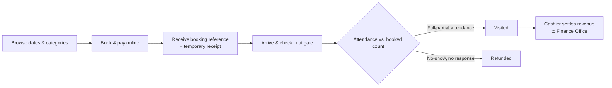

# 01 — Product Overview

**Document type:** Product vision and scope definition
**Audience:** All readers — this is the recommended starting point
**Related documents:** [02 — Software Requirements Specification](02-software-requirements-specification.md) (detailed requirements derived from this scope) · [03 — Software Design Specification](03-software-design-specification.md) (how the scope below is built)

---

## 1. Vision

The **Museum Ticketing & Booking Platform** gives visitors to the Science Museum a digital way to book, pay for, and receive a ticket online — bilingually, in Amharic and English — as an option that sits **alongside** the museum's existing counter process, not a replacement for it.

The product exists on a simple premise: the museum already runs a working ticketing operation — cashiers, categories, group bookings, government-receipted reconciliation — it just has no digital path for a visitor who would rather book ahead and pay by phone than queue in person with cash. The MVP's job is to add that path cleanly, without disturbing the manual process the museum, its cashiers, and its Finance Office already depend on.

## 2. The problem

The current process, confirmed directly through a site visit and stakeholder interviews, works — but only through in-person, cash-based, single-channel operation:

- **No digital payment option.** Every ticket is paid for in cash at the counter; visitors who would prefer Telebirr, CBE Birr, or card have no way to pay that way today.
- **No advance booking for individual visitors.** Only school/group visits can be arranged ahead of time, and only by phone call or letter — an individual visitor's only option is to show up and queue.
- **Bottlenecks when groups arrive unscheduled or all at once.** Large student groups arriving simultaneously strain the single entrance point and the cashier's manual headcount process.
- **No booking reference for groups.** A school group's headcount is only confirmed physically at the gate; there is no digital confirmation code that would let gate verification go faster.
- **Cash handling is the only settlement path.** Every reconciliation step — counting cash, matching it to system sales, producing a government Receipt Voucher — depends on a person physically carrying money and paper to the Finance Office.

None of this means the current process is broken — the Finance Office's own reconciliation method (a physical receipt, reconciled by hand) works today and is explicitly being kept, not replaced (Document 02, §2.7, §2.9). The gap is narrower and specific: there is no option for a visitor who wants to pay digitally and skip the queue.

## 3. Product positioning

The product is best understood as **an additive digital ticket counter that runs next to the real one** — not a system that replaces or absorbs the museum's existing process, and not a general-purpose ticketing SaaS for arbitrary venues.

| Dimension | Current manual process | Museum Ticketing & Booking Platform (digital track) |
|---|---|---|
| Payment | Cash only, at the counter | Online payment via Chapa (Telebirr, CBE Birr, card), alongside cash — cash is untouched |
| Booking | Individuals: walk-in only. Groups: phone/letter, days in advance | Individuals and groups can book and pay online ahead of time; walk-in remains available |
| Language | Not specified as bilingual in current tooling | Amharic and English, fully parallel, from the first release |
| Ticket validation at the gate | Physical receipt inspected visually | Same physical process for cash sales; digital bookings add a reference code, lookup-able by typed entry or a keyboard-wedge QR scanner — no new hardware required |
| Settlement to Finance | Cash counted, matched, deposited, government Receipt Voucher issued | A separate, batched digital settlement transfer with its own receipt, carried to Finance alongside the existing cash deposit — never merged into one ledger |
| Booking changes | Informal, by phone, no penalty (Q34) | Formal cancel/reschedule rules with automatic refund handling, since a digital payment can't be waved off the way an unpaid phone reservation can |

## 4. Target users

The platform serves the museum's own staff and the visitors who choose to use it — there is no multi-organization audience, since this is a single-venue system.

| Role | Represents | Primary goal on the platform |
|---|---|---|
| **Visitor** | An individual, family, or school/group representative | Book a visit ahead of time, pay online, and get in without queuing to pay in person |
| **Cashier** | Front-counter and gate staff | Verify a digital booking's headcount at the gate, and periodically settle collected digital revenue to the Finance Office |
| **Museum Manager** | Museum administration | Approve group/school bookings, control which dates are open for online booking, configure ticket categories and prices, and monitor bookings and revenue |
| **Platform Admin** | Whoever operates the platform technically | Provision staff accounts |

These four roles are fixed across the SRS and SDS; no other document in this set introduces a role not listed here. The **Finance Office** and **Chapa** are important parties in how the system works, but are external parties, not platform users (Document 02, §1).

### Representative personas

- **Hana (24), university student visiting with three friends** — wants to book and pay for four student tickets from her phone the night before, and just show a code at the gate instead of standing in the cash line.
- **Ato Girma, school trip coordinator** — currently books a class visit by phone call days in advance and pays in cash on arrival; wants a booking reference he can show at the gate so his group of 20 doesn't get held up at the entrance, and wants a straightforward way to handle the case where only 15 students end up coming.
- **Cashier at the gate** — already handles cash sales and headcount checks for groups; needs the digital track to add a lookup-and-confirm step at the gate and a simple way to send collected digital revenue to Finance, without changing how the cash side of her job works.
- **Museum Manager** — currently approves school visit requests by phone or letter and has no visibility into digital bookings until this platform exists; wants a dashboard showing what's booked, what's been paid, and the ability to close a date if the museum is already at capacity that day from other channels.

## 5. Core product journey

At the center of the digital track is one lifecycle, additive to — and running in parallel with — the museum's existing walk-in process:

Every functional requirement in Document 02 exists to make one stage of this journey work correctly for one of the four roles above; Document 03 specifies how each stage is implemented.

## 6. MVP scope boundary

The MVP is scoped to make the digital booking-and-payment path above work correctly and safely, without touching or duplicating the museum's existing manual process.

### In scope for MVP

- Online booking and payment (individual and group/school) via a payment aggregator, with the funds settling to an account the platform itself controls — never directly into the Finance Office's account.
- A booking lifecycle (`Pending` → `Visited` / `Cancelled` / `Refunded`) covering cancellation, a one-time reschedule, gate headcount reconciliation, partial-attendance refund requests, and an automatic refund if a booking is never resolved.
- Gate check-in that works with the museum's existing desktop hardware — by typed reference lookup or a keyboard-wedge QR scanner — with no new device requirement.
- Manual, Museum-Manager-controlled date availability (no automated capacity calculation).
- Batched Cashier-to-Finance settlement, producing its own Transfer Receipt, kept entirely separate from the manual cash track.
- Bilingual (Amharic/English) interface and generated documents, from the first release.
- A responsive web app and a native mobile app for Visitors; a web dashboard for staff.
- Reporting for Museum Manager and Platform Admin (revenue, category/group breakdowns, booking status mix), aligned to the museum's budget/fiscal calendar.

### Explicitly out of scope for this phase (see Document 02, §4 for the authoritative list)

- Direct technical integration with IFMIS — the Finance Office continues to reconcile from a physical receipt, by design, not as a gap to close later.
- Any merging of the manual (cash) track's records into the digital track's database.
- Automated, system-calculated museum capacity limits.
- Automated group-size discounts.
- Offline/degraded-mode ticket validation at the gate.
- Multi-venue support.

Every feature above the line was kept because it's required to make a Visitor's digital booking-to-settlement journey work correctly and safely. Every feature below the line was deliberately excluded because the museum's own stakeholders — Finance Office included — described a working alternative that this MVP is not meant to disturb.

## 7. Product-level success criteria

Detailed, testable acceptance criteria live in Document 02 (per-requirement). At the product level, the specific adoption targets below are placeholders pending confirmation with the Museum Manager and Finance Office — but directionally, the MVP succeeds if:

- A Visitor can complete the full digital journey (browse → book → pay → check in) with no staff intervention beyond the existing gate headcount step.
- The Cashier can settle a batch of digital revenue to the Finance Office in a single action, producing a receipt Finance accepts without extra explanation.
- No incident of a booking being double-refunded, double-settled, or lost between `Pending` and its final status occurs during the pilot period.
- [Placeholder — confirm with stakeholders] A target share of ticket sales (e.g., "X% of individual visitors") moves to the digital track within a defined pilot window, without a corresponding drop in overall visitor satisfaction with the gate experience.

## 8. Glossary

Definitions used consistently across this document set:

| Term | Meaning |
|---|---|
| Visitor | Anyone booking or purchasing a museum ticket, individually or as a group/school representative |
| Digital track | The online booking and payment path this project adds |
| Manual/cash track | The museum's existing counter process — cash, cashier-entered sale, government Receipt Voucher — left unchanged |
| Booking | One paid, digital reservation for one visit date, covering one or more visitors under a single category |
| Settlement | The batched transfer of collected digital revenue from the platform's own account to the Finance Office |
| Transfer Receipt | The document the digital track produces at settlement, carried physically to the Finance Office alongside the manual track's deposit slip |
| IFMIS | The Ministry of Finance's government financial system the Finance Office uses internally; not directly integrated with in this phase |
| MVP | Minimum Viable Product |
| SRS | Software Requirements Specification |
| SDS | Software Design Specification |
| ETB | Ethiopian Birr |
