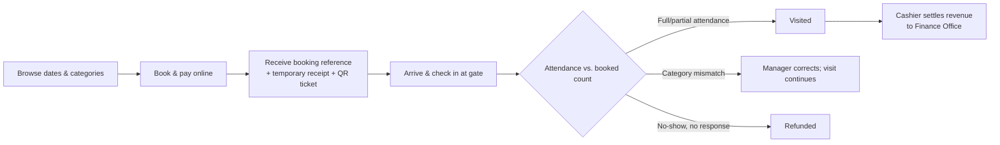

# 01 — Product Overview

**Document type:** Product vision and scope definition
**Audience:** All readers — this is the recommended starting point
**Related documents:** [02 — Software Requirements Specification](02-software-requirements-specification.md) (detailed requirements derived from this scope) · [03 — Software Design Specification](03-software-design-specification.md) (how the scope below is built)

---

## 1. Vision

**ZNHM Ticketing** is the unified digital ticketing platform of the **Zoological Natural History Museum (ZNHM)**, an Addis Ababa University museum at 4 Killo, Addis Ababa. It gives every visitor a single way to browse the museum's tickets, book a visit, pay online, receive a ticket, and be checked in at the gate — bilingually, in Amharic and English — and it gives museum staff the tools they need to run that operation end to end.

The platform is one product, not a digital option bolted onto a paper one. A booking made on the web, in the mobile app, or by a group coordinator all live in the same system of record, move through the same lifecycle, and are validated at the same gate. The museum's ticket categories, prices, date availability, gate check-in, revenue reporting, and settlement to the Finance Office are all managed here.

The product's premise is simple: a visitor should be able to decide to visit the museum, book and pay from wherever they are, and walk straight to the entrance with a ticket on their phone.

- Product: **ZNHM Ticketing** (short form **ZNHM**)
- Bundle / package ID: `et.aau.znhm.ticketing`
- URL scheme: `znhm`
- Brand blue: `#015484`
- Roles: `visitor`, `cashier`, `museum_manager`, `platform_admin`
- Languages: Amharic (`am`) and English (`en`), both first-class

## 2. The problem

Visitors want to book and pay online, ahead of arrival, and skip the in-person queue. The museum's ticketing operation has not historically offered that path:

- **No online purchase.** A visitor who would prefer to pay by Telebirr, CBE Birr, or card has no way to do so, and must pay in person instead.
- **No advance booking.** Individual visitors cannot reserve a time or a date before they travel to the museum; they can only arrive and hope the day is open.
- **Queues at the entrance.** Every visitor must pay at the counter before entering, so a busy morning or a school group arriving together congests the single entrance point.
- **No digital confirmation.** A group coordinator has no reference code to present; headcount is confirmed physically at the gate, which slows entry for large parties.
- **No affordable visibility.** Museum staff cannot see what has been booked, paid, or attended for a given day or period, and cannot plan around demand.

ZNHM Ticketing removes those limitations by putting the whole journey — discovery, booking, payment, ticket, gate check-in, and revenue reporting — online and in one place.

## 3. Product positioning

ZNHM Ticketing replaces the museum's ad-hoc, in-person ticketing with a single digital platform. The table below contrasts the experience before and after this product; both columns describe the digital platform's own scope, not a choice between two systems.

| Dimension | Before | After |
|---|---|---|
| Discovering tickets | Prices and categories are only known at the counter | Visitor browses live categories and prices online, in Amharic or English |
| Booking | Visitors arrive unannounced; groups are arranged informally | Individuals and groups book and pay online ahead of their visit |
| Payment | In person only | Online via Chapa (Telebirr, CBE Birr, card), settling to an account the platform controls |
| Ticket | No digital artifact | Every paid booking carries a reference and a temporary receipt; a real QR code is rendered on the ticket |
| Gate check-in | Headcount is confirmed physically | Cashier looks the booking up by reference — typed or camera-scanned — and records attendance |
| Language | Single-language tooling | Amharic and English, fully parallel, in every screen and every generated document |
| Revenue visibility | No system of record | Manager and Admin dashboards and reports over bookings, attendance, and revenue |
| Settlement to Finance | Manual, per cashier | A per-cashier settlement transfer with the voucher trail the Finance Office expects |

The product is built for the museum and its visitors specifically; it is not a general-purpose ticketing service for arbitrary venues.

## 4. Target users

The platform serves the museum's own staff and the visitors who use it. It is a single-venue system with four fixed roles.

| Role | Represents | Primary goal on the platform |
|---|---|---|
| **Visitor** | An individual, family, or school/group representative | Book a visit ahead of time, pay online, and get in without queuing to pay in person |
| **Cashier** | Front-counter and gate staff | Look up a booking at the gate, record attendance, correct a category when ID does not match, and reconcile collected revenue to the Finance Office |
| **Museum Manager** | Museum administration | Control which dates are open for online booking, configure ticket categories and prices, correct bookings, and monitor attendance and revenue |
| **Platform Admin** | Whoever operates the platform technically | Provision staff accounts and review the audit trail |

These four roles are fixed across this document set; no other document introduces a role not listed here. The **Finance Office** and **Chapa** are important parties in how the platform works, but they are external parties, not platform users (Document 02, §1).

### Representative personas

- **Hana (24), university student visiting with three friends** — books and pays for four student tickets from her phone the night before, then shows a QR code at the gate instead of standing in line.
- **Ato Girma, school trip coordinator** — books a class visit online, gets a booking reference he can present at the gate so his group of 20 is not held up, and can handle the case where only 15 students end up coming.
- **Cashier at the gate** — looks up a booking by its reference, confirms or corrects the category against the ID presented, records attendance, and reconciles her collected revenue to the Finance Office.
- **Museum Manager** — opens and closes dates, manages categories and prices, corrects a flagged booking, and uses the dashboard to see what is booked, paid, and attended.

## 5. Core product journey

One lifecycle sits at the center of the platform, and every role participates in it:

The Cashier checks a booking in, reads the voucher, keys the IFMIS *Document No* and *Ref No*, and hands the voucher over. A matching headcount checks straight in and counts as revenue immediately. A mismatch blocks check-in and is flagged for the Museum Manager, who alone corrects headcount and category (and any resulting payment or refund is settled) before the Cashier can complete the check-in. The museum is closed every Sunday, enforced server-side and not openable by the Manager.

Every functional requirement in Document 02 exists to make one stage of this journey work correctly for one of the four roles above; Document 03 specifies how each stage is implemented.

## 6. MVP scope boundary

The platform is scoped to make the booking-to-settlement journey above work correctly and safely for the four roles.

### In scope

- Online booking and payment (individual and group/school) via a payment aggregator, with funds settling to an account the platform itself controls.
- A booking lifecycle (`awaiting_payment` → `pending` → `visited` / `cancelled` / `refunded`) covering cancellation, a one-time reschedule, gate headcount reconciliation, partial-attendance refund requests, and an automatic refund if a booking is never resolved.
- A real QR code rendered on every ticket (web and mobile), encoding the bare booking reference, and camera-based scanning in the mobile Cashier experience.
- Gate check-in that works both from the museum's desktop terminals (typed reference or keyboard-wedge QR scanner) and from the mobile app (camera).
- Manual, Museum-Manager-controlled date availability.
- Per-cashier settlement, producing the voucher trail the Finance Office expects.
- Bilingual (Amharic/English) interface and generated documents, from the first release.
- A responsive web client for visitors and staff, and a native mobile app for all four roles.
- Reporting for Museum Manager and Platform Admin (revenue, category/group breakdowns, booking status mix), aligned to the museum's budget/fiscal calendar. One date-range-driven report set — Overview, Schools, Categories, Attendance, Revenue — with per-school visit history, no-show and shortfall figures, CSV export and print/PDF output, all counting people who actually attended rather than only people who booked.
- A school/institution registry keyed on the 10-digit TIN, so a school is one record across all its group bookings and can be reported on over time.
- Push notifications to registered devices, with user-controlled notification preferences (channel and language).
- A read-only audit log for Platform Admin.

### Not part of this release

- **IFMIS reconciliation stays with the Cashier.** She keys each transaction into IFMIS herself and hands over the voucher; the platform records the Document No / Ref No she reports back.
- **Capacity is controlled manually.** The Museum Manager opens and closes each date on a per-date basis, judging that day's capacity herself.
- **Pricing is one flat price per category.** Every ticket in a category, individual or group, is booked at that category's price.
- **The gate validates online.** Check-in reaches the server for every booking; the only offline read is the Visitor's own ticket, shown read-only.
- **ZNHM Ticketing serves one venue**, the Zoological Natural History Museum at 4 Killo.

Every feature above was kept because it is required to make a visitor's booking-to-settlement journey work correctly and safely across the four roles.

## 7. Mobile app

ZNHM Ticketing is a first-class four-role mobile client, not a visitor add-on. The native mobile app (iOS and Android, one React Native codebase) is a client of the same API as the web client and introduces no separate backend or source of truth.

After sign-in, the mobile app routes each account to the experience for its own role:

| Role literal | Route group | Experience |
|---|---|---|
| `visitor` | `(visitor)` | Verify, browse, book, pay, ticket with QR, cancel/reschedule, refund request, profile |
| `cashier` | `(cashier)` | Gate lookup (typed or camera-scanned), check-in, mismatch flagging, IFMIS voucher, personal reconciliation |
| `museum_manager` | `(manager)` | Dashboard, categories, availability, booking oversight and correction, reports |
| `platform_admin` | `(admin)` | Staff administration, audit log, reports |

Session bootstrap reads the stored token, calls the API for the current account, and dispatches to the matching route group; an unknown or missing role returns the user to sign-in. Role guards are per-role, and authorization is enforced server-side on every request. Full detail lives in [Document 09 — Mobile Application Design](09-mobile-app-design.md).

## 8. Product-level success criteria

Detailed, testable acceptance criteria live in Document 02 (per-requirement). At the product level, the platform succeeds if:

- A Visitor can complete the full journey (browse → book → pay → check in) with no staff intervention beyond the gate.
- The Cashier can reconcile a batch of collected revenue to the Finance Office in a single action, producing the voucher trail Finance accepts without extra explanation.
- No booking is double-refunded, double-settled, or lost between `pending` and its final status during the pilot period.
- A defined share of ticket sales moves online within the pilot window without a drop in visitor satisfaction with the gate experience.

## 9. Glossary

Definitions used consistently across this document set:

| Term | Meaning |
|---|---|
| Visitor | Anyone booking or purchasing a museum ticket, individually or as a group/school representative |
| Booking | One paid reservation for one visit date, covering one or more visitor categories under a single reference |
| Booking Item | One category line on a booking: category, quantity, attended quantity, unit price, subtotal |
| Reference | The 8-character code generated on a paid booking and presented at the gate |
| Settlement | The transfer of collected revenue from the platform's account to the Finance Office |
| IFMIS | The Ministry of Finance's government financial system the Finance Office uses internally; not directly integrated with |
| MVP | Minimum Viable Product |
| SRS | Software Requirements Specification |
| SDS | Software Design Specification |
| ETB | Ethiopian Birr |
