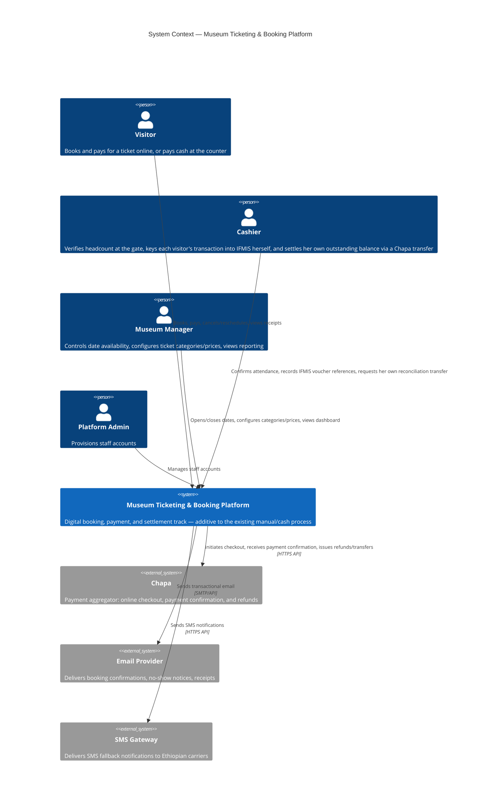
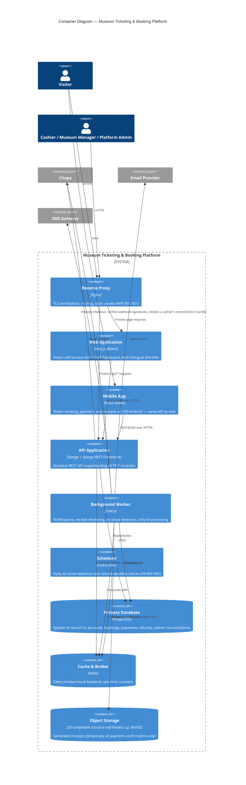
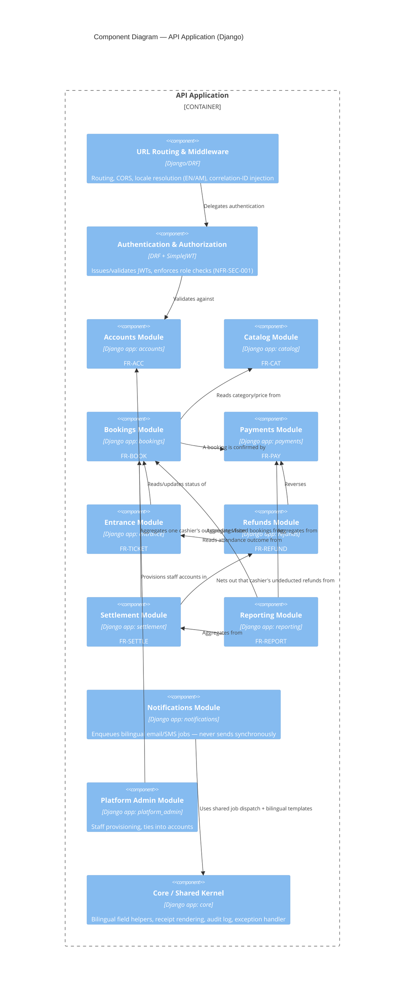
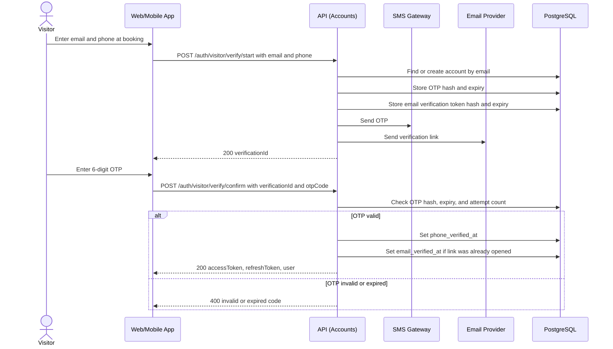
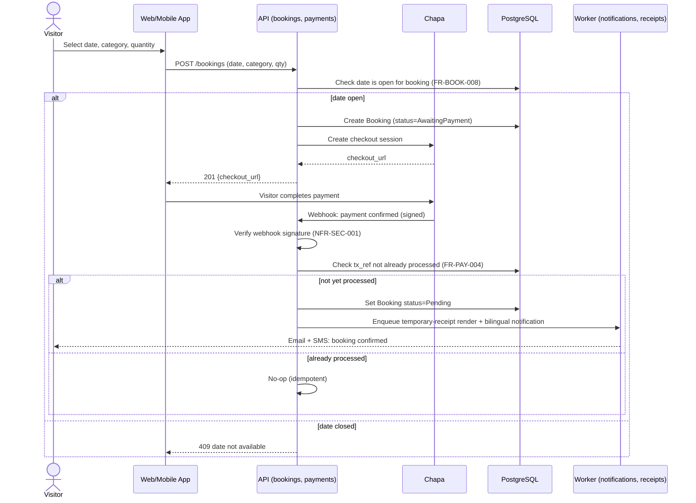
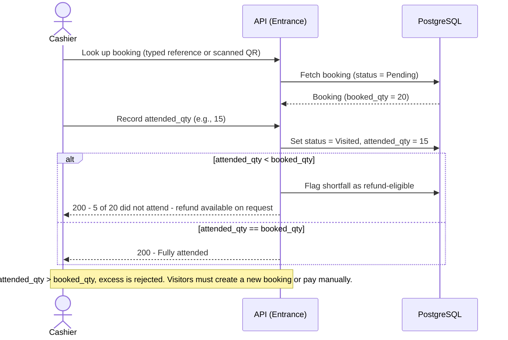
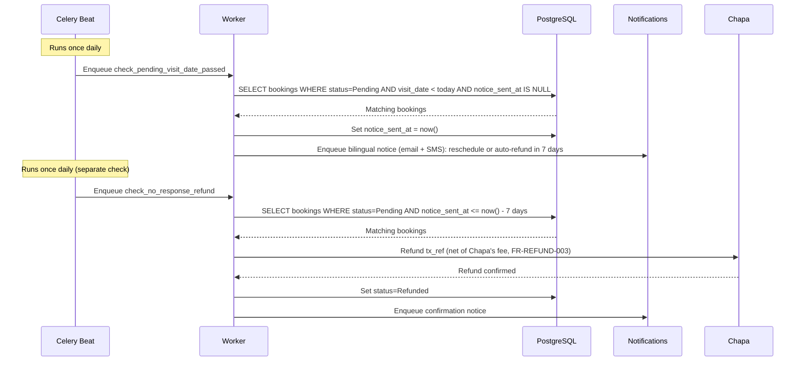
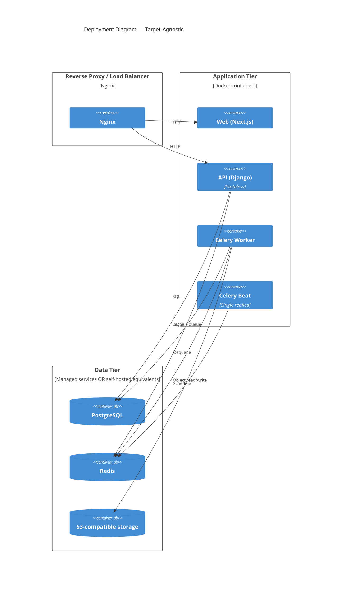
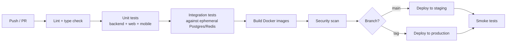

# 03 — Software Design Specification

**Document type:** Software Design Specification (SDS)
**Audience:** Software architects, backend engineers, frontend/mobile engineers, DevOps engineers, technical reviewers
**Status:** Complete — derived from and traceable to the SRS
**Related documents:** [02 — Software Requirements Specification](02-software-requirements-specification.md) (source of truth this document implements) · 04 — API Specification (endpoint-level contract) · 05 — Database Design (schema-level detail) · 08 — Deployment and DevOps (operational detail)

---

## 1. Introduction

### 1.1 Purpose

This document specifies **how** the Museum Ticketing & Booking Platform is built. Every design decision here exists to satisfy one or more requirements in [Document 02](02-software-requirements-specification.md). Where a requirement changes, this document changes with it; no new product behavior is introduced here — only the architecture and mechanisms that implement behavior already specified.

### 1.2 Scope

This document covers system architecture, backend module decomposition, authentication and authorization, background job design, storage architecture, deployment topology, and the cross-cutting concerns (notifications, localization, error handling, observability) needed to satisfy Document 02's non-functional requirements. Endpoint-level contracts and table-level schema are deferred to Documents 04 and 05; this is the architectural layer both must conform to.

### 1.3 Design principles

1. **Boring technology, deliberately.** Every component is well-understood and widely documented so a small team can operate it without specialist hires.
2. **Modular monolith over microservices.** One deployable backend, internally decomposed into bounded modules. There is exactly one venue and a small, fixed set of actors (§1, Document 02) — nothing here justifies distributed-systems overhead (see ADR-001).
3. **Stateless application tier.** No backend process holds session state in memory; all state lives in PostgreSQL, Redis, or object storage.
4. **Every asynchronous side effect is a named, retryable job.** Sending a notification, rendering a receipt, or resolving a no-show is never performed inline in a request/response cycle (see §6.1).
5. **Deployment-target agnostic.** Every stateful component is chosen to have a viable self-hosted, open-source-compatible equivalent, so the same container images run equally well on university-owned servers or a commercial cloud, without a redesign (see ADR-005). This directly reflects that hosting has not been decided yet.

---

## 2. Architectural Overview (C4 Model)

### 2.1 Level 1 — System Context



**Note on external parties not shown above:** the **Finance Office** and **IFMIS** are real parties in this system's business process (Document 02, §1 and §2.9) but are deliberately **not system integrations**. Per FR-GOV-001, nothing in this architecture calls IFMIS or the Finance Office's systems directly. Per the IFMIS decision (Document 01/02, §2.7): the Cashier personally keys each visitor's transaction into IFMIS herself, under her own name, and hands the resulting voucher directly to the visitor — the platform's role is limited to giving her the fields to copy in (`apps.entrance`) and tracking her own outstanding balance (`apps.settlement`); it never produces a document of its own for the Finance Office. They are omitted from the diagram above for that reason — including them with a `Rel` arrow would misstate this as a technical integration.

**Note on the manual/cash track:** the existing counter process (cash, paper receipt) is unaffected by this platform and has no representation here — see the system model note in Document 02.

### 2.2 Level 2 — Container Diagram



The **Web** application serves both the Visitor-facing site and the internal Staff dashboard (Cashier/Museum Manager/Platform Admin), split by route rather than by separate deployable apps — there is no multi-tenant or multi-organization reason to separate them (§3.3). The **Mobile** app exists only for the Visitor role (§7.1) and talks to the same API, never a separate backend.

### 2.3 Level 3 — Component Diagram (API Application)



---

## 3. Backend Module Design

### 3.1 Layering convention

Every Django app follows the same four-layer structure:

| Layer | File(s) | Responsibility |
|---|---|---|
| `models.py` | ORM models | Data shape and DB-level constraints only. No business logic. |
| `services.py` | Plain Python functions/classes | All business logic (e.g., "resolve a no-response booking" spans a status check, a refund call, and a notification). This is the layer that implements the rules in Document 02. |
| `serializers.py` | DRF serializers | Request/response shape and field validation. Delegates to `services.py` for anything stateful. |
| `views.py` | DRF viewsets/views | HTTP concerns only: routing to a service call, permission checks, response codes. |

This separation lets acceptance criteria expressed as business behavior (e.g., FR-BOOK-007's one-reschedule cap) be unit-tested against `services.py` directly, satisfying NFR-TEST-001.

### 3.2 Module-to-requirement mapping

| Django app | Requirements implemented | Depends on |
|---|---|---|
| `accounts` | FR-ACC | `core` |
| `catalog` | FR-CAT | `core` |
| `bookings` | FR-BOOK | `catalog`, `accounts` |
| `payments` | FR-PAY | `bookings` |
| `entrance` | FR-TICKET | `bookings` |
| `refunds` | FR-REFUND | `payments`, `entrance` |
| `settlement` | FR-SETTLE | `bookings`, `refunds` |
| `reporting` | FR-REPORT | `bookings`, `payments`, `settlement` |
| `notifications` | Cross-cutting (consumed by every module that issues a receipt or notice) | `core` |
| `platform_admin` | Staff-facing part of FR-ACC-002, FR-CAT-002 | `accounts`, `catalog` |
| `core` | Shared kernel: bilingual fields, receipt rendering, audit log, base permissions | none |

Localization (FR-LOC) is not a separate app; it is a cross-cutting concern applied to every module's models, serializers, and generated documents (§6.4), since bilingual support is a property of *every* module's output, not a bounded domain of its own.

`settlement`'s Chapa Transfer webhook reuses `payments`' own signature-verification helper rather than duplicating it — an incidental utility dependency, not a business-logic one, and not reflected as a `Rel` in §2.3 for that reason.

### 3.3 Single-tenant simplification

Unlike a multi-organization platform, this system serves **exactly one venue**. There is no organization/tenant foreign key, no per-tenant query scoping, and no tenant-isolation enforcement layer anywhere in the data model — an entire category of complexity that a multi-tenant design would require is correctly absent here, not overlooked (see ADR-004).

---

## 4. Authentication and Authorization Design

### 4.1 Authentication mechanism

Visitor and Staff accounts use **two different credential mechanisms**, per FR-ACC-001/005/006, but
both land on the same **stateless JWT** (`djangorestframework-simplejwt`) once authenticated, so the
rest of the API (§4.3, and every other module) checks one uniform token regardless of which flow
issued it:

- **Access token:** 15-minute expiry, `Authorization: Bearer` header. Contains `user_id` and `token_version` only — no role claims, so a role change is re-checked against the database on every request rather than trusted from an old token.
- **Refresh token:** 30-day expiry, rotated on every use.

A token-based (rather than cookie/session-based) scheme is required here specifically because there are **three clients** consuming the same API — Web, Mobile, and the Staff dashboard — none of which can rely on a browser-managed session cookie uniformly (see ADR-002).

**Visitor path — passwordless (FR-ACC-001, FR-ACC-003, FR-ACC-004):** no password is ever created,
stored, or checked for a Visitor account.

1. The Visitor supplies email + phone at the point of booking. The API generates a short-lived OTP
   (6 digits, 10-minute expiry, rate-limited per NFR-SEC — see §6.7) and sends it by SMS, and
   generates a signed, single-use email-verification token embedded in a link sent by email.
2. The Visitor enters the SMS OTP in the booking flow (the common case, since it can be done in the
   same session without switching apps); the email link is the fallback/secondary channel and also
   marks `email_verified_at` if opened. Both `email_verified_at` and `phone_verified_at` must be
   non-null before checkout is allowed (FR-ACC-003).
3. On successful OTP confirmation, the API issues the same access/refresh token pair described
   above, scoped to that Visitor's `account` row (created or matched by email, on first
   verification). This is what lets a Visitor return later (FR-ACC-004): re-verifying the same
   email or phone re-authenticates them into the same account and its booking history, with no
   password ever in the loop.
4. There is deliberately no Visitor "forgot password" flow (FR-ACC-006 is Staff-only) — if a Visitor
   loses access, they simply repeat step 1–3 with the same email/phone.

**Staff path — password-based (FR-ACC-002, FR-ACC-005, FR-ACC-006):** unchanged from the original
design. Cashier, Museum Manager, and Platform Admin accounts are provisioned by the Platform Admin
with a temporary password, authenticate with `email + password` (Argon2-hashed, per Document 05
§3.1), and can request a time-limited password-reset link by email (FR-ACC-006) — a conventional
flow, kept because these are the same small group of people logging in daily to a system that moves
money, not because it's the default for every account type in this system.

### 4.1.1 Sequence — Visitor passwordless verification (FR-ACC-001, FR-ACC-003, FR-ACC-004)



A returning Visitor (FR-ACC-004) runs the identical flow with the same email/phone — there is no
separate "login" request, since verification *is* the login for a Visitor.

### 4.2 Sequence — booking payment confirmation (FR-PAY-001, FR-PAY-002, FR-PAY-004)



Server-side webhook verification is the only path that confirms a booking — the client-side redirect after checkout is never trusted on its own, directly implementing FR-PAY-002.

### 4.3 Authorization model

There is no scoped/multi-resource RBAC in this system — with one venue and four fixed roles, authorization is a single flag check:

- **Visitor**: the implicit role of any authenticated account with no staff flag; can only act on their own bookings. A Visitor's authentication carries no password (§4.1), but the resulting access token is checked identically to a Staff token by every downstream permission class — passwordless is a credential-issuance difference only, not a second authorization path.
- **Cashier**, **Museum Manager**, **Platform Admin**: each staff account carries exactly one role (an enum field, not a boolean-per-role), checked by a single `HasStaffRole(role)` permission class.

This is deliberately simpler than a scoped-RBAC design: there is no second venue, department, or organization for a role to be scoped *to* (contrast with ADR-004).

---

## 5. Key Interaction Design (Sequence Diagrams)

### 5.1 Gate check-in and headcount reconciliation (FR-TICKET-001–005)



Because a QR scanner emulates keyboard input (ADR-007), this is the **same code path** whether the Cashier types the reference or scans a code — the API never needs to know which happened.

The check-in response also carries the payer name, amount in figures/words, and a generated purpose string the Cashier needs to key this transaction into IFMIS herself (`apps.entrance`, per FR-GOV-001 — the platform never calls IFMIS directly). Once she has the real Document No/Ref No back from IFMIS, a small follow-up call, `PATCH /bookings/{id}/ifmis-voucher`, records it on the booking (`booking.ifmis_voucher_reference`, Document 05 §3.3) — restricted to the same Cashier who checked the visitor in, and settable only once.

### 5.2 No-response notice and automatic refund (FR-PAY-005, FR-REFUND-001c)



Both checks are idempotent: a booking that is rescheduled or refunded between runs no longer matches the `WHERE` clause on the next run, so no explicit lock is needed beyond the status check itself.

### 5.3 Cashier-initiated reconciliation (FR-SETTLE)

Per the IFMIS decision (Document 01/02, §2.7): this is a **per-cashier** running balance, settled
by a real Chapa transfer, never a platform-wide batch — and the platform generates no receipt of
its own for it. The Chapa Transfer call is made synchronously from the API tier (not enqueued to
the Celery worker, unlike refunds — §6.1), but the transfer's own confirmation is asynchronous:
initiating it only ever produces a `pending` row, and a later webhook call is what moves it to
`completed` or `failed`.

```mermaid
sequenceDiagram
    actor C as Cashier
    participant A as API (settlement)
    participant D as PostgreSQL
    participant P as Chapa (transfer)

    C->>A: POST /settlement/reconcile (after a client-side confirm dialog — no OTP)
    A->>D: Lock this cashier's Visited/unreconciled bookings and undeducted refunds
    A->>A: balance = Σ(booking amounts) − Σ(refund amounts)
    alt balance <= 0
        A-->>C: 400 Nothing to reconcile
    else balance > 0
        A->>D: Create CashierReconciliation(cashier, amount=balance, status=pending)
        Note over A,D: Transaction commits here -- row locks released before calling Chapa
        A->>P: Initiate transfer (amount, reference = reconciliation.id)
        alt Chapa call fails synchronously
            A->>D: Mark reconciliation failed (underlying bookings/refunds untouched)
            A-->>C: 502 Could not reach the payment provider
        else Chapa accepts the transfer
            A->>D: Store chapa_transfer_reference
            A-->>C: 201 {id, amountEtb, status: pending, chapaTransferReference}
        end
    end

    Note over P: Chapa settles the transfer asynchronously
    P->>A: POST /settlement/webhook/chapa-transfer (signature-verified, replay-safe)
    alt Transfer succeeded
        A->>D: Mark reconciliation completed; attribute every Visited/unreconciled booking<br/>and undeducted refund for this cashier to it, in one transaction
    else Transfer failed
        A->>D: Mark reconciliation failed -- bookings/refunds are untouched and<br/>remain eligible for this cashier's next attempt
    end
```

The Cashier then carries her own proof of the completed Chapa transfer to the Finance Office,
alongside the IFMIS vouchers she has already handed each visitor individually at check-in
(`booking.ifmis_voucher_reference`, Document 05 §3.3) — those vouchers, not a document this
platform generates, are what show Finance how many visitors she handled and how much she owed
(FR-GOV-001). Nothing past the webhook call above is part of the system.

---

## 6. Cross-Cutting Design Concerns

### 6.1 Background job design

| Job | Triggered by | Satisfies |
|---|---|---|
| `render_and_store_receipt` | Booking payment confirmed | FR-PAY-002, FR-LOC-002/003 |
| `send_notification` | Booking confirmed, no-show notice, refund confirmed, reschedule confirmed | NFR-PERF-001 (keeps these off the request path) |
| `check_pending_visit_date_passed` | Celery Beat, daily | FR-PAY-005 (step 1: notice) |
| `check_no_response_refund` | Celery Beat, daily | FR-PAY-005 (step 2: auto-refund) |
| `process_refund` | Visitor cancellation, shortfall refund request, no-response auto-refund | FR-REFUND-001–004 |

All jobs retry automatically on transient failure and log a structured failure event on final exhaustion. `process_refund` is additionally guarded by a DB-level "already processed" check before calling Chapa, so a retried job cannot double-refund (NFR-IDEMPOTENT-001, NFR-CONSIST-001).

A cashier's reconciliation transfer (`apps.settlement.services.initiate_reconciliation`) is deliberately **not** a Celery job — it runs synchronously in the `POST /settlement/reconcile` request cycle, since the Cashier is waiting on its immediate result (a `pending` row and a Chapa reference, or a clear failure). Its actual confirmation is asynchronous, but arrives as a Chapa webhook call (`POST /settlement/webhook/chapa-transfer`, §5.3) rather than a scheduled or enqueued job — mirroring how `apps.payments`' own payment-confirmation webhook is handled synchronously in the request cycle, not via Celery Beat or a queued task.

### 6.2 Caching and queue design (Redis)

| Redis DB index | Purpose |
|---|---|
| 0 | Celery broker + result backend, split into `notifications`, `documents`, `payments` queues |
| 1 | Small application cache: ticket category list (FR-CAT), date-availability lookups (FR-BOOK-008) — both low-cardinality, read-heavy |
| 2 | Rate-limit counters: login attempts, booking-creation attempts per account, refund-request attempts |

Category and availability caches are invalidated on write (a Museum Manager price change or date closure) rather than left to a fixed TTL, so a Visitor never sees a stale price or a closed date as open.

### 6.3 Object storage design

| Prefix | Contents | Access pattern |
|---|---|---|
| `receipts/temporary/{booking_id}.pdf` | Temporary receipt issued at payment confirmation (FR-PAY-002) | Private; readable by the owning Visitor via a short-lived signed URL |

Receipts are **rendered once and stored**, not regenerated on demand, so a receipt's content always matches exactly what was issued at the time — important since these documents may later be relied on by the Finance Office (see ADR-009). A cashier's reconciliation transfer (§5.3) deliberately has no entry here: per the IFMIS decision, the platform never generates a document for that transfer — the Cashier's own proof of the Chapa transfer, alongside the IFMIS vouchers already handed to each visitor (Document 05 §3.3), is what she carries to the Finance Office instead. S3-compatible storage is chosen specifically because it has a drop-in, self-hosted equivalent (e.g. MinIO), consistent with the still-undecided hosting target.

### 6.4 Internationalization implementation (FR-LOC-001–004)

- **Data model:** any staff-editable text (category names, notice templates, booking purpose) is stored as a parallel-column pair (an English value and an Amharic value) rather than a single column with runtime translation — chosen because FR-LOC-004 requires each language to be independently maintainable, not machine-inferred from the other.
- **Generated documents:** every receipt and notice is rendered from a single bilingual template that places the Amharic and English content together on one document. The amount-in-words conversion used on the temporary receipt is a plain-English helper with no external dependency, since the only other place this figure is needed — `apps.entrance`'s IFMIS voucher-prep fields (§5.1) — is Cashier-facing screen text the Cashier keys into IFMIS herself, not a generated document, so it is implemented locally there rather than shared from `core`.
- **Web and Mobile:** both clients share the same message-catalog approach (English/Amharic JSON), and a Visitor's language choice is stored on their account so it follows them between the web site and the mobile app, not just within one session.

### 6.5 Error handling and API response contract

Every error response shares one envelope, produced by a single global exception handler:

```json
{
  "error": {
    "code": "VALIDATION_ERROR",
    "message": "Human-readable, localized message",
    "field_errors": { "quantity": "Must be at least 1" }
  }
}
```

The `message` field is localized per the Visitor's language preference (§6.4), so both Web and Mobile can display errors generically without per-form translation logic.

### 6.6 Observability

- **Structured logging:** every log line carries a `correlation_id`, generated at the reverse-proxy layer and propagated through any background job it triggers, so a booking, its payment, and its eventual reconciliation can be traced end-to-end.
- **Audit logging:** every refund, cashier reconciliation, IFMIS voucher recorded at check-in, date closure (FR-BOOK-008), manual attendance entry, and cancellation/reschedule is written to an append-only `AuditLog` table in `core` — never to application logs alone — directly implementing NFR-AUDIT-001.
- **Metrics:** request latency, error rate, and job queue depth exported in a standard, vendor-neutral format, consistent with the deployment-target-agnostic principle (§1.3).

### 6.7 Rate limiting

Implemented as DRF throttle classes backed by Redis DB 2 (§6.2):

- Login attempts: 5 per 15 minutes per account.
- Booking creation: capped per account/IP to limit fraudulent `AwaitingPayment` bookings from tying up checkout sessions.
- Refund-request endpoint: capped per booking to prevent repeated automated refund requests against the same shortfall.

---

## 7. Frontend Architecture

### 7.1 Structure

Three clients, one API:

| Client | Technology | Audience | Rationale |
|---|---|---|---|
| Web — Visitor site | Next.js, SSR for public pages | Visitor | Public booking/date pages benefit from fast first load; no auth required to browse |
| Web — Staff dashboard | Next.js, CSR behind auth, same app under `/staff/*` | Cashier, Museum Manager, Platform Admin | Highly interactive, no SEO need, no reason to be a separate deployable given single-venue scope (§3.3) |
| Mobile app | React Native (iOS + Android) | Visitor | Chosen so booking, payment, and receipts are available on-device, per the product decision to support a native app alongside the web site |

### 7.2 State management

Server state (bookings, payments, receipts — anything owned by the API) is managed with a data-fetching/cache library (e.g., React Query) on both Web and Mobile, since both are React-based and can share the same data-fetching patterns and, where practical, the same typed API-client package. Local UI state (form inputs, language toggle before it's persisted) uses built-in state. No client ever treats its own state as authoritative for a booking's status — the API's response is always what the UI trusts, which matters given how many of Document 02's rules (one reschedule, no-response refund, headcount reconciliation) are timing- and state-sensitive.

### 7.3 Component organization

Both Web and Mobile organize screens/components by the same module boundaries as the backend (`features/booking`, `features/payments`, `features/account`), so an engineer working on, say, FR-BOOK-007 can find the matching UI in a predictable place on either client. Shared presentational primitives (buttons, form fields, the language toggle) are kept platform-appropriate (React components for Web, React Native components for Mobile) but follow the same naming and prop conventions.

---

## 8. Deployment Architecture

### 8.1 Container topology



Every node in the **Data Tier** is deliberately chosen to have both a managed-cloud form and a self-hosted, open-source form (PostgreSQL, Redis, and MinIO-as-S3 all run identically either way) — since hosting has not been decided, this topology does not need to change regardless of which way that decision goes. **Celery Beat runs as exactly one replica**, since running two would duplicate the daily no-show/refund checks (§5.2).

### 8.2 Environments

Three environments share the same container images, differing only by configuration and data: `development` (local Docker Compose), `staging` (mirrors production topology, used for Museum Manager/Cashier acceptance testing before go-live), and `production`. Promotion is image-based — the exact image tested in staging is what reaches production.

### 8.3 CI/CD pipeline



A failing stage blocks progression; production deployment requires manual approval. This enforces NFR-TEST-001's per-function test-case expectation at the unit-test stage.

---

## 9. Architecture Decision Records

### ADR-001: Modular monolith over microservices
**Decision:** One deployable Django application, internally decomposed into bounded apps.
**Rationale:** One venue, four roles, modest transaction volume — nothing here has the scale or team-topology characteristics that would justify microservices' distributed-systems overhead.
**Consequence:** Module boundaries are enforced by code convention (§3.1), not network boundaries.

### ADR-002: JWT over server-side sessions
**Decision:** Stateless JWT access + rotated refresh tokens for all three clients (Web, Mobile, Staff dashboard).
**Rationale:** A native mobile app cannot share a browser session cookie with the web app; a token-based scheme is the natural common denominator across all three clients, not just a scalability choice.
**Trade-off accepted:** Immediate access-token revocation isn't free with pure JWTs; mitigated by a `token_version` check per request, at the cost of one indexed comparison.

### ADR-003: Celery + Redis for asynchronous work
**Decision:** Celery with Redis as broker for all background jobs, including the daily no-show/refund checks.
**Rationale:** Redis is already required (caching, rate limiting); Celery is a well-documented, widely-operable choice for a small team, consistent with the "boring technology" principle.
**Consequence:** Celery Beat's single-replica constraint (§8.1) must be operationally respected.

### ADR-004: No multi-tenancy layer
**Decision:** No organization/tenant scoping anywhere in the data model or query layer.
**Rationale:** The system serves exactly one venue (§3.3) — a tenant-scoping layer would add complexity with no corresponding requirement to satisfy.
**Consequence:** If the platform is ever extended to a second venue, this would need to be revisited as new design work, not assumed to already be supported.

### ADR-005: Deployment-target-agnostic infrastructure
**Decision:** Every stateful component (PostgreSQL, Redis, S3-compatible storage) is chosen specifically because it has both a managed-cloud form and a self-hosted, open-source-compatible form.
**Rationale:** Hosting (cloud vs. university-owned servers) is explicitly undecided. Building against vendor-specific managed services now would risk a rebuild later depending on which way that decision goes.
**Consequence:** Operationally, this means running and maintaining self-hosted equivalents (e.g., MinIO) is a real possibility the team should be prepared for, not just a theoretical option.

### ADR-006: React Native for the mobile app
**Decision:** A single React Native codebase for iOS and Android, rather than two separate native codebases.
**Rationale:** The product decision was "web + native mobile app." Given a small team already building a React-based web app, React Native lets the same engineers reuse data-fetching patterns, and where practical, shared API-client code, rather than maintaining three fully independent frontends.
**Consequence:** Any Mobile-specific platform capability (e.g., native camera APIs, if ever needed) may require a native module bridge — an accepted cost given the team-size constraint this decision is optimizing for.

### ADR-007: Keyboard-wedge QR scanning over camera-based scanning
**Decision:** Ticket lookup at the gate accepts either a typed reference code or a scanned QR code, through the **same text input field**, using USB/Bluetooth barcode-scanner hardware that emulates keyboard input — not a camera-based scanning app.
**Rationale:** The interview confirmed the counter currently has only desktop terminals, no tablets or camera-equipped devices. A keyboard-wedge scanner requires no new software path, no camera permission, and no mobile device at the gate — it just "types" the decoded reference into the existing lookup field, satisfying the "support both, QR if hardware exists later" decision without making QR support contingent on acquiring a smartphone/tablet.
**Consequence:** If the museum later wants camera-based scanning from a phone (e.g., a roaming Cashier away from the desktop), that is a distinct, larger feature — a camera-scanning mobile flow — not something this design already provides.

### ADR-008: Chapa's Refund API for automated refunds
**Decision:** Both the Visitor-cancellation refund and the no-response auto-refund (FR-REFUND) call Chapa's refund endpoint programmatically, rather than routing refunds through a manual payout process.
**Rationale:** Chapa exposes a documented refund capability tied to the original `tx_ref`; using it directly is what makes FR-REFUND-002's "system calculates and processes it, not a person" requirement achievable end-to-end.
**Consequence:** The refunded amount is net of Chapa's own transaction charge (FR-REFUND-003), which must be computed and stored per refund, not assumed equal to the original charge.

### ADR-009: The temporary receipt is rendered once and persisted, not regenerated on demand
**Decision:** The temporary receipt (FR-PAY-002) is rendered to PDF and stored in object storage at the moment it's issued.
**Rationale:** This is a financial document the Finance Office may later rely on for reconciliation. If receipt template design changes after go-live, a regenerate-on-demand approach would silently alter the content of a document that's already been physically handed over and audited elsewhere — an unacceptable inconsistency for a financial record.
**Consequence:** A template change only affects newly issued receipts going forward; historical receipts remain exactly as issued, which is the correct behavior for an audit trail.
**Superseded scope:** an earlier design also rendered a "Transfer Receipt" here for the (platform-wide, batched) settlement transfer described in the original FR-SETTLE-001–004 wording. That design was replaced by the per-cashier reconciliation model (ADR-010) before this document's Settlement Module (§2.3, §3.2) was implemented — no Transfer Receipt is generated for a reconciliation transfer, per that ADR.

### ADR-010: Per-cashier reconciliation, not a platform-wide settlement batch
**Decision:** `apps.settlement` tracks a running balance **per Cashier** (`CashierReconciliation`, scoped by `booking.checked_in_by_user_id`), settled by a real Chapa Transfer into the university's fixed bank account — never one shared, platform-wide total, and never a document the platform generates for the transfer itself.
**Rationale:** IFMIS ties financial responsibility to a named individual, not the institution as a whole. A Cashier who checks a visitor in personally keys that one transaction into IFMIS under her own name and hands the visitor the resulting voucher — the same thing she already does for a paper ticket. The platform's job is only to (a) give her the fields to copy into IFMIS at check-in (`apps.entrance`, §5.1) and (b) track what she individually still owes, so that settling up is her own number, never mixed with another cashier's shift. A single dedicated settlement account, or multiple cashiers sharing one IFMIS login, were both considered and rejected: neither preserves the per-transaction accountability IFMIS requires (see docs/ decision summary).
**Consequence:** There is no batch settlement endpoint, no join table between a reconciliation and the bookings it covers beyond a plain FK (`booking.reconciliation_id`, Document 05 §3.6), and no platform-generated Transfer Receipt (superseding the relevant part of ADR-009, above) — the IFMIS vouchers she has already handed each visitor (`booking.ifmis_voucher_reference`) remain the only audit trail Finance uses for that transfer.
**Trade-off accepted:** A reconciliation attempt's outcome is only known once Chapa's transfer webhook confirms it (§5.3), not at the moment `POST /settlement/reconcile` returns — the Cashier sees a `pending` status first, mirroring how payment confirmation itself is webhook-driven (§4.2) rather than synchronous with checkout.

---

## 10. Requirement Traceability

Every design element in this document exists to satisfy a requirement ID from [Document 02](02-software-requirements-specification.md); no component or job here introduces behavior not already specified there. Forward traceability continues into:

- **Document 04** (API Specification) — each endpoint is implemented by exactly one `views.py` handler in the module identified in §3.2.
- **Document 05** (Database Design) — every model referenced in §3–5 is defined at the column level, including the bilingual parallel-column fields required by §6.4.
- **Document 07** (Testing and Quality Assurance) — the service-layer/view-layer split in §3.1 is the basis for the unit-vs-integration test strategy required by NFR-TEST-001.
- **Document 08** (Deployment and DevOps) — §8.1–8.3 are the architectural input to that document's environment variables, runbooks, and monitoring configuration for whichever hosting target is ultimately chosen.

If an implementation discovers that a design decision here cannot satisfy its source requirement as written, this document is updated to reflect the corrected design; if the requirement itself was ambiguous or wrong, Document 02 is corrected first.
