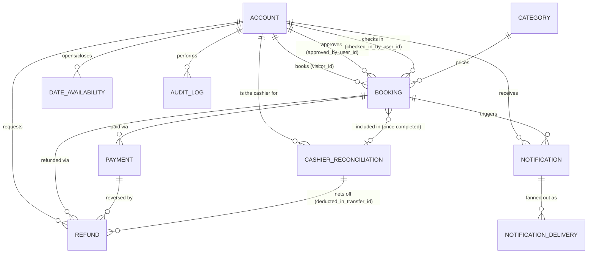

# 05 — Database Design

**Document type:** Database Design Specification
**Project:** Museum Ticketing & Booking Platform
**Audience:** Backend engineers, database administrators, technical reviewers
**Status:** Complete — derived from and traceable to the SRS and SDS
**Related documents:** [01 — Product Overview](01-product-overview.md) (vision and scope) · [02 — Software Requirements Specification](02-software-requirements-specification.md) (functional and non-functional requirement source) · [03 — Software Design Specification](03-software-design-specification.md) (module boundaries, single-tenant design, and background-job architecture this schema implements) · [04 — API Specification](04-openapi-specification.yaml) (resource shapes this schema serves) · 08 — Deployment and DevOps (backup, retention, and migration operations, once written)

---

## 1. Introduction

### 1.1 Purpose

This document specifies the **table-level schema** of the Museum Ticketing & Booking Platform's primary datastore: engine, column definitions, data types, keys, constraints, and indexes for every persisted entity. Every table exists to satisfy one or more functional or non-functional requirements defined in [Document 02](02-software-requirements-specification.md), and every design choice exists to satisfy the module boundaries and single-venue simplification defined in [Document 03, Sections 3.2–3.3](03-software-design-specification.md#32-module-to-requirement-mapping). No new product behavior is introduced here; this document is the schema-level realization of decisions already made upstream.

### 1.2 Scope

This document covers the relational schema for PostgreSQL (the system of record per [Document 03, Section 2.2](03-software-design-specification.md#22-level-2--container-diagram)): table definitions grouped by owning Django app, primary and foreign keys, uniqueness and check constraints, indexing strategy, and data-retention behavior. It does not cover Redis key design (Document 03 §6.2) or object storage layout (Document 03 §6.3), though several tables store a pointer into one or the other.

### 1.3 Conventions

| Convention | Rule |
|---|---|
| Primary keys | Every table uses a `UUID` primary key (`uuid_generate_v4()` at insert time), so booking references, receipt URLs, and API resource IDs never leak a record count or creation order. **One deliberate exception:** `date_availability` (Section 4.7) is keyed by the calendar date itself, since that table is inherently one row per date. |
| Timestamps | Every table has `created_at` (`TIMESTAMPTZ`, default `now()`); tables that are updated after creation also have `updated_at`. `audit_log` is the one exception — it is insert-only by design (Section 4.8). |
| No physical deletes on financial or lifecycle records | `account`, `category`, `booking`, `payment`, `refund`, and `cashier_reconciliation` are never `DELETE`d by an application action. Status/flag columns (`status`, `active`, `is_open_for_booking`) represent state transitions instead — "retiring" a category or "deactivating" a staff account both set a flag, they never remove the row. This is what makes NFR-RETENTION-001's one-year retention guarantee possible without a separate archival step. |
| Enumerations | Fixed, closed vocabularies (`status`, `role`, `booking_type`, `gateway`, `channel`, etc.) are implemented as PostgreSQL `CHECK` constraints against a `TEXT` column rather than native `ENUM` types, so adding a value later is a constraint migration, not a type migration. |
| Money | `amount_etb` / `price_etb` columns are `NUMERIC(12,2)`, never a floating-point type — every one of them ultimately feeds a receipt or a Finance Office reconciliation figure. |
| Bilingual fields | Any staff-editable text that appears on a Visitor- or Cashier-facing screen or generated document is stored as an explicit parallel-column pair — `_en` / `_am` — never a single column with runtime translation, so FR-LOC-004's "independently maintainable" requirement is a schema property, not a service-layer promise (Document 03 §6.4). |
| Snapshotting | Any figure that a booking's receipt depends on (category name, unit price) is copied onto the `booking` row at creation time, not just referenced by foreign key. This is what makes FR-CAT-002's "changes do not retroactively affect already-issued tickets" true at the data level, not just by convention. |
| Tenant/venue scoping | **None.** This system serves exactly one venue (ADR-004, Document 03 §3.3); no `organization_id`, `venue_id`, or equivalent column appears anywhere in this schema, and no table needs one. |

---

## 2. Entity-Relationship Diagram

*Diagram note:* `DATE_AVAILABILITY` is not tied to `BOOKING` by a foreign key — it is consulted, not referenced, at booking-creation time (Document 03 §6.2 caches this lookup). The relationship shown to `ACCOUNT` reflects only `closed_by_user_id`. `CASHIER_RECONCILIATION` is scoped to exactly one `ACCOUNT` (the Cashier personally responsible for that money in IFMIS, per the IFMIS decision) — there is no platform-wide settlement entity in this schema.

---

## 3. Table Definitions

Tables are grouped by the Django app that owns them, matching [Document 03, Section 3.2](03-software-design-specification.md#32-module-to-requirement-mapping).

### 3.1 `accounts` app

#### `account`

Implements FR-ACC-001 – FR-ACC-007. A single table serves both Visitor and Staff actors — there is
no separate staff table — because [Document 03, Section 4.3](03-software-design-specification.md#43-authorization-model)
treats authorization as a single-role-enum check, not a type hierarchy. Since [Document 03, Section 4.1](03-software-design-specification.md#41-authentication-mechanism)
splits credentials by role (Visitors passwordless, Staff password-based), `password_hash` is
nullable here and the ephemeral OTP/token columns exist only to support the Visitor verification
flow — none of this is optional metadata, it is what FR-ACC-001/003/004/006 are implemented with.

| Column | Type | Constraints | Notes |
|---|---|---|---|
| `id` | UUID | PK | |
| `email` | CITEXT | `UNIQUE NOT NULL` | Case-insensitive, to prevent duplicate accounts differing only by case. For a Visitor this row is created (or matched) on first OTP verification, not on an explicit "sign up" action (FR-ACC-001). |
| `phone` | TEXT | `UNIQUE` | Nullable at the schema level because `StaffCreateRequest` (Document 04) does not require it; required in practice for a Visitor by FR-ACC-001/003, enforced in `services.py`. |
| `password_hash` | TEXT | `NULLABLE`, `CHECK (role = 'visitor' OR password_hash IS NOT NULL)` | Argon2. **Null for every Visitor account** — there is no Visitor password anywhere in this system (FR-ACC-001). Required for every Staff role, enforced by the check constraint rather than left to application code alone. |
| `full_name` | TEXT | `NOT NULL` | |
| `role` | TEXT | `CHECK (role IN ('visitor','cashier','museum_manager','platform_admin')) NOT NULL DEFAULT 'visitor'` | The single flag [Document 03 §4.3](03-software-design-specification.md#43-authorization-model)'s `HasStaffRole` permission class checks. |
| `language_preference` | TEXT | `CHECK (language_preference IN ('en','am')) NOT NULL DEFAULT 'en'` | Stored on the account, not the session, so it follows the Visitor between Web and Mobile (FR-LOC-001, Document 03 §6.4). |
| `email_verified_at` | TIMESTAMPTZ | | Nullable. Both this and `phone_verified_at` must be non-null before a booking can proceed to payment (FR-ACC-003). For a Visitor, set by the OTP/email-link confirmation in Document 03 §4.1.1, not by a password-signup step. |
| `phone_verified_at` | TIMESTAMPTZ | | See above. |
| `phone_otp_hash` | TEXT | `NULLABLE` | Hash of the current outstanding SMS OTP (Document 03 §4.1.1). Cleared on successful verification or expiry; never stored in plaintext or logged. |
| `phone_otp_expires_at` | TIMESTAMPTZ | `NULLABLE` | 10-minute expiry from issuance (FR-ACC-001). |
| `phone_otp_attempts` | SMALLINT | `NOT NULL DEFAULT 0` | Incorrect-attempt counter for the current OTP, reset on reissue; backs the rate limit in Document 03 §6.7 so OTP guessing is bounded. |
| `email_verification_token_hash` | TEXT | `NULLABLE` | Hash of the current single-use email magic-link token. Cleared once opened. |
| `email_verification_expires_at` | TIMESTAMPTZ | `NULLABLE` | Expiry for the above, mirroring the OTP's short lifetime. |
| `password_reset_token_hash` | TEXT | `NULLABLE` | Staff-only (FR-ACC-006). Hash of an outstanding password-reset token; always `NULL` for a Visitor account, since Visitors never have a password to reset. |
| `password_reset_expires_at` | TIMESTAMPTZ | `NULLABLE` | Expiry for the above. |
| `active` | BOOLEAN | `NOT NULL DEFAULT true` | Deactivating a staff account (`DELETE /admin/staff/{id}`) sets this to `false`; the row is never removed, since it may already be `approved_by_user_id` or `checked_in_by_user_id` on historical bookings. |
| `token_version` | INTEGER | `NOT NULL DEFAULT 0` | Incremented to invalidate all outstanding access tokens for this account without waiting for their 15-minute expiry (ADR-002). |
| `created_at` / `updated_at` | TIMESTAMPTZ | `NOT NULL` | |

**Indexes:** unique on `email`; unique on `phone` (partial, `WHERE phone IS NOT NULL`); (`role`) partial `WHERE active` for staff listing (`GET /admin/staff`).

**Why one Visitor account row always exists, even for a "one-time" booker:** FR-ACC-003 requires a
verified email and phone before payment, and `booking.visitor_id` is a `NOT NULL` FK to `account.id`
(Section 3.3) — so every paid booking already has an `account` row behind it, for every Visitor,
with no separate "create an account" action and no distinct guest-vs-account code path. A repeat
visitor (e.g., a school that books every term) is simply matched to the same `account.id` on each
re-verification by email/phone (Document 03 §4.1.1) and their history is there automatically — this
is what keeps per-category and per-booking analytics (§7, `FR-REPORT-*`) able to include every
Visitor, one-time or repeat, directly implementing FR-ACC-007.

### 3.2 `catalog` app

#### `category`

Implements FR-CAT-001 – FR-CAT-003.

| Column | Type | Constraints | Notes |
|---|---|---|---|
| `id` | UUID | PK | |
| `name_en` | TEXT | `NOT NULL` | e.g. "Adult / Teacher". |
| `name_am` | TEXT | `NOT NULL` | Maintained independently of `name_en` (FR-LOC-004). |
| `price_etb` | NUMERIC(12,2) | `NOT NULL, CHECK (price_etb >= 0)` | Seeded from current policy: Student 50, Adult/Teacher 100, Foreign Resident 300, Non-Resident 500, Exempt 0. |
| `is_free` | BOOLEAN | `NOT NULL DEFAULT false` | Distinguishes an intentionally free category (e.g. AAU staff) from a data-entry zero. |
| `active` | BOOLEAN | `NOT NULL DEFAULT true` | "Retiring" a category (`DELETE /categories/{id}`) sets this `false`; it is never deleted, because existing `booking` rows still display via their own snapshot columns (Section 3.3), not a live join to this row. |
| `created_at` / `updated_at` | TIMESTAMPTZ | `NOT NULL` | |

**Indexes:** (`active`) — the public `GET /categories` endpoint only lists active categories.

### 3.3 `bookings` app

#### `booking`

Implements FR-BOOK-001 – FR-BOOK-008 and the lifecycle mechanics of FR-PAY-002/003/005. This is the central table of the schema — nearly every other table hangs off it.

| Column | Type | Constraints | Notes |
|---|---|---|---|
| `id` | UUID | PK | |
| `reference` | TEXT | `UNIQUE NOT NULL` | The single value looked up at the gate, whether typed or emitted by a keyboard-wedge QR scanner (FR-BOOK-004, FR-TICKET-001, ADR-007) — both paths hit the same field, so the API never needs to know which happened. |
| `visitor_id` | UUID | `NOT NULL, FK → account.id ON DELETE RESTRICT` | The Visitor or group-leader who owns the booking. |
| `category_id` | UUID | `NOT NULL, FK → category.id ON DELETE RESTRICT` | |
| `category_name_en` / `category_name_am` | TEXT | `NOT NULL` | Snapshot of the category's bilingual name at booking time. |
| `unit_price_etb` | NUMERIC(12,2) | `NOT NULL` | Snapshot of the category's price at booking time — a later Museum Manager price edit (FR-CAT-002) never touches this row. |
| `visit_date` | DATE | `NOT NULL` | Mutated in place on a reschedule (FR-BOOK-007); see `rescheduled_count` below. |
| `booking_type` | TEXT | `CHECK (booking_type IN ('individual','group')) NOT NULL` | |
| `group_name` | TEXT | `CHECK (booking_type <> 'group' OR group_name IS NOT NULL)` | DB-enforced version of FR-BOOK-003's requirement that a group booking name a school/group. |
| `group_contact_phone` | TEXT | | |
| `booked_quantity` | INTEGER | `NOT NULL, CHECK (booked_quantity >= 1)` | |
| `attended_quantity` | INTEGER | `CHECK (attended_quantity IS NULL OR (attended_quantity >= 0 AND attended_quantity <= booked_quantity))` | Set once, by the Cashier, at check-in. The upper-bound half of this constraint is FR-TICKET-005 ("extra visitors are not admitted under the original booking") enforced at the database level, not just in `services.py`. |
| `total_amount_etb` | NUMERIC(12,2) | `NOT NULL` | `booked_quantity × unit_price_etb`, computed and fixed at creation. |
| `status` | TEXT | `CHECK (status IN ('awaiting_payment','pending_approval','pending','visited','cancelled','refunded')) NOT NULL DEFAULT 'awaiting_payment'` | `pending_approval` exists only for a group booking awaiting the Museum Manager's decision (FR-BOOK-003); an individual booking never visits that state. |
| `approval_status` | TEXT | `CHECK (approval_status IN ('pending','approved','declined')), CHECK (booking_type = 'group' OR approval_status IS NULL)` | Present only for group bookings, matching the API contract (Document 04, `Booking.approvalStatus`). |
| `approved_by_user_id` | UUID | `FK → account.id` | The Museum Manager who decided (FR-BOOK-003). |
| `approved_at` | TIMESTAMPTZ | | |
| `rescheduled_count` | INTEGER | `NOT NULL DEFAULT 0, CHECK (rescheduled_count <= 1)` | FR-BOOK-007's "at most once" cap enforced as a database invariant, not only a service-layer check — a second reschedule attempt cannot succeed even if a bug bypasses `services.py`. |
| `notice_sent_at` | TIMESTAMPTZ | | Set the day the visit date has passed while still `Pending` (FR-PAY-005, step 1). |
| `checked_in_at` | TIMESTAMPTZ | | FR-TICKET-001. |
| `checked_in_by_user_id` | UUID | `FK → account.id` | The Cashier who recorded attendance (NFR-AUDIT-001). |
| `chapa_checkout_url` | TEXT | | Present only while `awaiting_payment`, or immediately after a group booking's approval; cleared once payment is confirmed. |
| `receipt_url` | TEXT | | Pointer into object storage (`receipts/temporary/{booking_id}.pdf`, Document 03 §6.3). Populated once, at payment confirmation, and never regenerated (ADR-009). |
| `ifmis_voucher_reference` | TEXT | `NULLABLE` | The real Document No/Ref No the Cashier gets back from IFMIS after keying this check-in's transaction into IFMIS herself. Not known at the instant check-in happens — she reports it back separately (`PATCH /bookings/{id}/ifmis-voucher`, `apps.entrance`); the platform never generates or calls IFMIS for this value (FR-GOV-001). |
| `reconciliation_id` | UUID | `FK → cashier_reconciliation.id ON DELETE RESTRICT` | Set once, only when this booking's amount has been included in a *completed* per-cashier reconciliation (Section 3.6) — never at the moment a reconciliation is merely initiated. `RESTRICT` (not `SET NULL`/`CASCADE`): a reconciliation with bookings attributed to it must never be deleted out from under them. |
| `created_at` / `updated_at` | TIMESTAMPTZ | `NOT NULL` | |

**Indexes:** unique on `reference`; (`visitor_id`); (`category_id`); (`status`, `visit_date`) — serves both the daily no-show sweep (`status='pending' AND visit_date < today`, Document 03 §5.2) and staff filtering (`GET /bookings?status=&visitDate=`); partial index on `checked_in_by_user_id` `WHERE status='visited' AND reconciliation_id IS NULL` — this is the query behind one Cashier's outstanding balance (FR-SETTLE, Section 3.6), scoped per-cashier rather than platform-wide since accountability in IFMIS is personal, not pooled; partial index on `notice_sent_at` `WHERE status='pending' AND notice_sent_at IS NOT NULL` for the seven-day no-response sweep.

### 3.4 `payments` app

#### `payment`

Implements FR-PAY-001 – FR-PAY-004 and NFR-SEC-001 / NFR-IDEMPOTENT-001.

| Column | Type | Constraints | Notes |
|---|---|---|---|
| `id` | UUID | PK | |
| `booking_id` | UUID | `NOT NULL, FK → booking.id` | |
| `tx_ref` | TEXT | `UNIQUE NOT NULL` | Chapa's own transaction reference — the value a retried or duplicated webhook call is checked against before any state change is applied, satisfying FR-PAY-004 and NFR-IDEMPOTENT-001 as a database-level guarantee, not just an application-level `if`. |
| `gateway` | TEXT | `CHECK (gateway IN ('chapa')) NOT NULL DEFAULT 'chapa'` | A closed vocabulary of one today, kept as a `CHECK` (per the enumeration convention) so a second aggregator is a migration, not a rewrite. |
| `amount_etb` | NUMERIC(12,2) | `NOT NULL, CHECK (amount_etb > 0)` | |
| `currency` | TEXT | `NOT NULL DEFAULT 'ETB'` | |
| `status` | TEXT | `CHECK (status IN ('initiated','completed','failed')) NOT NULL DEFAULT 'initiated'` | |
| `checkout_url` | TEXT | | The URL Chapa returns when the checkout session is created. |
| `webhook_payload` | JSONB | | Raw webhook body retained for reconciliation without needing to re-query Chapa after the fact. |
| `webhook_received_at` | TIMESTAMPTZ | | |
| `confirmed_at` | TIMESTAMPTZ | | Set only after signature verification succeeds (NFR-SEC-001) — this, not `webhook_received_at`, is what "payment verified as successfully completed" (FR-PAY-002) means, and what actually moves the booking to `Pending`. |
| `created_at` / `updated_at` | TIMESTAMPTZ | `NOT NULL` | |

**Indexes:** unique on `tx_ref`; (`booking_id`); (`status`).

### 3.5 `refunds` app

#### `refund`

Implements FR-REFUND-001 – FR-REFUND-005 and NFR-AUDIT-001.

| Column | Type | Constraints | Notes |
|---|---|---|---|
| `id` | UUID | PK | |
| `booking_id` | UUID | `NOT NULL, FK → booking.id` | |
| `payment_id` | UUID | `NOT NULL, FK → payment.id` | The original charge being reversed — needed so a booking's net amount (charge − fee − refund) is reconstructable per booking, per FR-REFUND-004. |
| `amount_etb` | NUMERIC(12,2) | `NOT NULL, CHECK (amount_etb > 0)` | Net of the aggregator's own transaction charge (FR-REFUND-003). |
| `aggregator_fee_etb` | NUMERIC(12,2) | `NOT NULL DEFAULT 0, CHECK (aggregator_fee_etb >= 0)` | Chapa's non-refundable charge, stored explicitly rather than only implied, so it never has to be recomputed to explain a discrepancy. |
| `reason` | TEXT | `CHECK (reason IN ('cancellation','partial_shortfall','no_response')) NOT NULL` | Corresponds directly to FR-REFUND-001(a)/(b)/(c). |
| `status` | TEXT | `CHECK (status IN ('pending','completed','failed')) NOT NULL DEFAULT 'pending'` | |
| `requested_by_user_id` | UUID | `FK → account.id` | Nullable — the two automatic paths (cancellation, no-response) have no requester; only `partial_shortfall` (FR-REFUND-001b) is Visitor-initiated. |
| `note` | TEXT | | Free-text context supplied with a shortfall request. |
| `chapa_refund_reference` | TEXT | | External reference once Chapa confirms the refund (ADR-008). |
| `deducted_in_transfer_id` | UUID | `FK → cashier_reconciliation.id ON DELETE RESTRICT` | Set only when this refund concerns a booking whose amount had **already** been included in an earlier, *completed* per-cashier reconciliation (Section 3.6). FR-REFUND-005 requires the figure a Cashier settles to be *net* of her own refunds, never an overstated gross one — this column is what marks a refund as already accounted for, once that reconciliation nets it off. Kept as `deducted_in_transfer_id` (not renamed) per this schema's convention for actor/target columns whose own name already ends in `_id` (e.g. `requested_by_user_id`). |
| `created_at` / `updated_at` | TIMESTAMPTZ | `NOT NULL` | |

**Indexes:** (`booking_id`); (`status`); partial index on `id` `WHERE deducted_in_transfer_id IS NULL AND status='completed'` — this is exactly the set a new reconciliation must net off for its cashier (Document 03 §5.3), scoped through `booking.checked_in_by_user_id` at query time so two cashiers' refunds never cross into each other's balance.

### 3.6 `settlement` app

#### `cashier_reconciliation`

Implements FR-SETTLE. Per the IFMIS decision (Document 01/02): this is a *per-cashier* running
balance, never a platform-wide batch. Whoever checked a visitor in personally enters that
transaction into IFMIS under her own name, so this table has one row per reconciliation
**attempt** by **one** Cashier — a real Chapa Transfer moving her outstanding balance out of
Chapa's pooled merchant balance into the university's fixed bank account. This is not a receipt
and nothing is ever generated from it for a Visitor: the IFMIS vouchers she has already handed
out one-per-visitor (`booking.ifmis_voucher_reference`, Section 3.3) remain the only audit trail
Finance uses.

| Column | Type | Constraints | Notes |
|---|---|---|---|
| `id` | UUID | PK | |
| `cashier_id` | UUID | `NOT NULL, FK → account.id ON DELETE RESTRICT` | The Cashier personally responsible for this money in IFMIS — the same person as `checked_in_by_user_id` on every booking this reconciliation ends up covering. |
| `amount_etb` | NUMERIC(12,2) | `NOT NULL, CHECK (amount_etb > 0)` | The net figure — Σ(this cashier's `Visited` booking amounts not yet reconciled) − Σ(her refunds not yet deducted), per FR-REFUND-005 — fixed at creation time (computed under a row lock) and never recomputed after the fact, even if the attempt later fails. |
| `chapa_transfer_reference` | TEXT | `NULLABLE` | Chapa's own reference for this transfer, populated once the Transfer API call has been made; used to match a later confirming webhook back to this row. |
| `status` | TEXT | `CHECK (status IN ('pending','completed','failed')) NOT NULL DEFAULT 'pending'` | |
| `initiated_at` | TIMESTAMPTZ | `NULLABLE` | |
| `completed_at` | TIMESTAMPTZ | `NULLABLE` | |
| `failure_reason` | TEXT | `NULLABLE` | Populated on the `failed` path only. |
| `created_at` / `updated_at` | TIMESTAMPTZ | `NOT NULL` | |

**Indexes:** (`cashier_id`); (`status`).

*Note:* there is no join table between `cashier_reconciliation` and `booking`. A booking belongs
to at most one reconciliation over its lifetime (once attributed, on completion, it stays there),
so `booking.reconciliation_id` (Section 3.3) is a plain foreign key, not a many-to-many
relationship — set only by `confirm_reconciliation_success`, atomically, across every `Visited`,
still-unreconciled booking checked in by that cashier, never at the moment a reconciliation is
merely initiated. A `pending` reconciliation that later fails leaves its underlying bookings/
refunds untouched and eligible for the cashier's next attempt.

### 3.7 `core` app

#### `date_availability`

Implements FR-BOOK-008.

| Column | Type | Constraints | Notes |
|---|---|---|---|
| `visit_date` | DATE | **PK** | The deliberate exception to the UUID-PK convention (Section 1.3) — this table is inherently one row per calendar date. |
| `is_open_for_booking` | BOOLEAN | `NOT NULL DEFAULT true` | |
| `closed_by_user_id` | UUID | `FK → account.id` | The Museum Manager who last changed this date's state. |
| `closed_at` | TIMESTAMPTZ | | |
| `created_at` / `updated_at` | TIMESTAMPTZ | `NOT NULL` | |

A date with **no row at all is implicitly open** — the system never calculates capacity itself (Document 02 §2.3), so a row is only written the first time a Museum Manager explicitly opens or closes a specific date. This keeps the table's size proportional to the number of dates staff have actually acted on, not the calendar itself.

**Indexes:** the primary key on `visit_date` already serves the range query behind `GET /availability?from=&to=` directly.

#### `notification`

Cross-cutting; backs every module that issues an email or SMS (Document 03 §6.1), kept off the request path per NFR-PERF-001.

| Column | Type | Constraints | Notes |
|---|---|---|---|
| `id` | UUID | PK | |
| `account_id` | UUID | `NOT NULL, FK → account.id` | The recipient. |
| `booking_id` | UUID | `FK → booking.id` | Nullable — most notifications are booking-related, but not necessarily all. |
| `notification_type` | TEXT | `NOT NULL` | e.g. `booking_confirmed`, `no_show_notice`, `refund_confirmed`, `reschedule_confirmed`, `group_booking_decided`. |
| `created_at` | TIMESTAMPTZ | `NOT NULL` | |

#### `notification_delivery`

| Column | Type | Constraints | Notes |
|---|---|---|---|
| `id` | UUID | PK | |
| `notification_id` | UUID | `NOT NULL, FK → notification.id` | |
| `channel` | TEXT | `CHECK (channel IN ('email','sms')) NOT NULL` | FR-PAY-005 sends both for a no-show notice, so one `notification` fans out to two `notification_delivery` rows. |
| `status` | TEXT | `CHECK (status IN ('queued','sent','failed')) NOT NULL DEFAULT 'queued'` | |
| `sent_at` | TIMESTAMPTZ | | |
| `error_message` | TEXT | | Populated on final job exhaustion (Document 03 §6.1). |
| `created_at` | TIMESTAMPTZ | `NOT NULL` | |

**Indexes:** (`account_id`) and (`booking_id`) on `notification`; (`notification_id`) on `notification_delivery`.

#### `audit_log`

Implements NFR-AUDIT-001, backing [Document 03, Section 6.6](03-software-design-specification.md#66-observability). This table has no `updated_at` and no service-layer update path — rows are inserted only.

| Column | Type | Constraints | Notes |
|---|---|---|---|
| `id` | UUID | PK | |
| `actor_user_id` | UUID | `FK → account.id` | Nullable for system-initiated actions — the daily no-show/refund jobs (Document 03 §5.2) act with no human actor. |
| `action` | TEXT | `NOT NULL` | e.g. `booking.cancelled`, `booking.rescheduled`, `booking.checked_in`, `booking.ifmis_voucher_recorded`, `refund.issued`, `settlement.reconciliation_completed`, `date_availability.changed`. |
| `entity_type` | TEXT | `NOT NULL` | The table name the action concerns. |
| `entity_id` | UUID | `NOT NULL` | |
| `metadata` | JSONB | | Free-form context — e.g. old/new `visit_date` on a reschedule, or the refund amount and reason. |
| `created_at` | TIMESTAMPTZ | `NOT NULL` | |

**Indexes:** (`entity_type`, `entity_id`) for "show the history of this booking/transfer"; (`actor_user_id`, `created_at`) for "show what this Cashier did"; (`created_at`) for NFR-RETENTION-001 windowed queries.

---

## 4. Indexing Strategy Summary

Beyond the per-table indexes in Section 3, the following choices exist specifically to satisfy Document 02:

| Requirement | Schema response |
|---|---|
| NFR-PERF-001 (dashboard reflects a change within seconds) | `booking(status, visit_date)` and `payment(status)` are indexed, since every dashboard/report query filters on one or both; notification sending is entirely off the request path (Section 3.7). |
| NFR-IDEMPOTENT-001 / FR-PAY-004 (no duplicate payment confirmation) | `payment.tx_ref` is `UNIQUE`, making a duplicate webhook a constraint violation the service layer catches and no-ops on, not a race condition it has to detect itself. |
| NFR-CONSIST-001 (atomic money operations) | Every state change described as one financial "operation" in Document 02 (payment confirmation, a refund, a cashier reconciliation) is written as a single database transaction spanning exactly the rows in Section 3.3–3.6 it touches — never split across a request and a later job for the same operation. |
| NFR-AUDIT-001 | `audit_log(entity_type, entity_id)` and `audit_log(actor_user_id, created_at)` (Section 3.7). |
| FR-BOOK-007 (reschedule at most once) | `booking.rescheduled_count` `CHECK (<= 1)` — a database-enforced invariant, not only a `services.py` check (Section 3.3). |
| FR-TICKET-005 (excess attendees not admitted under the original booking) | `booking.attended_quantity` `CHECK (<= booked_quantity)`. |
| FR-REFUND-005 (net figure on a reconciliation) | `refund.deducted_in_transfer_id`, with a partial index on the not-yet-deducted set (Section 3.5), is exactly what a cashier's reconciliation nets off — scoped through `booking.checked_in_by_user_id` so it is always one cashier's own refunds, never pooled across cashiers. |
| FR-SETTLE (per-cashier outstanding balance) | `booking`'s partial index on `checked_in_by_user_id` `WHERE status='visited' AND reconciliation_id IS NULL` (Section 3.3) is exactly the query behind one Cashier's "my balance" screen — accountability in IFMIS is personal, so this is never a platform-wide aggregate. |
| FR-BOOK-008 (manual, Museum-Manager-controlled date availability) | `date_availability` keyed directly by date, populated only for dates explicitly acted on (Section 3.7). |

---

## 5. Data Retention (NFR-RETENTION-001)

Booking, payment, refund, and reconciliation records must be retained for **at least one year**, aligned to the organization's budget/fiscal calendar (Document 02 §3, §5). This schema supports that requirement structurally, not through a scheduled purge job:

- `booking`, `payment`, `refund`, and `cashier_reconciliation` are never physically deleted by any application code path — Section 1.3's no-physical-delete convention applies to all four.
- `category` is "retired," never deleted, so a historical booking's `category_name_en/am` and `unit_price_etb` snapshot (Section 3.3) always resolves correctly even after the live category is gone from the public catalog.
- `account` is "deactivated," never deleted, for the same reason — a deactivated Cashier's `id` may still be `checked_in_by_user_id` on a two-year-old booking, and that reference must keep resolving.
- The exact fiscal-year boundary (Hamle 1–Sene 30 vs. an institution-specific cycle) is an open question noted in [Document 02, Section 5](02-software-requirements-specification.md#5-open-questions). The schema does not hard-code a boundary anywhere — `Reporting` module queries (Document 03 §3.2) take the fiscal year's start/end as a configuration value, not a schema constant, so resolving that open question later requires no migration.

---

## 6. Migration Strategy

Schema changes are applied as Django migrations, one migration file per app per change, run in the CI/CD pipeline's staging-promotion step described in [Document 03, Section 8.3](03-software-design-specification.md#83-cicd-pipeline-github-actions) before any production deploy. Additive, backward-compatible migrations (a new nullable column, a new table, a new index) may ship alongside the API version that uses them. Any migration that removes or narrows a column that a receipt or the audit log may already reference follows an expand/contract pattern — stop reading the column first, drop it in a later release — consistent with ADR-009's principle that a historical financial document's content must never silently change after the fact.

---

## 7. Requirement Traceability

| Requirement | Table(s) |
|---|---|
| FR-ACC-001 – FR-ACC-007 | `account` |
| FR-CAT-001 – FR-CAT-003 | `category`, `booking` (snapshot columns) |
| FR-BOOK-001 – FR-BOOK-007 | `booking` |
| FR-BOOK-008 | `date_availability` |
| FR-PAY-001 – FR-PAY-004 | `payment`, `booking` |
| FR-PAY-005 | `booking.notice_sent_at`, `refund` (reason=`no_response`), `notification` |
| FR-TICKET-001 – FR-TICKET-005 | `booking` (`attended_quantity`, `checked_in_at`, `checked_in_by_user_id`, `ifmis_voucher_reference`) |
| FR-REFUND-001 – FR-REFUND-005 | `refund`, `payment`, `cashier_reconciliation.id` (via `deducted_in_transfer_id`) |
| FR-SETTLE | `cashier_reconciliation`, `booking.reconciliation_id` / `checked_in_by_user_id` — per-cashier, never a platform-wide batch (see the IFMIS decision) |
| FR-REPORT-001 – FR-REPORT-003 | Derived from `booking`, `payment`, `cashier_reconciliation` (no dedicated table — see Document 03 §3.2, the `reporting` app is a query layer only) |
| FR-GOV-001 – FR-GOV-002 | No IFMIS-facing table or API integration exists (Document 02 §2.9); `booking.ifmis_voucher_reference` records only the voucher reference the Cashier reports back after keying the transaction into IFMIS herself |
| FR-LOC-001 – FR-LOC-004 | `category.name_en/am`, `account.language_preference` |
| NFR-SEC-001 | `payment.confirmed_at` (set only post-signature-verification) |
| NFR-IDEMPOTENT-001 | `payment.tx_ref` (`UNIQUE`) |
| NFR-CONSIST-001 | Section 4 (indexing strategy / transactional writes) |
| NFR-AUDIT-001 | `audit_log` |
| NFR-PERF-001 | Section 4 |
| NFR-LOCALE-001 | Bilingual column convention (Section 1.3) applied to `category` |
| NFR-RETENTION-001 | Section 5 |

---

*End of Document 05.*
