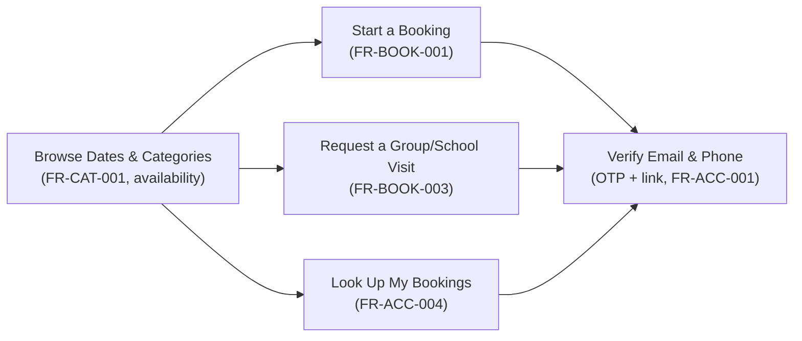
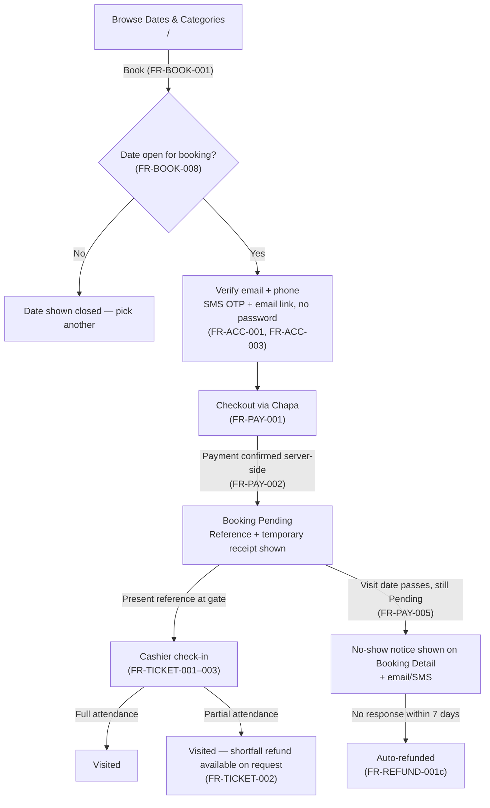
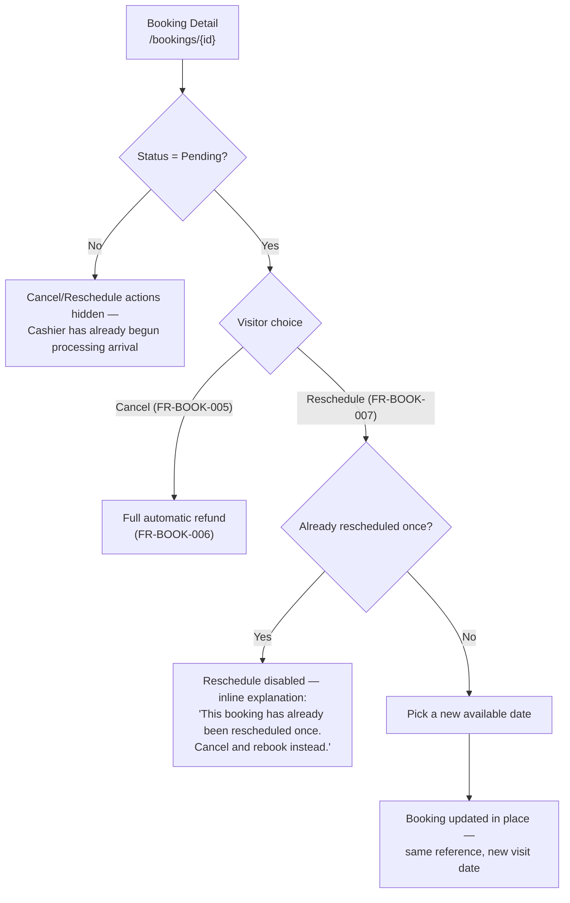
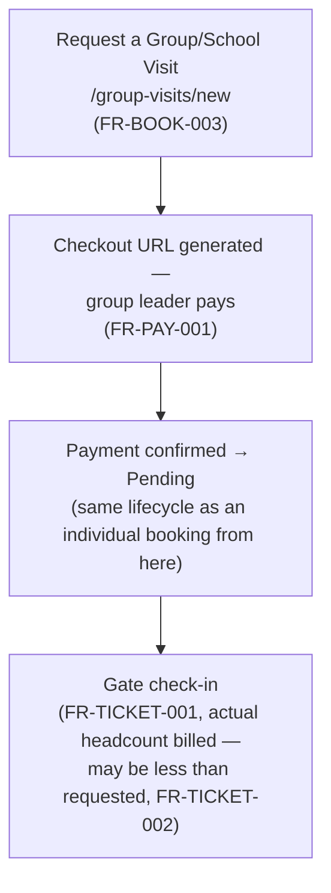
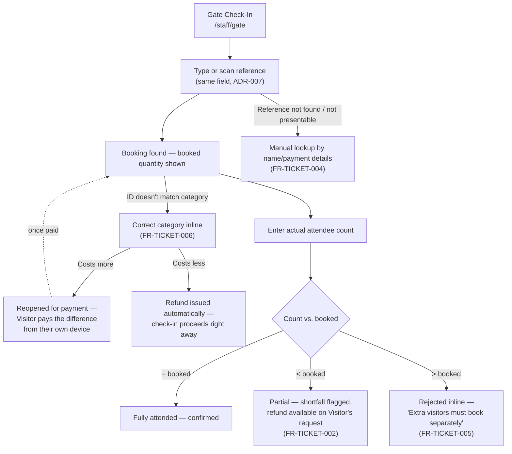
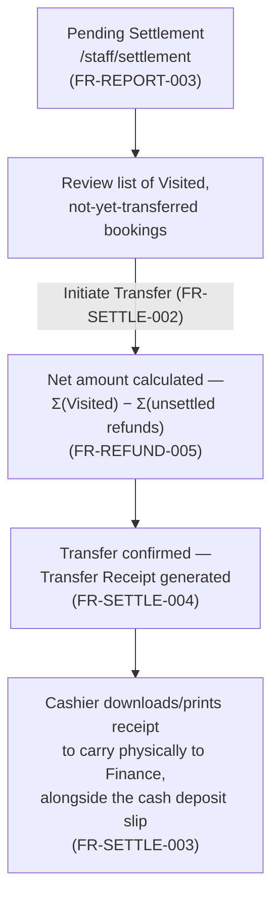

# 06 — UI/UX Specification

**Document type:** UI/UX Specification
**Project:** Museum Ticketing & Booking Platform
**Audience:** Frontend and mobile engineers, product designers, QA engineers, technical reviewers
**Status:** Complete — derived from and traceable to the SRS and SDS
**Related documents:** [01 — Product Overview](01-product-overview.md) (vision, personas, and the core product journey this document turns into screens) · [02 — Software Requirements Specification](02-software-requirements-specification.md) (source of every `FR-*`/`NFR-*` this document exposes to a user) · [03 — Software Design Specification](03-software-design-specification.md), [Section 7](03-software-design-specification.md#7-frontend-architecture) (rendering strategy, state management, and component organization this document's screens conform to) · [04 — API Specification](04-openapi-specification.yaml) (the contract each screen's data comes from) · [05 — Database Design](05-database-design.md) (the `status` and other enumerations `StatusBadge` and form controls render)

---

## 1. Introduction

### 1.1 Purpose

This document specifies **what the user sees and does**: the screen inventory, information architecture, key flows, and design-system rules for the Museum Ticketing & Booking Platform. Every screen listed here exposes one or more `FR-*`/`NFR-*` requirements from [Document 02](02-software-requirements-specification.md), and every screen's rendering strategy and component boundaries follow the frontend architecture already fixed in [Document 03, Section 7](03-software-design-specification.md#7-frontend-architecture). This document introduces no new product behavior — only the presentation and interaction layer for behavior already specified.

### 1.2 Scope

This document covers: the design principles that follow from this platform's specific constraints (Section 2), the design-system foundations shared across every screen (Section 3), the information architecture per role (Section 4), the full screen inventory with `FR-*` traceability (Section 5), the key end-to-end user flows (Section 6), the shared component library's organization (Section 7), accessibility and responsive design commitments (Section 8), bilingual localization behavior at the UI level (Section 9), and error/empty/loading state conventions (Section 10). It does not cover visual brand assets (logo, final color palette, imagery) or pixel-level mockups — those are a design-tool deliverable outside this document's scope and are referenced here only as design tokens.

### 1.3 Roles

Per [Document 02, Section 1](02-software-requirements-specification.md#1-roles), this document uses the same four system actors: **Visitor**, **Cashier**, **Museum Manager**, **Platform Admin**. Unlike a multi-role platform, an account holds exactly one of these roles for its lifetime (Document 03 §4.3) — there is no context switcher in this UI, because there is no second venue or role a staff account could switch between (ADR-004). The **Finance Office** and **Chapa** never see a screen in this document; they are external parties (Document 02 §1), not platform users.

---

## 2. Design Principles

| Principle | Implication |
|---|---|
| **Server is the source of truth for status and availability** | Per [Document 03, Section 7.2](03-software-design-specification.md#72-state-management), no screen renders a booking's status, a date's availability, or a reschedule/cancel eligibility from client-held state alone. A "Cancel" or "Reschedule" button visible on a stale cached page is always re-validated against the live API response before the action is allowed to proceed — this matters specifically because so many of Document 02's rules (one reschedule, the no-response window, headcount reconciliation) are timing-sensitive. |
| **One error contract, one error experience** | Every form on every screen renders validation errors using the single envelope shape defined in [Document 03, Section 6.5](03-software-design-specification.md#65-error-handling-and-api-response-contract) — inline, field-adjacent, in the active interface language — so the interaction pattern is identical whether the form is Visitor verification, a group-booking request, or the Cashier's check-in field. |
| **Bilingual by construction, not by translation layer** | Amharic and English are both first-class from the first release (FR-LOC-001–004); no screen is designed in English and "translated after." Layouts accommodate the roughly 20–30% text-length variance between the two languages (Amharic strings frequently run longer) without truncation, since both catalogs ship together (Document 03 §6.4). |
| **No optimistic UI for money-moving or state-changing actions** | Booking creation, payment, cancellation, reschedule, check-in, refund requests, and settlement transfers all show a pending state and wait for the API's authoritative response before updating the screen — never an optimistic client-side update rolled back on failure. This is the UI-layer expression of NFR-CONSIST-001 (atomicity) and NFR-IDEMPOTENT-001 (safe retries): a Cashier should never see a settlement appear to succeed and then silently revert. |
| **The gate console is built for the hardware that already exists** | The Cashier's check-in screen (Section 5.5) is a single reference-lookup text field that accepts both a typed code and a keyboard-wedge QR scan through the same input, because the counter has desktop terminals only — no tablets, no camera (Document 02 §F; ADR-007). Nothing in this UI assumes a camera-based scanning flow. |
| **No offline/degraded mode** | Per NFR-AVAIL-001, museum connectivity is reliable enough that no screen needs an offline fallback at this stage; every screen assumes a live connection to the API and shows a request-level error (Section 10) rather than a cached/stale view if that connection drops. |

---

## 3. Design System Foundations

### 3.1 Typography

| Token | Value | Rationale |
|---|---|---|
| `font-latin` | A humanist sans-serif with full Latin coverage (e.g., Inter or system-ui stack) | Body and UI text in English. |
| `font-ethiopic` | A sans-serif with full Ethiopic (Ge'ez) block coverage (e.g., Noto Sans Ethiopic) | Amharic text renders in this stack; paired with `font-latin` via a CSS `font-family` fallback list rather than swapped per locale, so a bilingual receipt (FR-LOC-002/003, rendering English and Amharic together on the *same* document) never falls back to tofu glyphs for either script. |
| Type scale | `text-xs` (12px) through `text-3xl` (30px), 5 steps, 1.25 ratio | Applied identically in both languages; a shared `line-height` token (1.5) accommodates Ethiopic script's taller x-height without a per-language override. |

### 3.2 Color roles

Colors are specified as semantic roles, not literal hex values, since final brand color selection is a design-tool deliverable outside this document's scope:

| Role token | Usage |
|---|---|
| `color-primary` | Primary actions (Book, Pay, Initiate Transfer), active nav state. |
| `color-surface` / `color-surface-alt` | Page and card backgrounds — the light/elevated distinction used across the Visitor site and Staff dashboard. |
| `color-text` / `color-text-muted` | Body text and secondary/meta text (booking reference, timestamps). |
| `color-success` / `color-warning` / `color-danger` | `StatusBadge` colors for the booking lifecycle (`Pending` amber, `Visited` green, `Cancelled`/`Refunded` neutral/red) and form validation states. |
| `color-focus` | Focus ring, distinct from `color-primary`, so keyboard-only staff (e.g., a Cashier tabbing through the check-in form without a mouse) always have a visible indicator independent of whichever brand color is ultimately chosen. |

### 3.3 Spacing and layout grid

- Spacing scale: 4px base unit, steps of 4/8/12/16/24/32/48/64.
- Breakpoints: `sm` 360px (minimum supported width, for the Visitor mobile app and small phones on the responsive web site), `md` 768px, `lg` 1024px, `xl` 1280px.
- The public Visitor site (Section 4.1) uses a single-column, mobile-first layout that widens to a 12-column grid at `lg`+. The Staff dashboard (Cashier / Museum Manager / Platform Admin) is designed **desktop-first** at `lg`+ with a fixed sidebar, since every staff screen is used at a counter workstation with an existing desktop terminal (Document 02 §F) — it degrades to a collapsible drawer below `lg` only as a fallback, not as its primary target.

### 3.4 Iconography

A single icon set is used platform-wide (outline style, 24px base grid) so icons never carry conflicting visual weight between the Visitor site and the Staff dashboard. Icons conveying meaning (booking status, an action button) carry an accessible label; purely decorative icons are marked `aria-hidden`.

---

## 4. Information Architecture

### 4.1 Public (unauthenticated) navigation

A Visitor can browse dates, categories, and prices with no verification step at all; verification (an
SMS OTP plus an email confirmation link — never a password, FR-ACC-001) is only required at the
point of actually booking, requesting a group visit, or looking up a past booking, matching the
current walk-in experience of "look, then decide" as closely as a digital flow can. There is no
"Login / Signup" screen for a Visitor — verifying *is* logging in (Document 03 §4.1.1), and the same
`Verify` step serves a first-time booker and a returning one identically.

### 4.2 Authenticated navigation (role-scoped)

There is no context switcher in this UI (Section 1.3) — the sidebar/menu a user sees is fixed to their one role:

| Navigation section | Visible to |
|---|---|
| My Bookings, Book a Visit, Request a Group Visit | `Visitor` |
| Gate Check-In, Settlement | `Cashier` |
| Date Availability, Ticket Categories, Dashboard, Reports | `Museum Manager` |
| Staff Accounts | `Platform Admin` |
| Account Settings, Language | All authenticated roles |

A Visitor's "authenticated" state here means a verified session issued by the passwordless flow in
Section 5.1 (FR-ACC-001), not a password login — the distinction matters only in how the session was
obtained; once issued, the Visitor's navigation and permissions are identical to what they would be
under any other credential scheme. Staff (`Cashier`, `Museum Manager`, `Platform Admin`) continue to
authenticate with a password (FR-ACC-005).

The Web application serves both the public Visitor site and the internal Staff dashboard, split by route (`/staff/*` for Cashier/Museum Manager/Platform Admin), per [Document 03, Section 2.2](03-software-design-specification.md#22-level-2--container-diagram) — there is no separate deployable app or subdomain for staff.

---

## 5. Screen Inventory

Every screen lists the `FR-*`/`NFR-*` IDs it exposes and its rendering strategy per [Document 03, Section 7.1](03-software-design-specification.md#71-structure) (`SSR` = server-rendered public page, `CSR` = client-rendered behind auth, `Native` = React Native mobile screen).

### 5.1 Auth & Account

| Screen | Route (Web) | Rendering | Role(s) | FR IDs exposed |
|---|---|---|---|---|
| Verify to book / look up bookings (email + phone → OTP + link) | `/verify` | SSR | Public — Visitor only | FR-ACC-001, FR-ACC-003, FR-ACC-004 |
| Staff log in (email + password) | `/staff/login` | SSR | Public (Staff only — Cashier, Museum Manager, Platform Admin) | FR-ACC-002, FR-ACC-005 |
| Staff forgot / reset password | `/staff/forgot-password`, `/staff/reset-password` | SSR | Public (Staff only) | FR-ACC-006 |
| Account settings (language, contact info) | `/settings/account` | CSR | All authenticated | FR-LOC-001 |

There is no "Sign up" screen and no password field anywhere in the Visitor experience — `/verify`
is both the first-time and the returning-Visitor entry point (FR-ACC-001, FR-ACC-004), and it is the
only auth screen exposed to Visitors. Staff login remains a conventional email+password screen,
now under its own `/staff/*` route since it no longer shares a screen with Visitor verification.

Mobile app mirrors Verify and Account Settings as native screens for the Visitor role only (ADR-006; Document 03 §7.1) — there is no Staff mobile experience.

### 5.2 Catalog & Availability

| Screen | Route | Rendering | Role(s) | FR IDs exposed |
|---|---|---|---|---|
| Browse categories & prices | `/` (embedded in home) | SSR | Public | FR-CAT-001 |
| Manage ticket categories | `/staff/categories` | CSR | Museum Manager | FR-CAT-002, FR-CAT-003 |
| Date availability calendar | `/staff/availability` | CSR | Museum Manager | FR-BOOK-008 |

### 5.3 Booking & Payment (Visitor)

| Screen | Route | Rendering | Role(s) | FR IDs exposed |
|---|---|---|---|---|
| Book a visit (date, category, quantity) | `/book` | CSR (browsable without verification; the `/verify` step, Section 5.1, is inserted before checkout, not before browsing) | Visitor | FR-BOOK-001, FR-PAY-001 |
| Checkout redirect / return | `/book/checkout` | CSR | Visitor | FR-PAY-001, FR-PAY-002 |
| Booking confirmed | `/bookings/{id}` | CSR | Visitor | FR-BOOK-004, FR-PAY-002 |
| My bookings (list) | `/bookings` | CSR | Visitor | FR-ACC-004 |
| Booking detail (reference, receipt, cancel/reschedule/refund actions) | `/bookings/{id}` | CSR | Visitor | FR-BOOK-005, FR-BOOK-006, FR-BOOK-007, FR-REFUND-001b |
| Request a group/school visit | `/group-visits/new` | CSR | Visitor (becomes group leader) | FR-BOOK-003 |

Mobile app mirrors Book a visit, Booking detail, and My bookings as native screens (ADR-006) — the same API, per [Document 03, Section 2.2](03-software-design-specification.md#22-level-2--container-diagram).

### 5.4 (Removed) Group Booking Approval

There is no Museum-Manager approval step for a group booking — see FR-BOOK-003 and Document 05's
`booking.status` note. A group visit is booked through the same `/group-visits/new` screen (Section
5.3) as before, with `date_availability` (FR-BOOK-008) as its only capacity control; this section
number is left in place, unused, rather than renumbering every section after it and the several
cross-references to them elsewhere in this document and in Documents 03/05.

### 5.5 Entrance / Gate Check-In (Cashier)

| Screen | Route | Rendering | Role(s) | FR IDs exposed |
|---|---|---|---|---|
| Gate lookup & check-in | `/staff/gate` | CSR | Cashier | FR-TICKET-001 – FR-TICKET-006 |

This is a single screen, not a multi-step flow: one reference-lookup field, a result card showing
booked quantity, and an attendance-count field to submit (Section 6.4). The result card also has an
inline "Correct" action next to the category (FR-TICKET-006, ID-verification addendum), available
only before check-in -- it opens a category picker in place, and the outcome (reopen-for-payment or
automatic refund) is reported back in a toast; there is no separate screen or route for it.

### 5.6 Refunds

| Screen | Route | Rendering | Role(s) | FR IDs exposed |
|---|---|---|---|---|
| Request a refund (partial-attendance shortfall) | Embedded in `/bookings/{id}` (Visitor) | CSR | Visitor | FR-REFUND-001b, FR-REFUND-002 |
| Refunds list (oversight) | `/staff/refunds` | CSR | Museum Manager | FR-REFUND-001 – FR-REFUND-005 |

There is no dedicated Visitor "refunds" screen — a refund is always initiated from, and its outcome always shown on, the booking it belongs to (Booking Detail, Section 5.3), since a refund has no meaning independent of its booking.

### 5.7 Settlement (Cashier / Museum Manager)

| Screen | Route | Rendering | Role(s) | FR IDs exposed |
|---|---|---|---|---|
| Pending settlement (Visited, not yet transferred) | `/staff/settlement` | CSR | Cashier | FR-SETTLE-001, FR-REPORT-003 |
| Settlement transfer confirmation & receipt | `/staff/settlement/transfers/{id}` | CSR | Cashier, Museum Manager | FR-SETTLE-002 – FR-SETTLE-004 |
| Settlement history | `/staff/settlement/transfers` | CSR | Cashier, Museum Manager | FR-SETTLE-001 |

### 5.8 Reporting & Dashboard

| Screen | Route | Rendering | Role(s) | FR IDs exposed |
|---|---|---|---|---|
| Dashboard (revenue, status mix, group vs. individual) | `/staff/dashboard` | CSR | Museum Manager, Platform Admin | FR-REPORT-001 |
| Periodic reports (daily/weekly/monthly/yearly) | `/staff/reports` | CSR | Museum Manager, Platform Admin | FR-REPORT-002 |

### 5.9 Staff Administration (Platform Admin)

| Screen | Route | Rendering | Role(s) | FR IDs exposed |
|---|---|---|---|---|
| Staff accounts (list, provision, deactivate) | `/staff/admin/staff` | CSR | Platform Admin | FR-ACC-002 |

### 5.10 Localization

The language toggle (FR-LOC-001) is not a standalone screen; it is a persistent control in the global header (`components/ui`, Section 7), present on every screen in this inventory, on both Web and Mobile.

---

## 6. Key User Flows

### 6.1 Visitor: browse → book → pay → check in → resolve (the core product journey)

*UI note:* the "Date open for booking?" check at B is always re-validated against the live `/availability` response at the moment of booking, never against a value cached from when the Visitor first loaded the page (Section 2's "server is the source of truth" principle) — a date the Museum Manager closes mid-session must reject the booking, not silently accept it.

### 6.2 Visitor: cancel or reschedule a Pending booking

*UI note:* the reschedule cap in E is a hard `rescheduled_count <= 1` database constraint (Document 05 §3.3), not just a UI affordance — the button is disabled with the explanation shown, rather than left enabled to fail with a raw error, directly satisfying FR-BOOK-007's intent at the UI layer.

### 6.3 Group/school visit: request → payment → check-in

*UI note:* a group booking follows the exact same flow as an individual one from creation onward —
there is no Museum-Manager review step in between (see Section 5.4). A group booking's headcount
shown at check-in (G) is always the number actually confirmed at the gate, which may differ from
what was requested at step A — the UI never presents the originally requested count as final once
check-in has occurred.

### 6.4 Cashier: gate check-in and headcount reconciliation

*UI note:* because a keyboard-wedge scanner emulates keyboard input, the reference field at B never has a separate "scan" mode or camera viewfinder — a scan and a typed entry are visually and functionally identical to the Cashier, matching ADR-007 exactly. The category-correction branch (J) is only ever offered before D — once attendance is recorded the booking is no longer `Pending` (FR-TICKET-003) and the "Correct" action is hidden, not just disabled, matching how every other Pending-only action in this UI (cancel, reschedule) already behaves once a booking moves on.

### 6.5 Cashier: settlement transfer

*UI note:* this action has no partial or per-booking mode — the "Initiate Transfer" button always covers the entire pending set shown on screen, per FR-SETTLE-001's "batches, on the Cashier's own timeline" model; there is no per-row "transfer just this one" control, because that is not how the underlying business process works.

---

## 7. Component Library Organization

Mirrors the frontend module boundaries fixed in [Document 03, Section 7.3](03-software-design-specification.md#73-component-organization), matching the same module names used in the backend (Document 03 §3.2):

| Directory | Contents | Examples |
|---|---|---|
| `components/ui` | Feature-agnostic presentational primitives | Button, TextField, Select, DatePicker, Modal, Toast, LanguageToggle, StatusBadge, ErrorBanner |
| `features/account` | Visitor passwordless verification, Staff password login/reset, settings | VisitorVerifyForm (email+phone, then OTP), StaffLoginForm, StaffForgotPasswordForm, LanguagePreferenceToggle |
| `features/catalog` | Category browsing and Museum Manager category management | CategoryCard, CategoryEditor |
| `features/booking` | Visitor booking flow and booking detail | DateCategoryPicker, BookingSummary, BookingDetailCard, CancelRescheduleControls |
| `features/group-bookings` | Group/school request | GroupVisitRequestForm |
| `features/entrance` | Cashier gate console | ReferenceLookupField, AttendanceEntryForm, CategoryCorrectionPanel |
| `features/refunds` | Refund request and staff visibility | RefundRequestButton, RefundHistoryTable |
| `features/settlement` | Cashier settlement flow | PendingSettlementTable, TransferConfirmationCard, TransferReceiptViewer |
| `features/reporting` | Dashboard and periodic reports | RevenueSummaryCard, StatusMixChart, CategoryBreakdownTable |
| `features/admin` | Platform Admin staff tools | StaffAccountTable, ProvisionStaffModal |

`StatusBadge` is the single component used everywhere a `booking.status`, `payment.status`, `refund.status`, or `settlement_transfer.status` value is displayed (Document 05, Section 3), so a status color/label mapping is defined once and cannot drift between the Visitor site and the Staff dashboard.

---

## 8. Accessibility and Responsive Design

Document 02 does not enumerate dedicated accessibility (`NFR-ACC-*`) or usability-testing (`NFR-USE-*`) requirement IDs the way it does for security or consistency. The commitments below are treated as standard good practice for a public-facing, bilingual government-adjacent service, not as claims traced to a specific requirement ID:

| Commitment | Implementation |
|---|---|
| Keyboard operability | Every interactive element in `components/ui` ships a visible focus state using `color-focus` (Section 3.2) and a logical tab order — important specifically for the Cashier's gate console (Section 5.5), which is used at speed with a keyboard-wedge scanner and rarely a mouse. |
| Screen-reader support | Status badges and icons conveying meaning carry an accessible label sourced from the same locale catalog as surrounding copy (Section 9), never a hardcoded English default. |
| Minimum tap target | 44×44px minimum for every interactive control on the Visitor mobile app and responsive web site, regardless of the Amharic/English label length (Section 3.1). |
| Responsive behavior | The Visitor site and mobile app are designed mobile-first down to 360px (Section 3.3); the Staff dashboard is designed desktop-first, since every staff screen maps to an existing counter workstation (Document 02 §F) rather than a phone. |
| Contrast | All color-role pairings (Section 3.2) are contrast-checked against WCAG 2.1 AA thresholds (4.5:1 text, 3:1 large text/UI components) independent of final palette choice, as a baseline quality bar for a public service. |

---

## 9. Localization and Bilingual UI

- The language toggle (FR-LOC-001) is a two-state control (English / አማርኛ) in the global header on both Web and Mobile, persisted via the authenticated user's `language_preference` (Document 05 §3.1) so it follows the Visitor between the web site and the mobile app; for a Visitor browsing before verification (Section 5.1), the choice is held client-side for that session only.
- The SMS OTP message and the email confirmation link (FR-ACC-001) are each sent in the Visitor's currently selected interface language, using the same bilingual template approach as every other generated notice (Document 03 §6.4) — a Visitor verifying in Amharic never receives an English-only OTP text.
- Every generated document — the temporary receipt (FR-PAY-002) and the Transfer Receipt (FR-SETTLE-004) — renders both languages together on the **same** document, including the amount in words in both Amharic and English (FR-LOC-003), matching the single-bilingual-template approach in [Document 03, Section 6.4](03-software-design-specification.md#64-internationalization-implementation-fr-loc-001004). The UI never offers a language toggle *on* a rendered receipt PDF — it is bilingual by construction, not by view state.
- Any staff-editable text — category names (Section 5.2), the settlement transfer's purpose line (Document 05 §3.6) — is edited through two explicit input fields (English, Amharic) side by side in the relevant admin form, never a single field with a "translate" button, per FR-LOC-004's independent-maintainability requirement.
- Because layouts must absorb the English/Amharic length variance (Section 3.1), no navigation label, button, or `StatusBadge` in the component library uses a fixed pixel width; all use intrinsic sizing with the minimum tap target from Section 8 regardless of label length.

---

## 10. Error, Empty, and Loading States

| State | Convention |
|---|---|
| Field-level validation error | Rendered inline beneath the field, sourced from the error envelope's `fieldErrors` map (Document 03 §6.5), in `color-danger`, with the field's `aria-invalid` and `aria-describedby` set for screen-reader users. |
| Request-level error (4xx/5xx) | A dismissible `ErrorBanner` at the top of the relevant panel, using the envelope's `message` (already localized server-side per Document 03 §6.4) — e.g., "This date is closed to online booking" (FR-BOOK-008) or "This booking has already been checked in" — never a raw HTTP status code shown to the user. |
| Empty state (e.g., no bookings yet, nothing pending settlement) | A dedicated empty state with a single primary action ("Browse dates," for a Visitor with no bookings; "Nothing to settle," with no action, for a Cashier whose queue is clear) — never a blank panel. |
| Loading state | Skeleton placeholders matching the target content's layout for CSR panels (avoids layout shift on the Staff dashboard and My Bookings list); the public browse screen (SSR) has no client-visible loading state for its primary content. |
| Optimistic UI | Not used for any of the actions listed in Section 2's "no optimistic UI" principle — booking creation, cancellation, reschedule, check-in, refund requests, and settlement transfers all show a pending state and wait for the API's authoritative response. |

---

## 11. Requirement Traceability

| Requirement | Screen(s) / Flow(s) |
|---|---|
| FR-ACC-001, FR-ACC-003, FR-ACC-004 | Section 5.1 (`/verify`), Section 5.3 (My Bookings) |
| FR-ACC-002, FR-ACC-005, FR-ACC-006 | Section 5.1 (`/staff/login`, `/staff/forgot-password`, `/staff/reset-password`), Section 5.9 |
| FR-ACC-007 | Section 5.8 (Reporting) — activity is attributable to a verified email/phone for every Visitor, one-time or repeat, since there is a single verification flow (Section 5.1) rather than a separate guest/account choice |
| FR-CAT-001 – FR-CAT-003 | Section 5.2 |
| FR-BOOK-001 – FR-BOOK-002 | Section 5.3, Flow 6.1 |
| FR-BOOK-003 | Section 5.3, Flow 6.3 |
| FR-BOOK-004 | Flow 6.1 |
| FR-BOOK-005 – FR-BOOK-007 | Section 5.3, Flow 6.2 |
| FR-BOOK-008 | Section 5.2, Flow 6.1 |
| FR-PAY-001 – FR-PAY-004 | Section 5.3, Flow 6.1 |
| FR-PAY-005 | Flow 6.1 (no-show notice on Booking Detail) |
| FR-TICKET-001 – FR-TICKET-006 | Section 5.5, Flow 6.4 |
| FR-REFUND-001 – FR-REFUND-005 | Section 5.6, Section 5.5 (FR-REFUND-001d is surfaced inline in the gate console, not a separate refunds screen) |
| FR-SETTLE-001 – FR-SETTLE-004 | Section 5.7, Flow 6.5 |
| FR-REPORT-001 – FR-REPORT-003 | Section 5.7 (Pending Settlement), Section 5.8 |
| FR-GOV-001 – FR-GOV-002 | No screen — deliberately no IFMIS-facing UI exists (Document 02 §2.9) |
| FR-LOC-001 – FR-LOC-004 | Section 5.10, Section 9 |
| NFR-SEC-001, NFR-IDEMPOTENT-001, NFR-CONSIST-001 | Section 2 ("no optimistic UI" principle) |
| NFR-AUDIT-001 | Section 5.5, 5.7 (every check-in and transfer is an explicit, attributable staff action, never a background/bulk edit) |
| NFR-PERF-001 | Section 10 (loading-state conventions keep perceived latency low without misleading optimism) |
| NFR-AVAIL-001 | Section 2 ("no offline/degraded mode" principle) |
| NFR-LOCALE-001 | Section 9 |
| NFR-RETENTION-001 | Section 5.7 (Settlement History), Section 5.6 (Refunds list) — both remain viewable, never purged from the UI |

---

*End of Document 06.*
