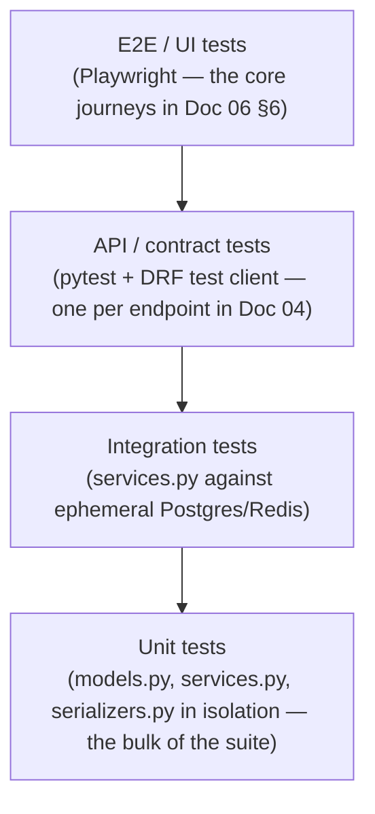
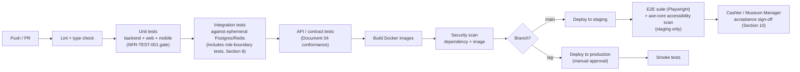

# 07 — Testing and Quality Assurance

**Document type:** Testing and Quality Assurance Plan
**Project:** Museum Ticketing & Booking Platform
**Audience:** QA engineers, backend engineers, frontend/mobile engineers, technical reviewers
**Status:** Complete — derived from and traceable to the SRS, SDS, Database Design, and UI/UX Specification
**Related documents:** [02 — Software Requirements Specification](02-software-requirements-specification.md) (source of every `FR-*`/`NFR-*` this document verifies) · [03 — Software Design Specification](03-software-design-specification.md), [Section 3.1](03-software-design-specification.md#31-layering-convention) (the layering this document's unit/integration split is built on) and [Section 8.3](03-software-design-specification.md#83-cicd-pipeline) (the pipeline this document's gates extend) · [04 — API Specification](04-openapi-specification.yaml) (the contract API/contract tests verify) · [05 — Database Design](05-database-design.md) (the constraints this document's schema-level tests verify) · [06 — UI/UX Specification](06-ui-ux-specification.md) (the screens and flows this document's usability/accessibility/E2E tests exercise)

---

## 1. Introduction

### 1.1 Purpose

This document specifies **how the Museum Ticketing & Booking Platform is verified**: the testing levels applied to each architectural layer fixed in [Document 03](03-software-design-specification.md), the tooling and environments used, the exit criteria tied to the non-functional requirements in [Document 02, Section 3](02-software-requirements-specification.md#3-non-functional-requirements), the CI/CD test gate pipeline, functional test design per backend module, non-functional test methodology, the role-based authorization test strategy this single-venue system needs instead of multi-tenancy testing, defect management, pilot/UAT acceptance testing, and a full requirement-to-test traceability matrix.

### 1.2 Scope

This document covers test strategy and methodology (Section 2), environments and tooling (Section 3), coverage and exit criteria (Section 4), the CI/CD test gate pipeline (Section 5), functional test design per module (Section 6), non-functional test methodology (Section 7), role-based authorization test strategy (Section 8), defect management (Section 9), pilot/acceptance testing before go-live (Section 10), and the full traceability matrix (Section 11). It does not cover deployment mechanics themselves (image promotion, rollback, monitoring configuration) — those are specified in [Document 03, Section 8](03-software-design-specification.md#8-deployment-architecture); this document specifies only the tests that gate that promotion, since this project set does not include a separate deployment/DevOps document.

### 1.3 Test identification format

Every functional test case in this document has an ID of the form `TC-<MODULE>-<NNN><suffix>`, where `<MODULE>` matches the `FR-*` prefix used in [Document 02, Section 2](02-software-requirements-specification.md#2-functional-requirements) (`ACC`, `CAT`, `BOOK`, `PAY`, `TICKET`, `REFUND`, `SETTLE`, `REPORT`, `GOV`, `LOC`) and `<NNN>` matches the `FR-*` number it verifies — so a test ID is traceable to its requirement on sight (e.g., `TC-BOOK-007a` verifies the first acceptance criterion of FR-BOOK-007, the one-reschedule cap). Non-functional test cases use `TC-NFR-<ID>`, matching the single corresponding `NFR-*` ID directly (e.g., `TC-NFR-RETENTION-001`), since [Document 02, Section 3](02-software-requirements-specification.md#3-non-functional-requirements) defines each NFR as one ID rather than a numbered range.

---

## 2. Testing Strategy and Levels

The test pyramid mirrors the four-layer backend convention fixed in [Document 03, Section 3.1](03-software-design-specification.md#31-layering-convention) and the three-client structure fixed in [Document 03, Section 7.1](03-software-design-specification.md#71-structure):

| Level | What it exercises | Why here |
|---|---|---|
| **Unit** | `services.py` business logic in isolation (Chapa/email/SMS calls mocked), `serializers.py` field validation, `models.py` constraints | Business rules live in `services.py` by design (Document 03 §3.1), so acceptance criteria expressed as business behavior — FR-BOOK-007's one-reschedule cap, FR-REFUND-003's fee-netting, FR-PAY-004's duplicate-confirmation guard — are tested directly, without HTTP overhead. This is also the layer NFR-TEST-001 is written against: "every function that moves money or changes booking status has a defined happy-path and failure-path test case." |
| **Integration** | `services.py` and `models.py` together against a real ephemeral Postgres/Redis, including the Celery jobs in [Document 03, Section 6.1](03-software-design-specification.md#61-background-job-design) | Business logic that spans multiple models and a queued job — e.g., recording attendance (`entrance`) then flagging a refund-eligible shortfall (`refunds`), or the daily no-response check writing a notice and later a refund (Document 03 §5.2) — needs a real transaction boundary and a real broker to verify correctly. |
| **API / contract** | `views.py` and `serializers.py` via the DRF test client against [Document 04](04-openapi-specification.yaml)'s contract | Verifies HTTP status codes, the shared error envelope (Document 03 §6.5), and role-based authorization behavior (Section 8) at the boundary a real client (Web, Mobile, or Staff dashboard) hits. |
| **E2E / UI** | Full user journeys through the rendered frontend (Playwright, headless Chromium) against a staging-equivalent stack | Reserved for the critical paths in [Document 06, Section 6](06-ui-ux-specification.md#6-key-user-flows): browse→book→pay→check-in→resolve (6.1), cancel/reschedule (6.2), group visit request→approval→payment→check-in (6.3), gate check-in (6.4), and settlement transfer (6.5) — since full-stack E2E tests are the most expensive to write and maintain and are not a substitute for the lower levels. |

Frontend component logic (`components/ui`, `features/*` per Document 06 §7) is unit-tested with a component-testing tool (e.g., Testing Library) at the same pyramid position as backend unit tests, on both the Web (Next.js) and Mobile (React Native) codebases, independent of the E2E layer above.

---

## 3. Test Environments and Tooling

| Environment | Purpose | Data |
|---|---|---|
| `development` (local Docker Compose) | Developer-run unit/integration tests on every save | Seeded fixture data — categories, sample bookings — per [Document 03, Section 8.2](03-software-design-specification.md#82-environments) |
| CI (ephemeral, per-PR) | Automated unit, integration, API, and security-scan gates (Section 5) | Fresh ephemeral Postgres/Redis containers per run, no persisted state between runs |
| `staging` | E2E suite, Cashier/Museum Manager acceptance testing, performance and accessibility checks, before go-live | Mirrors production topology at reduced scale (Document 03 §8.2); synthetic bookings, payments (Chapa test mode), and settlement transfers — since this is a single-venue system there is no tenant-isolation data to seed, only role-separated staff accounts (Cashier, Museum Manager, Platform Admin) and Visitor accounts |
| `production` | Smoke tests only, post-deploy (Document 03 §8.3) | Real data; no destructive or load testing is ever run here, and no refund/settlement test transactions are ever run against the live Chapa account |

| Concern | Tooling |
|---|---|
| Backend unit/integration/API tests | `pytest` + `pytest-django`, DRF `APIClient` |
| Frontend unit/component tests | Testing Library (component tests co-located with `features/*` per Document 06 §7, run on both the Web and Mobile codebases) |
| E2E tests | Playwright, run against `staging` |
| Performance/load tests | k6, run against `staging` only |
| Accessibility checks | Automated: `axe-core` integrated into the E2E suite for every public (SSR) Visitor screen per [Document 06, Section 5](06-ui-ux-specification.md#5-screen-inventory); manual: a keyboard-only pass and a screen-reader spot check before each release touching a public or gate-console screen, per the commitments in [Document 06, Section 8](06-ui-ux-specification.md#8-accessibility-and-responsive-design) |
| Payment integration testing | Chapa's sandbox/test-mode checkout and webhook signing, used in `staging` and CI integration tests — the real Chapa account is never used outside `production` |
| Security scanning | Dependency and container image scanning in CI (Document 03 §8.3); a manual review of the webhook-verification and refund/settlement code paths before first production go-live |
| Coverage measurement | `coverage.py` (backend), integrated into the CI unit-test stage |

---

## 4. Coverage and Exit Criteria

Unlike a larger multi-tenant platform, [Document 02, Section 3](02-software-requirements-specification.md#3-non-functional-requirements) does not fix a numeric coverage percentage or a dedicated maintainability NFR — the closest requirement is **NFR-TEST-001**, which is qualitative: every money-moving or status-changing function needs a defined happy-path and failure-path test case. This document therefore treats a coverage percentage as a QA best-practice target that operationalizes NFR-TEST-001, not as a requirement ID in its own right.

| Gate | Threshold | Enforced by |
|---|---|---|
| Backend business-logic coverage (QA best practice, operationalizes NFR-TEST-001) | ≥ 80%, with 100% of `bookings`, `payments`, `refunds`, and `settlement` service functions covered by an explicit happy-path **and** failure-path case | CI unit-test stage; a PR that drops coverage below threshold, or that adds a money/status-changing function with no failure-path test, fails the build (Section 5) |
| Requirement traceability | Every `FR-*` in [Document 02, Section 2](02-software-requirements-specification.md#2-functional-requirements) has ≥ 1 automated test | Section 11 of this document, reviewed at each Document 02 revision |
| Authorization coverage | Every `FR-*` with an access-restriction acceptance criterion (e.g., FR-ACC-002's staff-only provisioning, FR-BOOK-003's Manager-only approval, FR-TICKET-001's Cashier-only check-in) has a dedicated role-boundary test | Section 8 of this document |
| Idempotency and consistency | `payment.tx_ref` duplicate-confirmation and settlement-transfer double-run cannot apply a financial effect twice (NFR-IDEMPOTENT-001, NFR-CONSIST-001) | Dedicated integration tests, Section 7.2 |
| Auditability | Every refund, settlement transfer, date closure, check-in, and cancel/reschedule writes exactly one `audit_log` row (NFR-AUDIT-001) | Dedicated integration tests, Section 7.2 |
| Localization completeness | No user-facing string or generated document ships in only one language (NFR-LOCALE-001) | CI catalog-parity check, Section 7.4 |
| Retention | No application code path physically deletes a `booking`, `payment`, `refund`, `settlement_transfer`, `category`, or `account` row (NFR-RETENTION-001) | Static review + a dedicated test asserting the ORM exposes no hard-delete path for these models, Section 7.5 |

A release is blocked from production promotion if any threshold above is not met; there is no override path short of a documented, time-boxed exception approved by whoever owns the deployment decision (Document 03 §8.2–8.3).

---

## 5. CI/CD Test Gate Pipeline

This extends the pipeline already fixed in [Document 03, Section 8.3](03-software-design-specification.md#83-cicd-pipeline) with the specific test responsibilities at each stage — the stage names below are the same ones Document 03 defines; this document adds what each one verifies:

A failing stage blocks progression, consistent with Document 03 §8.3. The E2E and accessibility stages run only against `staging`, never in the per-PR ephemeral CI environment, since they require a full running stack (web, API, worker, database) rather than isolated test containers. The API/contract stage is inserted between integration tests and image build, ahead of Document 03's original sequence, so a contract break is caught before an image is even built.

---

## 6. Functional Test Strategy by Module

Each module's test design follows the pyramid in Section 2: unit tests cover every acceptance criterion expressible without cross-service orchestration; integration and API tests cover the rest; E2E tests cover only the journeys in [Document 06, Section 6](06-ui-ux-specification.md#6-key-user-flows). Representative (not exhaustive) test cases per module, using the Django app names from [Document 03, Section 3.2](03-software-design-specification.md#32-module-to-requirement-mapping):

| Module (Django app) | Representative test cases | Level |
|---|---|---|
| **accounts** (`FR-ACC`) | `TC-ACC-001a` OTP confirmation rejected once expired or after the max incorrect-attempt count (Document 05 `phone_otp_attempts`) · `TC-ACC-001b` no `password` field is accepted or stored on any Visitor-facing endpoint · `TC-ACC-002a` Cashier/Manager accounts cannot self-register, only Platform-Admin-provisioned · `TC-ACC-003a` booking payment blocked until both email and phone are verified · `TC-ACC-004a` a Visitor's booking history returns only their own bookings, and re-verifying the same email/phone re-authenticates into the same account · `TC-ACC-005a` Staff login rejected without a correct password; Visitor credentials never satisfy `/auth/login` · `TC-ACC-006a` a Staff password-reset token is single-use and expires; `/auth/forgot-password` and `/auth/reset-password` return 404-equivalent behavior (a generic 200) for a non-staff or unknown email, never confirming account existence | Unit + API |
| **catalog** (`FR-CAT`) | `TC-CAT-001a` seeded categories match the five current price points (Student 50 ETB, Adult/Teacher 100 ETB, Foreign Resident 300 ETB, Non-Resident 500 ETB, Exempt/Free) · `TC-CAT-002a` non-Museum-Manager category edit rejected (Visitor, Cashier, and Platform Admin all receive 403) · `TC-CAT-002b` a price change does not alter the price snapshot on an already-issued booking · `TC-CAT-003a` no discount is ever applied regardless of quantity | Unit + Integration |
| **bookings** (`FR-BOOK`) | `TC-BOOK-001a` individual booking created for an open date · `TC-BOOK-003a` group booking request routes to Museum Manager approval queue · `TC-BOOK-004a` booking reference generated only after payment confirmation, never before · `TC-BOOK-005a` cancel rejected once status is no longer `Pending` · `TC-BOOK-006a` cancelling a `Pending` booking enqueues a full automatic refund · `TC-BOOK-007a` a second reschedule attempt on the same booking is rejected · `TC-BOOK-008a` closing a date rejects new bookings for it but leaves existing bookings for that date untouched | Unit + Integration + E2E |
| **payments** (`FR-PAY`) | `TC-PAY-001a` checkout funds route to the platform's own Chapa account, never a Finance Office account · `TC-PAY-002a` a client-side checkout redirect alone does not confirm a booking; only a verified webhook does · `TC-PAY-002b` confirmation issues a temporary receipt and sets status to `Pending` · `TC-PAY-004a` a duplicate webhook for the same `tx_ref` is a no-op, not a second confirmation · `TC-PAY-005a` a `Pending` booking past its visit date with no attendance triggers the reschedule-or-refund notice exactly once · `TC-PAY-005b` no response within 7 days of the notice triggers an automatic full refund and sets status `Refunded` | Unit + Integration |
| **entrance** (`FR-TICKET`) | `TC-TICKET-001a` gate lookup by typed reference and by keyboard-wedge-scanned QR both resolve the same booking (ADR-007) · `TC-TICKET-002a` partial attendance (e.g., 15 of 20) sets status `Visited` without auto-refunding the shortfall · `TC-TICKET-003a` a `Visited` booking can no longer be cancelled or rescheduled · `TC-TICKET-004a` manual lookup by name/payment details succeeds when the reference cannot be presented · `TC-TICKET-005a` attendance exceeding the booked quantity is rejected; excess visitors are not admitted under the original booking | Unit + Integration |
| **refunds** (`FR-REFUND`) | `TC-REFUND-001a` each of the three refund triggers (cancellation, shortfall request, no-response) produces exactly one refund record · `TC-REFUND-002a` refundable amount is computed from recorded attendance, never entered by hand · `TC-REFUND-003a` refunded amount is net of Chapa's transaction fee · `TC-REFUND-004a` a refund is its own traceable transaction (original charge − fee − refund) · `TC-REFUND-005a` a refund issued after its booking was already settled is deducted from the **next** settlement transfer, never retroactively altering a past one | Unit + Integration |
| **settlement** (`FR-SETTLE`) | `TC-SETTLE-001a` a batch transfer includes every `Visited`, not-yet-settled booking regardless of when it was checked in · `TC-SETTLE-002a` a single Cashier action nets out refunds and produces a Transfer Receipt with amount, covered bookings, and a reference number · `TC-SETTLE-003a` the Transfer Receipt renders independently of, and never merges with, the manual-track cash deposit slip · `TC-SETTLE-004a` the Transfer Receipt carries amount-in-figures, amount-in-words (both languages), purpose, date, and reference number | Unit + Integration + E2E |
| **reporting** (`FR-REPORT`) | `TC-REPORT-001a` dashboard revenue/status-mix figures match the underlying `booking`/`payment`/`settlement_transfer` rows · `TC-REPORT-002a` daily/weekly/monthly/yearly report granularities all return correct sums · `TC-REPORT-003a` a `Visited` booking already included in a transfer is excluded from the pending-settlement list | Unit + API |
| **(no dedicated app — design conformance)** (`FR-GOV`) | `TC-GOV-001a` static/architecture review confirms no code path calls an IFMIS endpoint or writes to a Finance-Office-owned datastore | Design review (not automated) |
| **Cross-cutting** (`FR-LOC`) | `TC-LOC-001a` every Visitor/Cashier-facing string renders in both Amharic and English and can be switched at any time · `TC-LOC-002a` every generated document (temporary receipt, Transfer Receipt, no-show notice) presents both languages together on one document · `TC-LOC-003a` an amount-in-words renders correctly in both languages · `TC-LOC-004a` editing a category name or notice text in one language never alters the other | E2E + Integration |
| **notifications** (cross-cutting) | `TC-NOTIFY-001a` booking-confirmation and no-show notices are sent by both email and SMS, with email as the default/primary channel · `TC-NOTIFY-002a` an SMS gateway failure never blocks or delays the corresponding email | Integration |
| **platform_admin** (staff-facing part of `FR-ACC-002`) | `TC-ADMIN-001a` non-Platform-Admin receives 403 on every staff-provisioning endpoint · `TC-ADMIN-001b` deactivating a staff account does not remove that account's historical `checked_in_by_user_id`/`actor_user_id` references from past bookings or audit rows | API + Integration |

---

## 7. Non-Functional Test Methodology

Document 02's non-functional requirements are each a single ID (not a numbered range), so each gets one direct test entry below.

### 7.1 Performance (NFR-PERF-001)

| Test | Method |
|---|---|
| `TC-NFR-PERF-001` | k6 script against `staging`: create/update a booking, a check-in, and a settlement transfer, and assert the staff dashboard (`/staff/dashboard`) reflects each change within a few seconds — consistent with notifications being entirely off the request path (Document 03 §6.1). |

### 7.2 Security, idempotency, consistency, and audit (NFR-SEC-001, NFR-IDEMPOTENT-001, NFR-CONSIST-001, NFR-AUDIT-001)

| Test | Method |
|---|---|
| `TC-NFR-SEC-001` | Attempt to confirm a booking via a forged/unsigned webhook payload and via a client-only "payment succeeded" signal with no matching Chapa confirmation; assert both are rejected and the booking stays `AwaitingPayment`. |
| `TC-NFR-IDEMPOTENT-001` | Replay the same Chapa webhook (same `tx_ref`) and the same settlement-transfer request twice; assert the second attempt is a no-op and produces no duplicate financial effect (backed by `payment.tx_ref UNIQUE`, Document 05 §4). |
| `TC-NFR-CONSIST-001` | Force a failure mid-transaction (e.g., kill the process after the Chapa refund call but before the DB write) in an integration test harness; assert the booking/refund state never lands in a partially-applied state — either the whole operation committed or none of it did. |
| `TC-NFR-AUDIT-001` | For each of: a cancellation, a reschedule, a check-in, a refund, a settlement transfer, and a date closure — assert exactly one `audit_log` row is written with the correct `actor_user_id` (or `NULL` for the two system-initiated jobs, Document 05 §3.7), `action`, `entity_type`/`entity_id`, and timestamp. |

### 7.3 Availability (NFR-AVAIL-001)

`TC-NFR-AVAIL-001`: since Document 02 deliberately excludes an offline/degraded gate-validation mode (§4), this is verified as a design-conformance check rather than a failover drill — confirm the gate check-in screen ([Document 06, Section 5.5](06-ui-ux-specification.md#55-entrance--gate-check-in-cashier)) has no offline queue or local-cache fallback, and that a connectivity loss surfaces a clear error rather than silently accepting an unverifiable check-in.

### 7.4 Localization (NFR-LOCALE-001)

- `TC-NFR-LOCALE-001`: a CI lint step (not a runtime test) fails a PR that adds a new user-facing string to only one of the two locale catalogs (English/Amharic), enforcing "both languages before ship" at review time, per [Document 03, Section 6.4](03-software-design-specification.md#64-internationalization-implementation-fr-loc-001004).
- Covered together with `TC-LOC-001a`–`TC-LOC-004a` in Section 6, since NFR-LOCALE-001 and the FR-LOC-* requirements describe the same bilingual behavior at the NFR and FR level respectively.

### 7.5 Retention (NFR-RETENTION-001)

| Test | Method |
|---|---|
| `TC-NFR-RETENTION-001` | Static review of `booking`, `payment`, `refund`, `settlement_transfer`, `category`, and `account` service functions confirming no code path issues a hard `DELETE`; an integration test attempts to "delete" a `category` and a Cashier `account` and asserts each is retired/deactivated in place, per [Document 05, Section 5](05-database-design.md#5-data-retention-nfr-retention-001), with all historical foreign-key references (e.g., `checked_in_by_user_id`) still resolving afterward. |

### 7.6 Accessibility and usability (good practice, not a numbered NFR)

Per [Document 06, Section 8](06-ui-ux-specification.md#8-accessibility-and-responsive-design), Document 02 does not enumerate dedicated `NFR-ACC-*` or `NFR-USE-*` requirement IDs. This document tests the commitments in Document 06 §8 as QA best practice for a public-facing, bilingual, government-adjacent service, without claiming a requirement ID that does not exist:

- Automated `axe-core` scans run in the E2E suite against every public (SSR) Visitor screen ([Document 06, Section 5](06-ui-ux-specification.md#5-screen-inventory)); zero Critical/Serious violations gates a `staging` release.
- A manual keyboard-only pass covers the gate check-in console ([Document 06, Section 5.5](06-ui-ux-specification.md#55-entrance--gate-check-in-cashier)) specifically, since it is used at speed with a keyboard-wedge scanner and rarely a mouse.
- A screen-reader spot check confirms `StatusBadge` and icon labels render in the active interface language, never a hardcoded English default.
- A lightweight, informal usability pass with one or two prospective Cashiers and a Museum Manager on `staging` (folded into Section 10's acceptance testing) checks that the gate lookup-and-check-in flow and the settlement flow are usable without a training session, since both replace a manual step staff already perform today.

---

## 8. Role-Based Authorization Test Strategy

[Document 03, Section 4.3](03-software-design-specification.md#43-authorization-model) deliberately has **no multi-tenancy or scoped RBAC layer** — there is exactly one venue and four fixed roles (ADR-004), so authorization is a single `HasStaffRole(role)` permission check plus "a Visitor can only act on their own resources." This document's authorization test strategy reflects that simplicity directly, rather than adapting a multi-tenant test pattern this project doesn't need:

- **Visitor self-scoping tests (API level):** for every Visitor-facing endpoint that returns or modifies a resource (`/users/me/bookings`, `/bookings/{id}`, `/bookings/{id}/cancel`, `/bookings/{id}/reschedule`, `/bookings/{id}/refund-requests`), a test authenticates as Visitor B and asserts Visitor A's booking is neither visible nor modifiable — a 404, not a 403, for the lookup case (consistent with not confirming the resource's existence to someone with no claim on it).
- **Staff role-boundary tests (API level):** for every `FR-*` acceptance criterion phrased as a staff-role restriction, a dedicated test authenticates as a staff account with the *wrong* role and asserts a 403:

  | Endpoint (Document 04) | Required role | Test |
  |---|---|---|
  | `/admin/staff`, `/admin/staff/{id}` | Platform Admin | `TC-ADMIN-001a` |
  | `/categories` (write), `/categories/{id}` (write) | Museum Manager | `TC-CAT-002a` |
  | `/availability`, `/availability/{date}` | Museum Manager | Role-boundary test, Section 6 |
  | `/bookings/{id}/approval` | Museum Manager | Role-boundary test, Section 6 |
  | `/bookings/{id}/check-in`, `/bookings/lookup` | Cashier | Role-boundary test, Section 6 |
  | `/settlement/pending`, `/settlement/transfers` | Cashier (write), Cashier + Museum Manager (read) | Role-boundary test, Section 6 |
  | `/reports/dashboard`, `/reports/summary` | Museum Manager, Platform Admin | Role-boundary test, Section 6 |

- **Session-revocation tests:** per [Document 03, ADR-002](03-software-design-specification.md#adr-002-jwt-over-server-side-sessions), an access token carries no role claim — role is re-checked against the database on every request. A test bumps a staff account's `token_version` (e.g., on role change or forced logout) and asserts a request bearing the old, still-unexpired access token is rejected on its very next call.
- **No tenant-leakage tests are applicable or written** for this system, since there is no second organization, hackathon, or venue for data to leak across (ADR-004) — this is a deliberate scope difference from a multi-tenant platform's test strategy, not an omission.

This category is tracked as its own coverage line in Section 4, separate from the general business-logic coverage target, since a missing authorization test is a materially different risk than a missing edge-case test.

---

## 9. Defect Management

| Severity | Definition | Response |
|---|---|---|
| **Critical** | Double refund, double settlement, funds routed anywhere other than the platform's own Chapa account, a lost or unresolvable booking between `Pending` and its final status, or complete unavailability of booking, payment, or gate check-in | Blocks any further promotion; fixed and re-verified before the pipeline (Section 5) proceeds. |
| **High** | An FR acceptance criterion violated without a direct financial-exposure component (e.g., FR-BOOK-007's reschedule cap not enforced, FR-LOC-002's bilingual receipt rendering only one language) | Blocks production promotion; may proceed to `staging` for continued testing of unrelated areas. |
| **Medium** | A requirement violated with an available manual workaround (e.g., a report granularity temporarily miscalculated but correctable from raw data), or a non-critical usability issue | Tracked and scheduled; does not block promotion by default. |
| **Low** | Cosmetic, copy, or non-blocking usability issue | Tracked in the normal backlog. |

Every defect is logged against the `FR-*`/`NFR-*` ID it violates (where applicable), so defect density per requirement is visible in the same traceability structure as Section 11.

---

## 10. Pilot / Acceptance Testing Before Go-Live

Per [Document 03, Section 8.2](03-software-design-specification.md#82-environments), `staging` mirrors production topology and is explicitly the environment for Museum Manager/Cashier acceptance testing before go-live. Acceptance testing at this stage consists of:

1. **QA acceptance pass:** the full E2E suite (Section 5) plus manual exploratory testing of the current release's changed areas, using Chapa's sandbox/test-mode checkout throughout.
2. **Cashier acceptance pass:** a real Cashier performs the actual gate lookup-and-check-in flow and the settlement-transfer flow on `staging` with realistic (non-production) bookings, confirming the digital track slots into her existing routine without new hardware or a training session (Document 03, ADR-007).
3. **Museum Manager acceptance pass:** a real Museum Manager works through date-closure, group-booking approval, and the dashboard/reports on `staging`.
4. **Go/no-go criteria for first production go-live:** all Section 4 gates pass; zero open Critical/High defects; the manual security review of the webhook-verification and refund/settlement code paths is signed off; and both language versions of every generated document have been visually reviewed against a real Amharic reader, since automated locale-parity checks (Section 7.4) confirm completeness but not translation quality.

---

## 11. Requirement-to-Test Traceability Matrix

Every `FR-*` and `NFR-*` from [Document 02](02-software-requirements-specification.md) maps to at least one test case. Representative test IDs are shown per Section 6/7; the full per-acceptance-criterion matrix is maintained as a living artifact in the test suite itself, so this table is regenerable directly from the suite rather than hand-maintained and liable to drift.

| Requirement range | Test level(s) | Section |
|---|---|---|
| FR-ACC-001 – 007 | Unit, API | 6 |
| FR-CAT-001 – 003 | Unit, Integration | 6 |
| FR-BOOK-001 – 008 | Unit, Integration, E2E | 6 |
| FR-PAY-001 – 005 | Unit, Integration | 6 |
| FR-TICKET-001 – 005 | Unit, Integration | 6 |
| FR-REFUND-001 – 005 | Unit, Integration | 6 |
| FR-SETTLE-001 – 004 | Unit, Integration, E2E | 6 |
| FR-REPORT-001 – 003 | Unit, API | 6 |
| FR-GOV-001 – 002 | Design review (no automated test — deliberately no integration exists) | 6 |
| FR-LOC-001 – 004 | E2E, Integration, CI catalog-parity lint | 6, 7.4 |
| NFR-SEC-001 | Security | 7.2 |
| NFR-IDEMPOTENT-001 | Integration | 7.2 |
| NFR-CONSIST-001 | Integration | 7.2 |
| NFR-AUDIT-001 | Integration | 7.2 |
| NFR-TEST-001 | This document's own coverage structure (Section 4) — the requirement this entire document exists to satisfy | 4 |
| NFR-PERF-001 | Performance (k6) | 7.1 |
| NFR-AVAIL-001 | Design-conformance review | 7.3 |
| NFR-LOCALE-001 | CI catalog-parity lint, E2E | 7.4 |
| NFR-RETENTION-001 | Static review + integration test | 7.5 |
| Role-based access restrictions embedded in FR-ACC-002, FR-BOOK-003, FR-BOOK-008, FR-TICKET-001–004, FR-SETTLE-001–002, FR-REPORT-001, FR-CAT-002 | Role-boundary tests | 8 |

---

*End of Document 07.*
