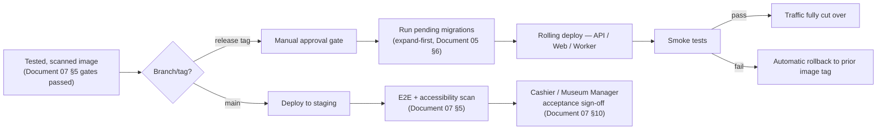

# 08 — Deployment and DevOps

**Document type:** Deployment and DevOps Runbook
**Project:** ZNHM Ticketing
**Audience:** DevOps engineers, backend engineers, on-call responders, technical reviewers
**Status:** Complete — derived from and traceable to the SRS, SDS, Database Design, and Testing and QA documents
**Related documents:** [02 — Software Requirements Specification](02-software-requirements-specification.md) (source of the NFR-AVAIL, NFR-PERF, and NFR-RETENTION requirements this document operationalizes) · [03 — Software Design Specification](03-software-design-specification.md), [Sections 6.1–6.7](03-software-design-specification.md#6-cross-cutting-design-concerns) (background jobs, caching, storage, and observability this document deploys and monitors) and [Sections 8.1–8.3](03-software-design-specification.md#8-deployment-architecture) (the architectural input this document turns into operational configuration) · [05 — Database Design](05-database-design.md), [Section 6](05-database-design.md#6-migration-strategy) (the migration pattern this document's deploy sequence executes) · [07 — Testing and Quality Assurance](07-testing-and-quality-assurance.md), [Section 5](07-testing-and-quality-assurance.md#5-cicd-test-gate-pipeline) (the test gates this document's pipeline extends into an actual deploy)

---

## 1. Introduction

### 1.1 Purpose

This document specifies **how the ZNHM Ticketing is built, deployed, operated, and recovered**: environment configuration, infrastructure strategy, the CI/CD pipeline's deploy stage (beyond the test gates already specified in [Document 07](07-testing-and-quality-assurance.md)), monitoring and alerting, backup and disaster recovery, scaling policy, incident response, and the hosting decision this project's design deliberately leaves open. This document introduces no new architecture — every decision here is the operational realization of the architecture already fixed in [Document 03, Sections 8.1–8.3](03-software-design-specification.md#8-deployment-architecture), per that document's own forward reference (Document 03, Section 10).

### 1.2 Scope

This document covers infrastructure topology (Section 2), environment and secrets configuration (Section 3), the deployment pipeline and release process (Section 4), monitoring and observability (Section 5), backup and disaster recovery (Section 6), scaling policy (Section 7), incident response (Section 8), the hosting decision (Section 9), and financial-record retention operations (Section 10). It does not cover what is tested before a deploy — that is [Document 07](07-testing-and-quality-assurance.md)'s scope — only what happens once a tested image is promoted.

### 1.3 Open item flagged for confirmation

[Document 03, ADR-005](03-software-design-specification.md#adr-005-deployment-target-agnostic-infrastructure) states plainly that hosting (cloud vs. the museum's parent institution's own servers) **has not been decided**, and every stateful component was chosen specifically to work either way. [Document 02, Section 5](02-software-requirements-specification.md#5-open-questions) separately flags that the exact fiscal-year boundary underlying NFR-RETENTION-001 needs confirmation with the Finance Office. Neither open item is resolved by this document — Section 9 below documents both concrete hosting paths this design already supports, to be finalized with the museum's parent institution once a decision is made, and Section 10's retention operations are built to not require a schema or code change regardless of which fiscal-year boundary is eventually confirmed.

Unlike a larger platform, [Document 02, Section 3](02-software-requirements-specification.md#3-non-functional-requirements) does not define numbered scaling or compliance requirement ranges (no `NFR-SCALE-*`, no `NFR-COMP-*`) — this system serves exactly one venue (ADR-001, ADR-004) with modest transaction volume. Sections 7 and 10 below are written accordingly: as sound operational practice for a small, single-venue system handling real money and a government Finance Office's trust, not as fulfillment of requirement IDs that don't exist in this project.

---

## 2. Infrastructure Topology

### 2.1 Production topology

This is the operational configuration of the container topology fixed in [Document 03, Section 8.1](03-software-design-specification.md#81-container-topology):

| Component | Deployment unit | Scaling | Notes |
|---|---|---|---|
| Nginx (reverse proxy, TLS termination) | Load balancer + Nginx container | Managed by load balancer | Terminates TLS; origin traffic to the app tier is internal-network only. |
| Web (Next.js) | Docker container, N replicas | Horizontal, small fixed pool (2 replicas minimum for zero-downtime rolling deploys) | Stateless; serves the Visitor SSR site and the Staff CSR dashboard under the same web client, split by route (Document 03 §7.1). |
| API (Django) | Docker container, N replicas | Horizontal, small fixed pool (2 replicas minimum) | Stateless (Document 03 §8.1); no session affinity required, consistent with ADR-002's stateless-JWT decision. |
| Celery Worker | Docker container, N replicas | Horizontal, **per-queue** (Section 7.2) | Separate replica pools per queue (`notifications`, `documents`, `payments`) so a backlog in one queue cannot starve another — see [Document 03, Section 6.2](03-software-design-specification.md#62-caching-and-queue-design-redis). |
| Celery Beat | Docker container, **exactly 1 replica** | None — fixed at 1 | Enforced by deployment configuration (not just convention), since a second replica would duplicate the daily no-show/refund checks (Document 03 §8.1, ADR-003's accepted trade-off). |
| PostgreSQL | Managed service **or** self-hosted, per Section 9 | Vertical | System of record for accounts, bookings, payments, refunds, settlements (Document 05). |
| Redis | Managed service **or** self-hosted, per Section 9 | Vertical | Three logical DB indices per Document 03 §6.2: broker/queues, category/availability cache, rate-limit counters. |
| S3-compatible object storage | Managed service **or** self-hosted (MinIO), per Section 9 | N/A (object storage) | Prefixes per Document 03 §6.3 — critically, the only copy of already-issued, never-regenerated receipts (ADR-009; see Section 6.3 below). |

Given the modest, single-venue scale (ADR-001), a small fixed replica count (2 for Web/API, sized per queue for Worker) is sufficient at launch; horizontal headroom exists because the application tier is stateless by design, not because this scale currently requires it.

### 2.2 Infrastructure as Code

All infrastructure (load balancer, container orchestration, database/cache/storage provisioning, DNS, TLS certificates) is defined declaratively (Terraform or equivalent) and version-controlled alongside the application, so that a given `staging` or `production` topology is reproducible from source rather than hand-configured. Infrastructure changes go through the same pull-request review as application code; a plan/diff is a required artifact on any infrastructure PR before apply. Because ADR-005 leaves the hosting target open, the IaC definitions are written against interfaces (a PostgreSQL connection string, an S3-compatible endpoint, a Redis URL) rather than a specific cloud provider's proprietary resource types wherever a self-hosted equivalent (Section 9) must also be supportable.

### 2.3 Container image strategy

One image per deployable component (`web`, `api`, `worker`; `beat` reuses the `api`/`worker` image with a different entrypoint rather than a fourth image, to minimize build surface). Images are tagged with the Git commit SHA, never `latest`, so that "the exact image tested in staging is the one deployed to production" (Document 03 §8.2) is enforceable by tag equality, not by trust.

The **Mobile app** (React Native, ADR-006) is not part of this container-based deploy pipeline — it is released independently through the Apple App Store and Google Play Store review processes, which introduce a review-time lag the backend deploy cadence does not have. Because both share the same API (Document 03 §2.2), a backend release that changes request/response shape in a way an already-published mobile build depends on must be avoided or made backward-compatible until store review confirms the corresponding mobile update has rolled out — an engineering discipline this project treats as good practice, since Document 02 does not define a formal API-versioning NFR.

### 2.4 Mobile release

The mobile app is built and shipped through Expo services, separately from the container pipeline:

- Builds are produced with **EAS Build** (`eas build`), one profile per environment, and submitted with `eas submit`.
- iOS ships to the **App Store** and Android to the **Google Play Store**, under the bundle/package ID `et.aau.znhm.ticketing`.
- The mobile app registers the URL scheme `znhm` for deep links.
- The client's only build-time configuration is `EXPO_PUBLIC_API_URL` (Section 5.3); because store review lags the backend deploy cadence, a backend change that alters request/response shape must stay backward-compatible until the matching mobile update is live (Section 2.3).

QR codes are rendered entirely on the client, so the backend needs no QR generation dependency; there is no server-side QR endpoint to deploy.

---

## 3. Environment and Secrets Configuration

### 3.1 Environments

Reproduced from [Document 03, Section 8.2](03-software-design-specification.md#82-environments) with the operational detail that section deferred here:

| Environment | Infrastructure | Data | Access |
|---|---|---|---|
| `development` | Local Docker Compose | Seeded fixture data (sample categories, bookings), reset freely | Individual developer machines |
| `staging` | Same topology as production, reduced instance sizes/replica counts | Synthetic bookings, payments, and settlement transfers using Chapa's sandbox mode (per [Document 07, Section 3](07-testing-and-quality-assurance.md#3-test-environments-and-tooling)); never real Visitor PII or real payment data | Engineering team, QA, and the Cashier/Museum Manager conducting acceptance testing (Document 07 §10) |
| `production` | Full topology (Section 2.1) | Real Visitor, booking, payment, and settlement data | Access restricted to on-call engineers via just-in-time elevated access, logged |

### 3.2 Configuration and secrets

- Non-secret configuration (feature flags, queue names, cache TTLs, the fiscal-year start/end date underlying NFR-RETENTION-001's reporting periods, per Document 05 §5) is environment-variable-driven and stored alongside the IaC definitions per environment.
- Secrets — database credentials, Redis auth, object storage keys, the JWT signing key, email/SMS gateway credentials, and Chapa's API key/secret and webhook-signing secret — are stored in a managed secrets manager, never committed to the repository or baked into an image layer, and are injected into containers at runtime.
- The JWT signing key (backing `token_version`-checked access tokens, Document 03 §4.1) is rotatable independently of a deploy; rotation invalidates all outstanding access tokens platform-wide (Visitor, Cashier, Museum Manager, and Platform Admin sessions alike) and is treated with the same sign-off rigor as an incident response action (Section 8).
- `staging` never holds a production Chapa API key or production email/SMS credentials — it uses Chapa's sandbox/test mode and sandbox or suppressed email/SMS sending — so a `staging` misconfiguration can never trigger a real payment, a real refund, or a real notification to an actual Visitor.

---

## 4. Deployment Pipeline and Release Process

### 4.1 Pipeline (extends Document 07 §5)

Deployment picks up exactly where [Document 07, Section 5](07-testing-and-quality-assurance.md#5-cicd-test-gate-pipeline)'s test gates leave off:

### 4.2 Migration execution

Per [Document 05, Section 6](05-database-design.md#6-migration-strategy)'s expand/contract pattern, migrations run as a distinct step **before** the new application code is rolled out, not as part of container startup — so that a migration failure is caught and blocks the rollout before any replica serves traffic against a schema it doesn't expect. A destructive (contract-phase) migration — one that removes or narrows a column a receipt or the audit log may already reference — only ships once the release that stopped reading that column has run in production for at least one full release cycle, consistent with ADR-009's principle that a historical financial document's content must never silently change after the fact.

### 4.3 Rolling deploy and rollback

- API, Web, and Worker replicas are updated in a rolling fashion (old and new versions briefly coexist), which is safe specifically because the API is stateless (Document 03 §8.1) and every background job either checks an "already processed" flag before acting or is otherwise safely retryable (Document 03 §6.1, NFR-IDEMPOTENT-001).
- Celery Beat, being single-replica, has a brief scheduling gap during its own replacement; this is accepted as a known limitation (consistent with ADR-003) rather than solved with a redundant scheduler, since the two daily jobs it triggers (the no-show notice check and the no-response refund check, Document 03 §5.2) tolerate a sub-minute gap without violating FR-PAY-005's one-week window.
- Rollback is image-tag-based: reverting to the immediately prior tag on smoke-test failure requires no rebuild, consistent with the image-based (not rebuild-based) promotion principle in Document 03 §8.2. A rollback that would require reverting an already-applied expand-phase migration is treated as an incident (Section 8), not a routine rollback, since the expand/contract pattern is specifically designed so this should not be necessary.

### 4.4 Release cadence

Application releases are not gated to a fixed schedule; a release ships whenever a tagged, tested image passes Document 07's gates. Any change to a request/response shape a live mobile app build depends on (Section 2.3) is treated as a special case requiring compatibility planning ahead of the release, not a routine deploy.

---

## 5. Monitoring and Observability

Builds on the observability design already fixed in [Document 03, Section 6.6](03-software-design-specification.md#66-observability):

| Signal | Source | Consumer |
|---|---|---|
| Structured JSON logs, correlated by `correlation_id` (generated at the reverse-proxy layer, propagated through every Celery job it triggers) | API, Web, Worker containers | Log aggregation platform; used to trace a single booking through payment, check-in, refund, and settlement end-to-end |
| Metrics: request latency, error rate, queue depth | Exported in a standard, vendor-neutral format from API and Worker containers (Document 03 §6.6), consistent with the deployment-target-agnostic principle (Document 03 §1.3) | Metrics/dashboarding stack, self-hostable or managed per Section 9 |
| Audit trail | `audit_log` table (Document 05, Section 3.7) | Queried directly by Museum Manager / Platform Admin oversight, not a monitoring-stack concern |

### 5.1 Dashboards

- **Request performance:** p50/p95/p99 latency and error rate per endpoint, directly instrumenting NFR-PERF-001's "dashboard reflects a change within a few seconds" target.
- **Queue health:** per-queue depth and job failure/retry rate for `notifications`, `documents`, and `payments` (Document 03 §6.2) — the `payments` queue is watched most closely, since it carries `process_refund` and the settlement-transfer Chapa call.
- **Cache health:** hit rate on the Redis category/availability cache (Document 03 §6.2), a leading indicator of a Visitor seeing a stale price or a closed date shown as open if invalidation-on-write (Document 03 §6.2) is ever bypassed.
- **Daily job execution:** confirmation that Celery Beat's two daily jobs (`check_pending_visit_date_passed`, `check_no_response_refund`, Document 03 §5.2) actually ran in the last 24 hours — a silent Beat failure would mean no-show notices and auto-refunds simply stop happening with no error surfaced elsewhere.

### 5.2 Alerting

| Alert | Threshold | Maps to |
|---|---|---|
| API p95 latency | Sustained elevation over a few seconds | NFR-PERF-001 |
| API error rate | > 1% sustained 5 min | General health |
| `payments` queue depth | Sustained growth beyond a defined backlog threshold | Risk to timely refund/receipt processing (NFR-CONSIST-001, NFR-IDEMPOTENT-001) |
| Celery Beat missed run | Either daily job (Section 5.1) has not run in > 25 hours | FR-PAY-005 — a missed run means no-show notices and no-response refunds silently stop |
| SMS gateway failure/dead-letter rate | Any sustained increase | Should page — the SMS gateway now also delivers the Visitor OTP that FR-ACC-001 requires to book at all, not only the FR-PAY-005 notice, so a sustained failure blocks new bookings outright and needs faster response than a notification-only degradation; the email channel (magic link) remains a fallback verification path but is not a substitute for a timely SMS OTP in the booking flow |
| Chapa webhook signature failures | Any sustained increase | Possible integration break or spoofing attempt against NFR-SEC-001 |
| Chapa settlement-transfer failure | Any failure | Directly blocks the Cashier's FR-SETTLE-002 workflow; paged with urgency given the physical hand-off to Finance depends on it |
| Failed login rate (aggregate) | Anomalous spike | Possible credential-stuffing signal against Visitor or staff accounts |
| Certificate expiry | 14 days out | Basic operational hygiene |

Alerts route to on-call per Section 8.

---

### 5.3 Health checks, logging and rate limits (Phase 8)

**Probes.** `GET /healthz` is liveness (process is up; no dependencies). `GET /readyz` is readiness: it checks Postgres and Redis and returns `503` with per-dependency detail (`{"checks": {"database": "ok", "redis": "error"}}`) when either is down. Point the orchestrator's liveness probe at `/healthz` and the load balancer's health check at `/readyz`. Both are unauthenticated, uncached, exempt from the HTTPS redirect (probes are plain HTTP), and deliberately not part of the OpenAPI contract.

**Logging.** Application logs go to stdout; the container runtime or log shipper owns retention. `LOG_LEVEL` (default `INFO`) sets the level for the project's own `apps.*` loggers, so an incident can be debugged with `LOG_LEVEL=DEBUG` and no code change. Django itself stays at `WARNING`, and `django.request` 5xx responses always surface (and reach Sentry when `SENTRY_DSN` is set). Application code logs identifiers only, never visitor PII.

**Rate limits** (per IP, Redis-backed; Document 03 §6.7): `login` 5/15m, `otp-request` 5/15m, `password-reset-request` 5/15m, `booking-create` 10/15m, and, added in Phase 8, `otp-verify` 10/15m (OTP and magic-link verification), `password-reset-confirm` 10/15m and `institution-lookup` 30/15m (TIN autofill, to stop TIN enumeration). `apps/core/tests/test_throttle_scopes.py` fails if any of these endpoints loses its scope.

**Production security posture** (`config/settings/production.py`): HTTPS redirect and HSTS (preload deliberately off until every subdomain is HTTPS), secure/HttpOnly/SameSite=Lax cookies, `nosniff`, `X-Frame-Options: DENY`, `Referrer-Policy: same-origin`, and `CSRF_TRUSTED_ORIGINS` mirroring `CORS_ALLOWED_ORIGINS`. Verify with `python manage.py check --deploy` against the production settings before each release; the only remaining expected warnings are `SECRET_KEY` strength when a throwaway key is used.

**Additional environment variables**

| Variable | Where | Purpose |
|---|---|---|
| `LOG_LEVEL` | backend | Level for `apps.*` loggers (default `INFO`). |
| `NEXT_PUBLIC_SITE_URL` | frontend | Canonical origin for the sitemap, Open Graph tags and hreflang alternates. Required in every deployed environment. |
| `NEXT_PUBLIC_FISCAL_YEAR_START_MONTH` / `_DAY` | frontend | Seeds the "This year" preset in Manager reports. Must match the backend's `FISCAL_YEAR_START_MONTH` / `_DAY`; the report figures themselves always come from the backend. |
| `EXPO_PUBLIC_API_URL` | mobile | Base URL of the API, **including the `/api/v1` prefix** (for example `http://192.168.1.10:8000/api/v1`). On a physical device this must be a LAN address, not `localhost`, because the device cannot reach the development machine's loopback interface. |

## 6. Backup and Disaster Recovery

Document 02 does not define a numbered backup RPO/RTO requirement the way it does for, say, retention (NFR-RETENTION-001). This section defines targets as sound operational practice for a system of record that a government Finance Office ultimately relies on, not as fulfillment of a requirement ID that doesn't exist in this project.

| Parameter | Value | Mechanism |
|---|---|---|
| Backup frequency | At least every 24 hours | Automated PostgreSQL snapshot (managed provider or self-hosted `pg_dump`/WAL archiving, per Section 9), plus continuous WAL archiving for point-in-time recovery below the 24h floor where the hosting option supports it |
| RPO (Recovery Point Objective) | 24 hours | Snapshot cadence above |
| RTO (Recovery Time Objective) | 4 hours | Restore procedure below |
| Object storage | Versioned bucket, backed up independently of the database | Protects already-issued receipt PDFs (Section 6.3) — these cannot be regenerated to match their original content byte-for-byte if lost, per ADR-009, so their backup is treated with at least the same rigor as the database's |

### 6.1 Restore procedure

1. Provision a new PostgreSQL instance from the most recent snapshot (or point-in-time recovery to the desired moment).
2. Point a `staging`-topology stack at the restored instance to validate integrity before any production cutover.
3. Cut production traffic over via the same load-balancer/DNS mechanism used for a normal deploy (Section 4), not a bespoke path — minimizing untested recovery machinery.
4. Post-restore, reconcile any object-storage writes (a receipt PDF rendered after the last database snapshot) that are now orphaned relative to the restored booking/settlement rows, via a manual review before reopening general availability — this matters specifically because a Transfer Receipt already carried to the Finance Office must still correspond to what the restored system shows.

### 6.2 Restore drills

A restore drill is executed against `staging` before the first production go-live and at a regular cadence thereafter, asserting the RPO and RTO figures above hold in practice, not just on paper.

### 6.3 Object storage retention note

Per [Document 03, ADR-009](03-software-design-specification.md#adr-009-receipts-are-rendered-once-and-persisted-not-regenerated-on-demand), both the temporary receipt and the Transfer Receipt are rendered once at issuance and never regenerated — an object-storage loss is not recoverable by re-running the render job after the fact, since a template change since issuance would silently produce a different document than the one originally handed to a Visitor or carried to Finance. This makes object-storage backup integrity, not just database backup integrity, load-bearing for this platform's financial record-keeping.

---

## 7. Scaling Policy

There is no numbered `NFR-SCALE-*` requirement in [Document 02](02-software-requirements-specification.md) — this system serves exactly one venue with modest transaction volume by design (ADR-001). This section describes a scaling approach sized to that reality, not a target derived from a requirement ID that doesn't exist here.

### 7.1 Application tier

- API and Web replicas can scale horizontally on a simple CPU/request-rate policy if a specific high-traffic event is anticipated (e.g., a well-publicized free-entry day driving an unusual volume of individual bookings) — this is available headroom given the stateless design (Document 03 §8.1), not a capability the current scale requires by default.
- No schema migration is required to add replicas, since the stateless API/Web design and single-tenant data model (ADR-004) both scale by adding replicas, not by restructuring data.

### 7.2 Worker tier

Celery Workers scale per-queue (Section 2.1), so a burst in one job type (e.g., a wave of notification jobs around a well-attended weekend) scales the `notifications` queue's workers without affecting `documents` or `payments` queue capacity — the operational expression of the queue isolation designed in Document 03 §6.1/6.2.

### 7.3 Data tier

Given the single-venue scale, a single managed (or self-hosted, per Section 9) PostgreSQL instance, sized with modest headroom, is expected to be sufficient without a read replica at launch. The indexing strategy in [Document 05, Section 4](05-database-design.md#4-indexing-strategy-summary) — particularly `booking(status, visit_date)` and `payment(status)`, which every dashboard/report query filters on — is what keeps NFR-PERF-001 achievable without additional data-tier scaling. A read replica for reporting load is a documented option to revisit if reporting query load is ever observed to contend with the transactional write path, not a day-one requirement.

---

## 8. Incident Response

| Severity | Definition | Response |
|---|---|---|
| SEV-1 | Full outage, financial data loss, a confirmed double refund or double settlement, or funds routed anywhere other than the platform's own Chapa-controlled account | Immediate page to on-call; incident channel opened; Section 6's restore procedure invoked if data-tier-related. |
| SEV-2 | A core flow degraded platform-wide (e.g., online payment confirmation failing for all Visitors, or gate check-in unavailable) but not a full outage | Paged within business-hours-equivalent response time; investigated same-shift. |
| SEV-3 | A single dependency degraded with isolation holding (e.g., SMS gateway down while email notifications continue, per FR-PAY-005's email-as-primary design) | Tracked, not paged with the same urgency, since the design means no other function is at risk. |

Every incident is retrospected with a written postmortem; where the root cause traces to a gap in Section 5's alerting or Section 6's backup coverage, the postmortem's corrective action is a change to this document, keeping it current with actual operational experience rather than static.

---

## 9. Hosting Decision

Per [Document 03, ADR-005](03-software-design-specification.md#adr-005-deployment-target-agnostic-infrastructure) and the open item flagged in Section 1.3, hosting has not been decided, and every stateful component (PostgreSQL, Redis, S3-compatible storage via MinIO) was deliberately chosen to have both a managed-cloud form and a self-hosted, open-source-compatible form. Two concrete paths this design already supports:

1. **University/parent-institution-hosted**, running the same container images and the self-hosted forms of each stateful component (PostgreSQL, Redis, MinIO) on servers the museum's parent public body already operates or controls — consistent with how the Finance Office already keeps its own systems in-house.
2. **Commercial cloud hosting**, using each provider's managed equivalent (managed PostgreSQL, managed Redis, managed S3-compatible storage) — trading operational effort for less infrastructure to run directly, at the cost of a recurring cloud bill and a data-residency posture that would need sign-off from the museum's parent institution.

Whichever path is chosen, no application code, container image, or IaC interface (Section 2.2) needs to change — only the environment-specific configuration values (connection strings, endpoints, credentials, Section 3.2) do. This decision should be finalized with the museum's parent institution and reconciled with whatever data-handling expectations govern a government-adjacent public body's systems, since Document 02 does not itself specify a data-residency requirement to satisfy.

---

## 10. Financial Record Retention Operations

Operationalizes NFR-RETENTION-001 and NFR-AUDIT-001, the two non-functional requirements most directly tied to this platform's role as a financial system a government Finance Office ultimately relies on:

- **No physical deletion, enforced operationally as well as at the schema level:** [Document 05, Section 5](05-database-design.md#5-data-retention-nfr-retention-001) already ensures `booking`, `payment`, `refund`, `settlement_transfer`, `category`, and `account` are never hard-deleted at the application-code level. This document adds the operational counterpart: no manual database intervention (a support script, an ad-hoc `DELETE`, a bulk cleanup job) is ever run against these tables outside of the reviewed migration process in Section 4.2 — the same discipline that keeps a historical Transfer Receipt trustworthy also has to hold for anyone with direct database access.
- **Retention window:** records are retained for at least one year aligned to the organization's budget/fiscal calendar, per NFR-RETENTION-001. Since the exact fiscal-year boundary is an open question (Document 02 §5), the retention window is configured, not hard-coded (Section 3.2), so confirming that boundary later requires a configuration change, not a migration or a code change.
- **Audit trail durability:** the `audit_log` table (NFR-AUDIT-001, Document 05 §3.7) is included in the same backup and restore procedure as every other table (Section 6) — an audit trail that survives everything else but is lost in a restore would defeat its own purpose.
- **Receipt durability:** covered in Section 6.3 above — this is the sharpest instance of "financial record retention" in this platform, since a lost, unregenerable receipt PDF has no equivalent fallback the way a database row restored from a snapshot does.

---

## 11. Requirement Traceability

| Requirement | Section |
|---|---|
| NFR-SEC-001 | 3.2 (TLS via secrets/config, Chapa webhook secret handling), 5.2 |
| NFR-IDEMPOTENT-001 | 4.3, 5.2 (`payments` queue monitoring) |
| NFR-CONSIST-001 | 5.2, 6 (restore procedure preserves transactional integrity) |
| NFR-AUDIT-001 | 5 (audit trail as a monitored/consumed signal), 10 |
| NFR-TEST-001 | Out of this document's scope — see [Document 07](07-testing-and-quality-assurance.md) |
| NFR-PERF-001 | 5.1, 7.1, 7.3 |
| NFR-AVAIL-001 | 5 (monitoring), 8 (incident response) — no offline/degraded mode exists by design, so availability here means "the online service itself stays up," not a fallback mode |
| NFR-LOCALE-001 | Out of this document's scope — an application-layer concern, see [Document 03, Section 6.4](03-software-design-specification.md#64-internationalization-implementation-fr-loc-001004) |
| NFR-RETENTION-001 | 6, 9, 10 |

---

*End of Document 08.*
