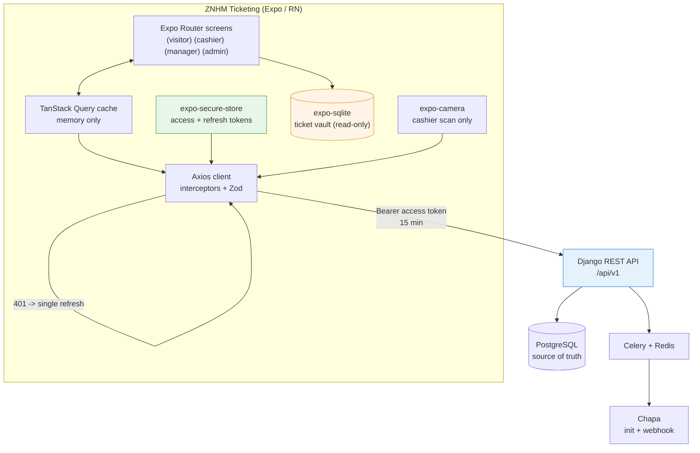
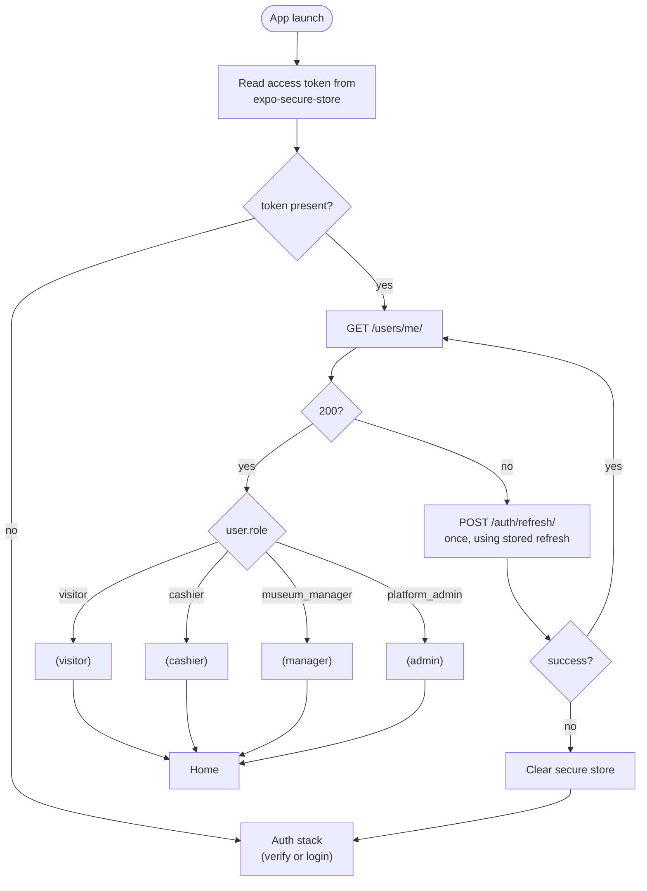

# Document 09: Mobile Application Design Specification

**Document ID:** DOC-09
**Status:** Complete
**Scope:** ZNHM Ticketing — native iOS and Android client for all four roles
**Target codebase:** `mobile/` (Expo SDK 57)
**Related documents:** Document 01 (Product Overview), Document 02 (SRS), Document 03 (SDS), Document 04 (API), Document 05 (Database), Document 06 (UI/UX), Document 07 (QA), Document 08 (Deployment)

---

## 1. Purpose and Scope

### 1.1 Purpose

The **ZNHM Ticketing** mobile application is the native iOS and Android client of the platform, built from one React Native codebase. It is a client of the existing Django REST Framework backend. It introduces **no backend of its own** and **no source-of-truth database of its own**.

The application serves the platform's four actors:

| Business name | Display name | `account.role` literal | Client group |
|---|---|---|---|
| Visitor | Visitor | `visitor` | `(visitor)` |
| Cashier | Cashier | `cashier` | `(cashier)` |
| Museum Manager | Manager | `museum_manager` | `(manager)` |
| Platform Admin | Admin | `platform_admin` | `(admin)` |

The application is bilingual (**English `en`**, **Amharic `am`**) at parity with the web client, per FR-LOC-001 through FR-LOC-004.

### 1.2 In scope

- Visitor journey: identity verification, category browsing, availability, booking creation, payment, ticket retrieval with a **real QR code**, cancellation, reschedule, refund request, receipt download, and profile.
- Cashier journey: gate reference lookup (typed **or** camera-scanned), check-in, mismatch flagging, IFMIS voucher recording, personal balance and reconciliation.
- Museum Manager journey: dashboard, category administration, date availability, booking oversight including category correction, and the report set.
- Platform Admin journey: staff account administration, the read-only audit log, and the report set.
- Notification preferences: channel and language.
- A read-only, encrypted-at-rest **offline ticket vault** for the Visitor's own confirmed bookings.
- Deep-link handling and an in-app browser for the payment redirect.

### 1.3 Not part of this release

- **Django admin functionality.** Browsing `AuditLogEntry` and editing system settings through Django admin are web-only; the app reads the audit log through its API instead.
- **IFMIS integration of any kind.** Per FR-GOV-001, the Cashier keys entries into IFMIS herself on a government terminal.
- **Platform-generated IFMIS Transfer Receipts.** Per ADR-010, the Cashier carries Chapa's own transfer proof.
- **Offline gate validation or any offline write queue.** The gate is online-only; see §4.

### 1.4 Design decisions

The mobile client is defined by the platform's architecture decision records:

- **ADR-006 — one React Native codebase** for iOS and Android.
- **ADR-011 — camera-based QR scanning** on the mobile client, complementing the web keyboard-wedge scanner.
- **ADR-012 — a four-role mobile application**, routed by role after login, rather than a Visitor-only app.
- **ADR-013 — mobile-specific refresh-token delivery** through the `X-Client-Platform: expo` header.
- **ADR-014 — a read-only Visitor ticket cache**, narrowly amending NFR-AVAIL-001.
- **ADR-015 — a real QR code on every ticket**, whose payload is the bare booking reference.
- **ADR-016 — push notifications with user preferences.**

---

## 2. Tech Stack

### 2.1 Selected stack

| Concern | Choice | Version | Purpose |
|---|---|---|---|
| Framework | Expo SDK (managed workflow) | `~57.0.26` | The scaffolded `mobile/` app; managed Expo per Document 08. |
| Runtime | React Native | `0.86.3` | Matches `mobile/package.json`. |
| UI runtime | React | `19.2.3` | Scaffold-pinned. |
| Language | TypeScript | `~6.0.3` | Strict typing on all three tiers (Document 03 §8.3, Document 07 §5). |
| Navigation | Expo Router | `~57.0.24` | File-based routing with layout guards and dynamic `(role)` groups (§3.4). |
| Server state | TanStack Query | `^5.104.1` | Cache, retry, and invalidation; already a dependency. |
| HTTP | Axios | `^1.20.0` | Interceptor model ported from the web client. |
| Runtime validation | Zod | `^4.6.5` | Parses `GET /users/me/` and any contract drift at the boundary. |
| i18n | i18next + react-i18next | `^26.4.2` / `^17.0.15` | Bilingual catalogs (§2.3). |
| Secure storage | `expo-secure-store` | `~57.0.4` | Keychain / Android Keystore for the token pair. |
| Camera | `expo-camera` | present | Cashier QR scanning (ADR-011). |
| Local cache | `expo-sqlite` | present | Read-only ticket vault (ADR-014). |
| QR encode | `react-native-qrcode-svg` | `^6.3.26` | Bare reference payload (§8.2). |
| SVG peer | `react-native-svg` | present | Hard peer of `react-native-qrcode-svg`. |
| Icons | `@expo/vector-icons` | `^15.0.2` | Bundled with Expo. |
| Dates | `date-fns` | `^4.4.0` | Time-zone-safe helpers. |
| Locale detection | `expo-localization` | present | Device-locale default for the `en`/`am` toggle. |
| Deep links | `expo-linking` | present | `znhm://` scheme (§2.2). |
| In-app browser | `expo-web-browser` | Expo-bundled | Chapa checkout without losing the session (§8.3). |
| Sharing | `expo-sharing`, `expo-file-system` | Expo-bundled | Receipt PDF and report CSV export. |

### 2.2 Identifiers and scheme

`mobile/app.json` carries the product identifiers:

```json
{
  "expo": {
    "name": "ZNHM Ticketing",
    "slug": "znhm-ticketing",
    "scheme": "znhm",
    "ios":      { "bundleIdentifier": "et.aau.znhm.ticketing", "supportsTablet": true },
    "android":  { "package": "et.aau.znhm.ticketing" },
    "userInterfaceStyle": "light",
    "plugins": ["expo-router", "expo-secure-store", "expo-camera", "expo-sqlite"],
    "extra": { "router": {} }
  }
}
```

The app boots through the Expo Router entrypoint (`"main": "expo-router/entry"`), so the role route groups in §6 are the app's navigation surface. The `expo-camera` plugin supplies `ios.infoPlist.NSCameraUsageDescription` and `android.permissions.CAMERA`, with the bilingual purpose string from §9.4.

### 2.3 Catalogs

The mobile app ships the same Amharic and English message catalogs as the web client, under `mobile/src/i18n/locales/{en,am}/`. The two catalogs are kept at exact key parity, and a CI catalog-parity check fails a change that adds a user-facing string to only one language (Document 07 §7.4). i18next binds the catalogs directly on mobile.

### 2.4 Environment configuration

The app reads one build-time variable:

```
EXPO_PUBLIC_API_URL=http://192.168.1.10:8000/api/v1
```

`EXPO_PUBLIC_API_URL` must include the `/api/v1` prefix (the contract has no `servers:` block, so no base URL is generated). On a physical device it must be a LAN address, not `localhost`. Document 08 §5.3 lists it alongside the other environment variables.

---

## 3. Architecture and Four-Role Authentication

### 3.1 Architecture

The mobile application is a **stateless API client**. It owns no authoritative data, runs no business rules, and issues no artifacts of record. Every mutation is a single authenticated call to the shared Django REST backend.



**Invariants.**

- PostgreSQL is the only source of truth. `expo-sqlite` caches one entity (the Visitor ticket) and is never an input to a decision.
- No business rule — pricing, availability, reschedule caps, refund arithmetic, reconciliation — is implemented in the client. Each exists server-side and is authoritative.
- The client never asserts a security outcome. QR content is a **lookup key, not an authenticator** (§8.2).

### 3.2 Authentication model

One credential pair, one token model (ADR-002), two login paths (Document 03 §4.1):

- **Visitor** — `POST /auth/visitor/verify/start/` → `{verification_id, otp_expires_in_seconds}` → 6-digit OTP, 10-minute expiry, 5 attempts, delivered by SMS plus a signed email magic link.
- **Cashier / Manager / Admin** — `POST /auth/login/` with `email` + `password`.

Tokens carry `user_id` and `token_version` and **no role claim**; the role is re-read from the database on every request. Lifetimes are access **15 minutes** and refresh **30 days**, rotated on use; `token_version` is bumped on password reset, invalidating all outstanding tokens.

### 3.3 Mobile refresh-token delivery

A native client has no cookie jar, so the browser-only HttpOnly refresh cookie cannot restore a session after relaunch or refresh the 15-minute access token. The three auth endpoints therefore accept the optional `X-Client-Platform` header (ADR-013):

- `X-Client-Platform: expo` on `POST /auth/login/`, `POST /auth/visitor/verify/confirm/`, or `POST /auth/refresh/` returns `refresh_token` in the response body, and `POST /auth/refresh/` accepts a `refresh_token` field in its request body.
- Without the header (or with `web`), the refresh token is delivered only as an HttpOnly cookie, exactly as the browser client expects.

The app stores the token pair in `expo-secure-store` (§9.1) and never persists it anywhere less protected. This is what makes an app relaunch survivable and what the client-platform header exists for; the web cookie path is unchanged.

### 3.4 Session bootstrap and dynamic routing



Rules:

1. **The access token is persisted** in secure storage, so a relaunch restores the session; the web client keeps its access token in memory only.
2. **One proactive refresh** at about 12 minutes of token age, so a user mid-task is never interrupted. A shared in-flight refresh promise collapses concurrent 401s into exactly one refresh call.
3. **`GET /users/me/` is snake_case** (`full_name`, `language_preference`, `role`) while the rest of the API is camelCase; normalize at the Zod boundary, never ad hoc in screens.
4. **Role guards are per-role**, gating on the exact literal rather than a blanket `isStaff` check, so a Cashier cannot reach Manager or Admin routes.
5. **Unknown or missing role** routes to the auth stack with a retry affordance, never to a default staff group.
6. **Logout** calls `POST /auth/logout/` *and* clears secure store, so no stale credential can resurrect a session the user believes is closed.

---

## 4. Offline Cache Strategy

### 4.1 Principle

The application **has no database of its own**. The backend's tables (`account`, `category`, `booking`, `booking_item`, `payment`, `refund`, `cashier_reconciliation`, `date_availability`, `notification`, `notification_delivery`, `device_token`, `notification_preference`, `institution`, `audit_log`) are authoritative and are never mirrored wholesale, and never written to.

### 4.2 Cached scope

Exactly one entity is cached: the **Visitor's own confirmed booking, for display and offline reference only.**

| Capability | Cached? | Reason |
|---|---|---|
| Visitor confirmed ticket (QR + reference + visit date) | **Yes** | Display-only; the one artifact a visitor may need without a connection |
| Categories, availability, pricing | No | Must be live to avoid a stale or wrong quote |
| Booking creation, payment | No | Money movement requires the server |
| Cashier lookup, check-in, flag, voucher, reconciliation | **No — ever** | The gate is online-only; Cashier, Manager, and Admin screens never read the cache |
| Manager / Admin anything | No | Administrative decisions must never render stale data |

### 4.3 Schema

```sql
CREATE TABLE IF NOT EXISTS cached_ticket (
  booking_ref        TEXT PRIMARY KEY,   -- booking.reference, 8 chars, e.g. 'K7M2QP4A'
  booking_id         TEXT NOT NULL,      -- UUID hex from server
  status             TEXT NOT NULL,
  visit_date         TEXT NOT NULL,      -- ISO 'YYYY-MM-DD', museum-local
  category_names_en  TEXT NOT NULL,
  category_names_am  TEXT NOT NULL,
  total_etb          TEXT NOT NULL,      -- decimal string; never a float
  checkout_url       TEXT,
  synced_at          INTEGER NOT NULL,   -- epoch ms
  payload_json       TEXT NOT NULL       -- full Booking for re-render
);
CREATE INDEX IF NOT EXISTS idx_cached_ticket_status ON cached_ticket (status);
```

Money is stored as the **decimal string the API returns**, never as a JS number. The contract types money as `type: string, format: decimal`, so the app uses a decimal helper and never `Number()` on ETB.

### 4.4 Rules

1. **Write-through on read.** Every successful `GET /bookings/` or `GET /bookings/{id}/` for a Visitor upserts. There is no explicit sync button.
2. **Evict on transition.** A booking leaving `pending` (`visited`, `cancelled`, `refunded`) is deleted, not updated, so a void ticket can never render offline.
3. **Expiry.** Rows older than **30 days** are purged on launch, aligned with the refresh-token lifetime. A ticket older than its visit date is also evicted.
4. **No write queue.** There is no outbox, no replay, and no conflict resolution, because there is no offline write.
5. **Failure is loud.** Any screen needing live data without a network surfaces an explicit error and a retry control; it never renders a cached substitute for a non-ticket entity.
6. **A cached ticket never authorizes anything.** Scanning is disabled when offline (§8.2).

---

## 5. Role Feature Modules

Each module is a client of the same authenticated API. The endpoint list reflects `contracts/openapi.yaml` and the matching backend permission class.

### 5.1 Visitor — `(visitor)`

| Screen | Endpoint(s) | Notes |
|---|---|---|
| Verify identity | `POST /auth/visitor/verify/start/`, `POST /auth/visitor/verify/confirm/` | `email`, `phone`, optional `full_name`, optional `language_preference` |
| Email-link status | — | Polls the confirm endpoint while the magic link is outstanding |
| Browse categories | `GET /categories/` | Bilingual names from the API |
| Availability | `GET /availability/?from=&to=` | Both params are required and documented in the contract. A date absent from the response is **open**, not closed |
| Create booking | `POST /bookings/` | `booking_type` is **only** `individual` or `group`; a school visit is `group` + `institution` + `group_tin` |
| Payment | `checkoutUrl` returned by `POST /bookings/` | See §8.1 |
| My bookings | `GET /users/me/bookings/` | Feeds the offline cache (§4.4) |
| Ticket + QR | `GET /bookings/{id}/` | Real QR on the reference (§8.2) |
| Cancel | `POST /bookings/{id}/cancel/` | `pending` only; automatic refund |
| Reschedule | `POST /bookings/{id}/reschedule/` | **One time only**, enforced by a database `CHECK` |
| Edit before payment | `PATCH /bookings/{id}/` | `awaiting_payment` only |
| Refund request | `POST /bookings/{id}/refund-requests/` | Visitor-only |
| Group / school visit | `GET /institutions/?tin=` | TIN lookup and validation |
| Receipt | `GET /bookings/{id}/receipt/download/` | Shared via `expo-sharing` |
| Profile | `GET /users/me/`, `PUT /users/me/` | `full_name`, `phone`, `language_preference`; changing phone clears `phone_verified_at` and re-triggers OTP |
| Notification preferences | `GET`/`PUT /notifications/preferences/` | Channels and language (FR-NOTIFY-PREF-001) |

Identity always comes from the JWT, never from the booking request. The booking wizard is **3 steps**, and there is no approval gate for individuals or groups — creation always yields `awaiting_payment`.

Booking lifecycle: `awaiting_payment → pending → visited | cancelled | refunded`.

### 5.2 Cashier — `(cashier)`

All endpoints require the Cashier role.

| Screen | Endpoint(s) |
|---|---|
| Login | `POST /auth/login/` |
| Gate lookup | `GET /bookings/lookup/?reference=` — typed or **camera-scanned** |
| Check in | `POST /bookings/{id}/check-in/` |
| Flag mismatch | `POST /bookings/{id}/flag-mismatch/` |
| IFMIS voucher | `GET`/`PATCH /bookings/{id}/ifmis-voucher/` — record Doc No / Ref No |
| My balance | `GET /settlement/my-balance/` |
| Initiate reconciliation | `POST /settlement/reconcile/` |
| Reconciliation history | `GET /settlement/reconciliations/`, `GET /settlement/reconciliations/{id}/transfer-receipt/download/` |
| Bookings list | `GET /bookings/` with `status`, `visitDate`, `bookingType`, `flagged` filters |
| Refunds (read) | `GET /refunds/` — read-only; a Cashier does not issue refunds |

### 5.3 Museum Manager — `(manager)`

| Screen | Endpoint(s) |
|---|---|
| Dashboard | `GET /reports/dashboard/` |
| Categories | `GET`/`POST /categories/`, `PUT`/`DELETE /categories/{id}/` |
| Date availability | `PUT /availability/{date}/` — open or close |
| Bookings oversight | `GET /bookings/` |
| Category correction | `PATCH /bookings/{id}/category-correction/`, `PATCH /bookings/{id}/category-corrections/batch/` |
| Add item | `POST /bookings/{id}/items/` |
| Refund decisions | `GET /refunds/` |
| Reports | `GET /reports/{summary,cashier-balances,booking-timeline,institutions,institutions/{id},categories,attendance,revenue,comparison}/` |

Reports are range-driven with seven presets or explicit `from`/`to`, computed in **Africa/Addis_Ababa**, and CSV-exportable. Settlement is Cashier-only. A category rename propagates to `categoryNameEn`/`categoryNameAm` on existing tickets.

### 5.4 Platform Admin — `(admin)`

| Screen | Endpoint(s) | Notes |
|---|---|---|
| Staff list | `GET /admin/staff/` | Filter by `role`, `isActive` |
| Create staff | `POST /admin/staff/` | `email`, `password`, `role`, `fullName` |
| Edit staff | `PUT /admin/staff/{id}/` | No `PATCH`; a role change is a full `PUT` |
| Deactivate | `DELETE /admin/staff/{id}/` | Soft delete |
| Reports | All `/reports/*` | The API grants Manager **or** Admin |
| Audit log | `GET /admin/audit-log/` | Read-only, filterable, paginated (FR-AUDIT-001) |

### 5.5 Capability matrix

| Capability | Visitor | Cashier | Manager | Admin |
|---|:--:|:--:|:--:|:--:|
| Book / pay | ✅ | — | — | — |
| Own ticket + QR | ✅ | — | — | — |
| Cancel / reschedule | ✅ | — | — | — |
| Refund request | ✅ | — | — | — |
| Refund read | — | ✅ | ✅ | ✅ |
| Gate lookup / check-in | — | ✅ | — | — |
| Camera scan | — | ✅ | — | — |
| IFMIS voucher record | — | ✅ | — | — |
| Reconciliation | — | ✅ | — | — |
| Category / pricing admin | — | — | ✅ | — |
| Availability admin | — | — | ✅ | — |
| Category correction | — | — | ✅ | ✅ |
| Reports | — | — | ✅ | ✅ |
| Staff admin | — | — | — | ✅ |
| Audit log | — | — | — | ✅ |
| Notification preferences | ✅ | ✅ | ✅ | ✅ |

---

## 6. Directory Structure

```
mobile/
├── App.tsx                        # providers only; routes live in app/
├── index.ts                       # registers expo-router/entry
├── app.json                       # ZNHM identifiers, znhm scheme, config plugins
├── .env.example                   # EXPO_PUBLIC_API_URL
├── eas.json                       # EAS build profiles
├── src/
│   ├── api/
│   │   ├── client.ts              # Axios instance, interceptors, inFlightRefresh
│   │   ├── endpoints.ts           # every path, grouped by role
│   │   ├── generated/
│   │   │   └── schema.d.ts        # openapi-typescript output (do not hand-edit)
│   │   ├── schemas.ts             # Zod envelopes (User, Booking, Payment…)
│   │   └── queries/               # TanStack Query hooks per domain
│   ├── auth/
│   │   ├── AuthProvider.tsx       # session state, bootstrap, role
│   │   ├── useAuth.ts
│   │   ├── guards.tsx             # <RequireRole role="cashier">
│   │   └── session.ts             # secure-store read/write/clear
│   ├── components/
│   │   ├── ui/                    # Button, Card, Input, Badge, EmptyState,
│   │   │                          # ErrorState, Skeleton, Sheet, Toast
│   │   ├── BookingSummary.tsx  AvailabilityCalendar.tsx
│   │   ├── QRCode.tsx             # real QR via react-native-qrcode-svg
│   │   └── Scanner.tsx            # expo-camera, Cashier only
│   ├── database/
│   │   ├── schema.ts              # CREATE TABLE cached_ticket
│   │   ├── tickets.ts             # upsert / evict / purge
│   │   └── index.ts
│   ├── features/
│   │   ├── visitor/               # verify, browse, book, pay, tickets,
│   │   │                          # cancel, reschedule, refund, profile
│   │   ├── cashier/               # gate, scan, check-in, voucher, settlement
│   │   ├── manager/               # dashboard, categories, availability,
│   │   │                          # correction, reports
│   │   ├── admin/                 # staff CRUD, audit log
│   │   └── shared/                # language toggle, offline banner, reports
│   ├── i18n/
│   │   ├── index.ts               # i18next init
│   │   ├── locales/{en,am}/common.json
│   │   └── keys.ts                # typed key union
│   ├── navigation/
│   │   ├── routes.ts              # role -> routes
│   │   └── linking.ts             # znhm:// parsing
│   ├── theme/
│   │   ├── colors.ts  spacing.ts  typography.ts
│   ├── utils/
│   │   ├── dates.ts               # time-zone-safe helpers
│   │   ├── money.ts               # decimal-string arithmetic
│   │   └── reference.ts           # 8-char reference validation
│   └── constants/
│       ├── config.ts              # API URL, roles, statuses
│       └── queryKeys.ts
└── __tests__/                     # mobile unit tests
```

**Route tree.** Role groups are directories; each has its own `_layout.tsx` guard, and `(tabs)` lives only under `(visitor)` because a Cashier/Manager/Admin home is a dashboard, not a tab bar.

```
app/
├── _layout.tsx                    # providers, splash gate, deep-link handler
├── index.tsx                      # decides auth vs role group
├── +not-found.tsx
├── (auth)/
│   ├── _layout.tsx
│   ├── visitor-verify.tsx
│   ├── staff-login.tsx
│   └── language.tsx
├── (visitor)/
│   ├── _layout.tsx                # RequireRole visitor + (tabs)
│   ├── (tabs)/_layout.tsx
│   ├── (tabs)/index.tsx           # home
│   ├── (tabs)/book.tsx
│   ├── (tabs)/tickets.tsx
│   ├── (tabs)/profile.tsx
│   ├── book/new.tsx               # 3-step wizard (§5.1)
│   ├── book/payment.tsx
│   ├── bookings/[id]/index.tsx    # ticket + QR
│   ├── bookings/[id]/cancel.tsx
│   ├── bookings/[id]/reschedule.tsx
│   ├── bookings/[id]/refund.tsx
│   ├── group-visit.tsx
│   └── settings/notifications.tsx
├── (cashier)/
│   ├── _layout.tsx                # RequireRole cashier
│   ├── index.tsx  scan.tsx  gate.tsx
│   ├── settlement/index.tsx  settlement/history.tsx
│   └── vouchers/[id].tsx
├── (manager)/
│   ├── _layout.tsx                # RequireRole museum_manager
│   ├── index.tsx  categories.tsx  availability.tsx
│   ├── bookings/index.tsx  bookings/[id].tsx
│   ├── refunds.tsx
│   └── reports/{index,[report]}.tsx
└── (admin)/
    ├── _layout.tsx                # RequireRole platform_admin
    ├── index.tsx  staff.tsx  staff/[id].tsx
    ├── audit.tsx
    └── reports/                   # shared implementation with (manager)
```

Report screens are shared between `(manager)` and `(admin)` through `features/shared/`, since the API grants both roles access.

---

## 7. API and Contract Integration

### 7.1 Contract as source of truth

`contracts/openapi.yaml` is generated from the live views and consumed by the web and mobile clients; CI fails on drift. Types are generated with:

```bash
npx openapi-typescript ../contracts/openapi.yaml -o src/api/generated/schema.d.ts
```

Generation consequences to design around:

1. **No `servers:` block** → no base URL; supply `EXPO_PUBLIC_API_URL` (§2.4).
2. **Security scheme is `TokenVersionAuth`** (bearer JWT), not `bearerAuth`.
3. **Money is `type: string, format: decimal`** → never a JS number (§4.3).
4. **Dates and times are bare strings** → validate with Zod at the boundary.
5. **`booking.reference` now documents its format** — `minLength`/`maxLength` 8, `pattern: '^[A-HJ-NP-Z2-9]{8}$'`, and an `example` — from the alphabet `ABCDEFGHJKLMNPQRSTUVWXYZ23456789` (ambiguous `0/O/1/I` excluded). The QR payload and the vault key both use it (§8.2).
6. **`Booking.items[]`, not `category_id`.** Each item is `{id, categoryId, categoryNameEn, categoryNameAm, quantity, attendedQuantity, unitPriceEtb, subtotalEtb}`.
7. **Parameters are documented.** `GET /availability/` takes required `from` and `to`; `GET /bookings/` accepts `status`, `visitDate`, `bookingType`, and `flagged`.
8. **`GET /users/me/` is snake_case**; everything else is camelCase.
9. **Trailing slashes are mandatory** on every path.
10. **Auth uses `X-Client-Platform`** on login, Visitor verify/confirm, and refresh (§3.3).
11. **Audit log and notification endpoints are available**: `GET /admin/audit-log/`, `GET`/`PUT /notifications/preferences/`, and `POST`/`DELETE /notifications/devices/`.
12. **`GET /health/` sits outside the contract** — reachable at `/api/v1/health/`, useful for a connectivity probe.

### 7.2 Error envelope

```json
{ "errors": { "field": ["human-readable message"] }, "message": "optional summary" }
```

Field errors map onto inputs and a non-field `message` onto a form-level banner. A raw Axios error object is never shown.

### 7.3 Client configuration

```ts
// src/api/client.ts
const api = axios.create({
  baseURL: process.env.EXPO_PUBLIC_API_URL,   // includes /api/v1
  timeout: 20000,
});

api.interceptors.request.use((config) => {
  const token = await session.getAccessToken();
  if (token) config.headers.Authorization = `Bearer ${token}`;
  return config;
});
```

One in-flight refresh promise is shared by all concurrent 401s; refresh is attempted **once** per request; if it fails, the original error is rethrown and the store is cleared so the UI falls back to the auth stack. Auth requests send `X-Client-Platform: expo` (§3.3).

### 7.4 Identity and reconciliation idempotency

Server guarantees the client relies on, never reimplements:

- `POST /bookings/` reuses an existing `initiated` payment's `checkout_url`, so retrying is safe.
- The payment webhook is signature-verified over the raw body and is idempotent on `tx_ref`.
- Reconciliation is idempotent: `tx_ref` unique, `deducted_in_transfer_id` guard.

---

## 8. Feature Modules

The app is organized as a set of feature modules. Each is described by what it does and the requirements it satisfies.

| Module | What it does | FR IDs |
|---|---|---|
| **Authentication** | Visitor OTP verification, Staff password login, secure token storage, session bootstrap, refresh, logout, per-role guards, role routing | FR-ACC-001, FR-ACC-004, FR-ACC-005 |
| **Booking** | Category browsing, availability calendar, 3-step booking wizard, pre-payment edit, group/school visit with TIN lookup, cancel, reschedule | FR-BOOK-001, FR-BOOK-003, FR-BOOK-005, FR-BOOK-007, FR-BOOK-008 |
| **Payment** | Chapa checkout handoff in the in-app browser, polling until the webhook confirms, temporary receipt | FR-PAY-001 – FR-PAY-004 |
| **Digital Ticket** | Booking list and detail, real QR code, receipt download, offline ticket vault | FR-BOOK-004, FR-QR-001 |
| **Gate** | Reference lookup (typed or camera-scanned), check-in, mismatch flagging, IFMIS voucher recording | FR-TICKET-001 – FR-TICKET-006, FR-QR-002 |
| **Manager Console** | Dashboard, category administration, date availability, booking oversight and correction, reports | FR-CAT-002, FR-BOOK-008, FR-REPORT-001 – FR-REPORT-003 |
| **Admin Console** | Staff account administration, read-only audit log, shared reports | FR-ACC-002, FR-AUDIT-001 |
| **Offline Vault** | Read-only write-through and eviction of the Visitor's own ticket; loud failure for every live-only screen | NFR-AVAIL-001 (as amended) |
| **Localization** | Amharic/English catalogs at parity, language toggle, bilingual generated documents | FR-LOC-001 – FR-LOC-004, NFR-LOCALE-001 |
| **Notifications** | Channel and language preferences; push registration and delivery | FR-NOTIFY-PREF-001, FR-NOTIFY-PUSH-001, NFR-NOTIFY-001 |
| **Release** | EAS builds, store submission, deep links, security and accessibility passes | — |

### 8.1 Payment flow

`checkoutUrl` opens in `expo-web-browser`, never `Linking.openURL`. The browser redirect is ignored; the app polls `GET /bookings/{id}/` every two seconds for up to sixty seconds and renders the ticket on `pending`. Confirmation is webhook-driven (FR-PAY-002), so the client redirect is never trusted. A payment abandoned after the polling window shows a clear "payment not received" state with a safe retry that reuses the same `checkout_url`.

### 8.2 QR code

The QR encodes the bare 8-character `reference`. It is rendered on a white background with a quiet zone at a size a cashier can read at arm's length, and the screen brightness is raised while the ticket is focused. The QR is a **lookup key**: a screenshot of it only resolves if the booking is still valid server-side, and it authorizes nothing by itself. The same value validates the offline vault entry and lets the scanner reject malformed input before any network call.

---

## 9. Security and Asset Pipeline

### 9.1 Token and data handling

| Concern | Rule |
|---|---|
| Access + refresh tokens | `expo-secure-store` only. **Never** AsyncStorage, which is plain text on Android. |
| Refresh path | The token pair is persisted in secure storage and rotated through `POST /auth/refresh/` with `X-Client-Platform: expo` (§3.3); the rotated refresh token is written back to secure storage, and a failed refresh clears it. |
| In-memory copy | A React state mirror for the current render, cleared on logout |
| Logout | `POST /auth/logout/` **and** clear secure store |
| Cached ticket rows | Contain no PII beyond what the ticket itself shows; purged at 30 days (§4.4) |
| Logging | Never log `Authorization` headers, tokens, OTPs, or full `checkout_url`s |
| TLS | HTTPS only outside development; no cleartext in release builds |
| Screenshots | `expo-screen-capture` prevention on the ticket and profile screens, so a QR cannot leak to the gallery |
| Camera | Requested lazily, only on the Cashier scan screen, never at launch |
| Role gates | Client-side guards are UX only; authorization is server-side and re-checked per request; role is never cached in a token claim |
| Reference format | 8 chars, `[A-HJ-NP-Z2-9]{8}`, validated before any request |

### 9.2 Design tokens

Brand blue **`#015484`**. Token module: `src/theme/colors.ts` (`znhmBlue`, surface, text, success, warning, danger), `spacing.ts` (4-point scale), `typography.ts` (system sans stack; no serif display face is used). Component names follow Document 06 §7 (`Button`, `Card`, `Input`, `Badge`, `EmptyState`, `ErrorState`, `Skeleton`, `Sheet`, `Toast`).

### 9.3 Asset pipeline

| Asset | Treatment |
|---|---|
| App icon | Regenerate at 1024×1024, no alpha, no rounded corners (the OS masks) |
| Splash | Brand blue `#015484` field, white logo |
| Adaptive icon | Foreground logo at 66 % safe zone |
| In-app logo | Use the AAU mark only with museum permission; otherwise use the `Zoological Natural History Museum` text lockup |
| Gallery photos | Ship a single hero photograph rather than tiling one image |
| Fonts | `.ttf` for `expo-font` |
| Museum copy | Zoological and natural-history framing throughout |

### 9.4 Copy and naming

- Display name **`ZNHM Ticketing`**; in-app short form **`ZNHM`**.
- Bundle/package **`et.aau.znhm.ticketing`**; URL scheme **`znhm`**.
- Camera purpose string, bilingual: *"ZNHM Ticketing uses the camera to scan a ticket QR code at the entrance gate."* / the Amharic equivalent from `src/i18n/locales/am/`.
- Every user-facing string lives in `src/i18n/locales/{en,am}/`, never inline.

---

## 10. Definition of Done

1. All four roles authenticate, route, and complete their workflows against the live API.
2. No screen exists for a capability the backend does not support; unsupported surfaces render an explicit "not yet available" state, never a mock.
3. `npx tsc --noEmit` and `npx expo lint` are clean, and unit tests cover `money.ts`, `reference.ts`, `dates.ts`, and the auth refresh interceptor.
4. `en`/`am` parity holds at 100 % for every mobile-reachable key.
5. No token, `.env` value, or personal data appears in the release bundle.
6. The app builds for iOS and Android under bundle/package `et.aau.znhm.ticketing`, with `znhm://` deep links resolving on a cold start.
7. ADRs 011–016 are reflected in Documents 01, 02, 03, 06, and 07.
